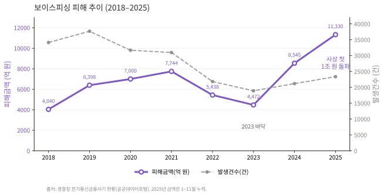
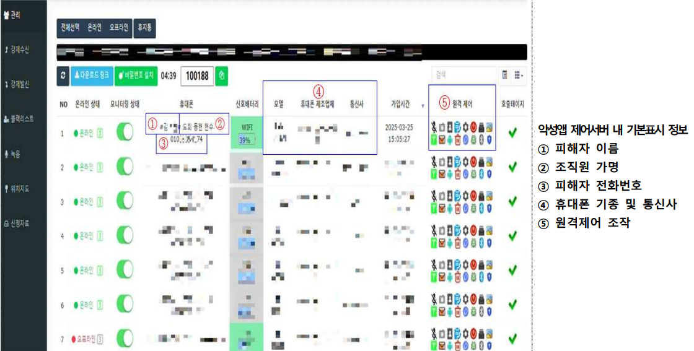
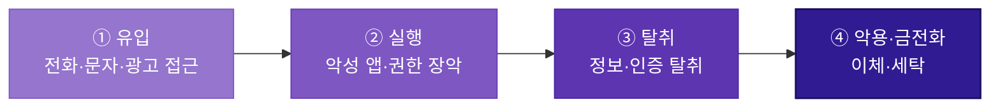

# 보이스피싱

!!! abstract "한눈에 보기"
    검찰·금융사를 사칭해 심리를 지배하고, 수사 협조나 저금리 대출을 미끼로 **악성 앱 설치**를 유도한다. 과거의 '전화 사기'가 이제는 원격제어·전화 가로채기가 결합된 **모바일 단말 장악 범죄**로 진화했다.

## 1. 공격 유형 설명 및 정의

보이스피싱은 전기통신수단을 이용해 타인을 기망·공갈하여 자금을 이체·출금하게 하거나 개인정보를 탈취하는 전기통신금융사기의 한 유형이다(통신사기피해환급법 제2조). 과거에는 전화 통화만으로 이루어졌으나, 최근에는 **악성 앱 설치를 기점으로 원격제어·전화 가로채기·정보 탈취가 결합된 모바일 기반 복합 범죄**로 진화했다.

| 유형 | 정의 / 수법 | 모바일 연계 요소 |
| --- | --- | --- |
| **기관사칭형** | 검찰·경찰·금융감독원 등을 사칭, "계좌가 범죄에 연루됐다"며 자산보호·수사협조 명목으로 이체·앱 설치 유도 | 원격제어 앱, 가짜 검찰청/금감원 앱 |
| **대출빙자형** | 저금리 대환대출·정부지원대출을 미끼로 수수료·보증금·기존대출 상환금 편취 | 가짜 금융사 앱, 대출 심사 명목 악성 앱 |
| **지인사칭형(메신저피싱)** | 카카오톡 등에서 가족·지인 사칭, "폰 고장·인증 요청" 등으로 상품권/이체 요구 | 메신저 계정 탈취, 원격 인증 유도 |
| **미끼문자 연계형** | 택배·부고·과태료 등 미끼문자 내 악성 URL로 악성 앱 설치 유도 후 보이스피싱으로 연결 | 스미싱 → 악성 앱 설치 → 보이스피싱 결합 |

!!! note "최근 추세 — 기관사칭형의 급증"
    2025년 기관사칭형 발생건수는 **13,323건**으로 역대 최고치를 기록하며 대출사기형(10,037건)을 추월했다. 전체 범죄의 중심축이 대출빙자형에서 기관사칭형으로 이동했다. (경찰청, 공공데이터포털)

---

## 2. 실제 피해 현황

### 2.1 피해 추이

*출처: 경찰청, 「전기통신금융사기 발생 및 검거 현황」, 공공데이터포털 (2025년 금액은 1~11월 누적)*

건수는 2019년을 정점으로 줄었지만 피해액은 2023년 바닥을 찍고 급반등해 2025년 **사상 첫 연간 1조 원**을 넘었다. 건당 평균 피해액이 2024년 약 2,500만 원에서 2025년 약 5,300만 원으로 **2배 이상** 뛴 결과로, 악성 앱으로 단말을 통째로 장악하는 '탈탈 털기식' 범행이 늘며 **공격의 중심이 모바일 단말 장악으로 재편**되었음을 보여준다.

| 연도 | 피해금액 | 발생건수 | 주요 특징 |
| --- | --- | --- | --- |
| 2018 | 4,040억 원 | 34,132건 | 계좌이체형 급증 진입 |
| 2019 | 6,398억 원 | 37,667건 | 발생건수 역대 최고 |
| 2020 | 7,000억 원 | 31,681건 | 대면편취형 비중 증가 |
| 2021 | 7,744억 원 | 30,982건 | 기관사칭·메신저피싱 급증 |
| 2022 | 5,438억 원 | 21,832건 | 범정부 합동수사단 출범, 감소 전환 |
| 2023 | 4,472억 원 | 18,902건 | 통신차단·계좌동결 제도 효과로 연속 감소 |
| 2024 | 8,545억 원 | 21,173건 | 미끼문자+악성앱 결합 수법으로 재급증 |
| 2025 | 1조 1,330억 원+ (1~11월) | 23,360건 | 사상 첫 연간 1조 원 돌파 |

참고 지표(2025) · 기관사칭형 비중 41%→51% · 50대 이상 피해자 47%→53% · 9월 통합대응단 출범 후 10월 발생건수 −32.8%·피해액 −22.9%

### 2.2 대표 사례

!!! example "사례 ① — 악성 앱 제어서버 확인 · 경찰청 2025.4"
    경찰이 수사 과정에서 보이스피싱 조직의 제어서버(악성 앱을 원격으로 조종하는 서버) 관리자 페이지를 직접 확인했다. 조직은 피해자의 이름·전화번호·단말 기종·실시간 위치·통화 내용을 한 화면에서 관리하고 있었다. 특히 금감원·검찰·경찰의 실제 전화번호 약 80개를 등록해, 피해자가 해당 기관 대표번호로 확인 전화를 걸어도 조직에게 연결되도록 조작했다(전화 가로채기). 악성 앱은 하루 단위로 업데이트됐고, 자산 탈취가 끝난 피해자의 앱 통신은 자동 차단해 탐지를 회피했다.

    

    *출처: 경찰청 보도자료 「그놈 목소리, 치밀한 각본 주인공이 되시겠습니까」 붙임1 (2025.4.28)*

    **💡 시사점** - 피해자가 직접 수행한 검증 절차까지 무력화되므로, 전화 가로채기·원격제어 구동 여부가 핵심 탐지 신호가 된다.

!!! example "사례 ② — Operation BlackEcho · 금융보안원 2024"
    금융보안원이 악성 앱 900여 개를 분석해 추적한 대출빙자형 캠페인. SNS 저금리 대출 광고로 유인해 가짜 구글 플레이스토어에서 대출 신청 앱(1차 악성 앱)을 설치하게 하고, 1차 앱이 접근성 권한(화면을 대신 읽고 조작할 수 있는 안드로이드 권한)을 악용해 **사용자 개입 없이 2차 악성 앱을 자동 설치**하는 이중 구조가 특징이다. 2차 앱은 원격제어·전화 가로채기를 수행하며, 자금은 피해자 직접 이체, 원격제어 이체, 피해자 명의 알뜰폰 비대면 개통을 통한 이체의 세 경로로 편취됐다.

    **💡 시사점** - 사용자 클릭 없이도 감염이 확산되므로, 접근성 권한 활성화 자체가 가장 이른 탐지 지점이다.

---

## 3. 공격 흐름 정의

*배경이 짙어질수록 단말 장악도와 피해 위험이 높아진다.*

| 단계 | 핵심 행위 |
| :--- | :--- |
| **① 유입** | 전화·문자·SNS 광고로 접근, 미끼로 링크 접속·앱 설치 유도 |
| **② 실행** | 악성 앱·원격제어 앱 설치, 접근성·통화 권한 과다 부여, 전화 가로채기로 검증 전화 차단 |
| **③ 탈취** | 개인·금융·인증정보 수집, OTP·SMS 자동 가로채기, 원격제어로 화면·입력 탈취 |
| **④ 악용·금전화** | 계좌이체·오픈뱅킹 출금, 비대면 대출, 명의도용 알뜰폰 개통 → 상품권·가상자산 세탁 |

---

## 4. 피해자가 속는 지점

보이스피싱이 무서운 건 정교한 기술이 아니라, **피해자의 정상적인 검증 행동까지 공격 경로로 삼는다**는 데 있다.

- **자체 확인이 무력화된다** — 대표번호로 직접 건 확인 전화조차 전화 가로채기로 조직에게 연결된다. 사용자가 믿는 검증 절차 자체가 사기범의 손 안에 있다.
- **클릭이 필요 없다** — 접근성 권한 하나가 넘어가면 피해자가 아무것도 누르지 않아도 2차 악성 앱이 설치된다. "의심스러우면 누르지 마세요"라는 교육이 작동하지 않는 지점이다.
- **안심시킨 뒤 장악한다** — 악성 앱은 피해자를 위축시키거나 반대로 안심시켜, 준비된 시나리오대로 따라오게 만드는 사전작업이다. 피해자가 안전하다고 느끼는 순간 단말은 이미 넘어가 있다.

---

## 5. 탐지 관점 정리

사용자의 주의력에 기댄 방어는 위 지점들에서 모두 무너진다. 따라서 방어의 실효 지점은 **사람의 판단이 아니라 단말에 반드시 남는 흔적**으로 이동해야 한다.

| 방어가 무너지는 지점 | 대신 관측해야 할 흔적 |
| --- | --- |
| 사용자의 확인 전화 | 전화 가로채기 구동 |
| 사용자의 설치 판단 | 접근성 권한 활성화, 비공식 경로 설치 |
| 사용자의 거래 인지 | 원격제어 세션, 기기·인증수단 변경 직후 고액 거래 |

범죄를 완벽히 막을 수는 없어도 **흔적은 반드시 남는다.** 이 흔적을 어떤 데이터로 관측하고 조합하는지는 이후 [공격 흐름]·[탐지 데이터] 장에서 다룬다.

---

## 참고 자료

- 경찰청, 「전기통신금융사기 발생 및 검거 현황」, 공공데이터포털 (2025.12.31 기준) [🔗](https://www.data.go.kr/data/15063815/fileData.do)
- 경찰청 보도자료, 「그놈 목소리, 치밀한 각본 주인공이 되시겠습니까」 (2025.4.28) [🔗](https://www.counterscam112.go.kr/bbs002/board/boardDetail.do?pstSn=60)
- 금융위원회 보도자료, 「당정, 보이스피싱 근절 종합대책 추진상황 점검」 (2025.12.30) [🔗](https://www.fsc.go.kr/no010101/85959)
- 금융보안원, 「Operation BlackEcho — 보이스피싱 악성 앱 프로파일링」 (2024) [🔗](https://www.fsec.or.kr/bbs/241)