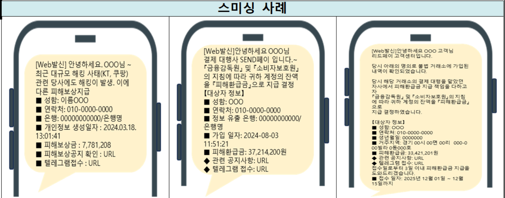
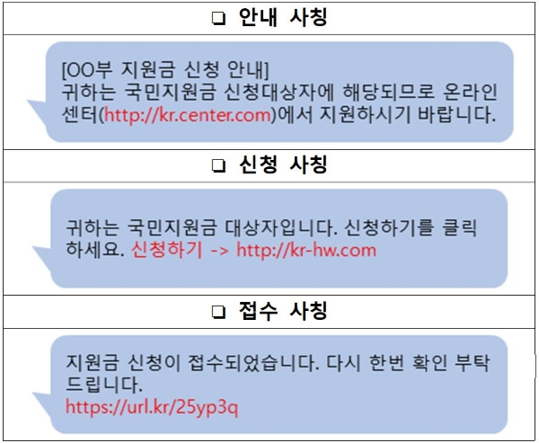
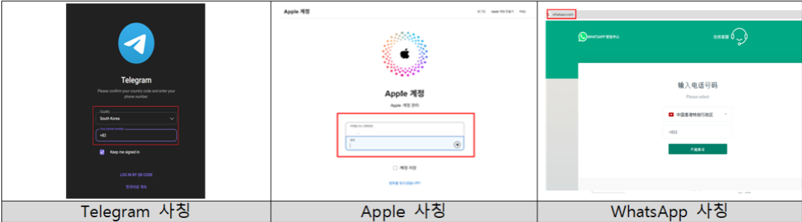
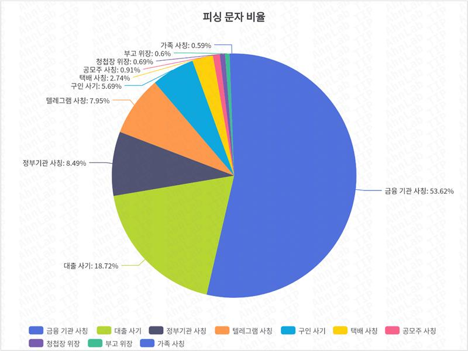
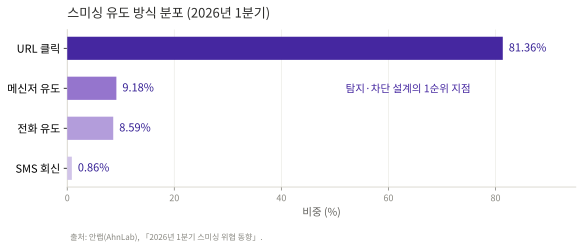
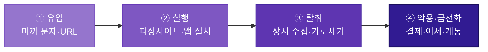

# 스미싱

!!! abstract "한눈에 보기"
    문자메시지에 악성 URL을 심어 피싱사이트 접속이나 **악성 앱 설치**를 유도한다. 심리적 유인(사회공학)과 기술적 탈취가 결합된 공격으로, 그 자체로 끝나기보다 **보이스피싱·악성 앱 감염의 진입 경로**로 기능한다.

## 1. 공격 유형 설명 및 정의

스미싱(Smishing)은 SMS와 피싱(Phishing)의 합성어로, 문자메시지를 통해 수신자를 기망하여 악성 URL 접속을 유도하고 개인정보·금융정보를 탈취하거나 악성 앱을 설치시키는 전기통신금융사기 수법이다. 공격은 두 개의 층위로 구성된다.

**심리적 수법**에서는 관심·불안·긴급 심리를 자극하는 미끼 문구로 "확인이 필요한 상황"을 조성해 단일 행동(URL 클릭)을 유도하고, **기술적 수법**에서는 발신번호 변작, 단축 URL을 통한 목적지 은닉, 탐지 회피를 위한 신규 도메인 사용, 문자 대량발송 인프라 악용이 결합된다.

스미싱은 단독 범죄로 완결되기보다 후속 공격의 진입 경로로 기능하는 경우가 많다. 2024년 보이스피싱 피해액이 재급증(8,545억 원)한 주요 원인도 미끼문자와 악성 앱(원격제어)이 결합한 수법이었다. 
([보이스피싱](entry-01-voicephishing.md) 참조) 

| 유형 | 미끼·수법 | 유도 목표 |
| --- | --- | --- |
| **금융기관 사칭** | 카드 개통 완료·이상 거래·결제 승인 안내, [국제발신] + 카드사명 + 문의번호 병기 | 회신 전화 → 보이스피싱 연계 |
| **대출 사기** | 저금리·긴급 승인·연체자 가능, 카카오톡 ID로만 상담 유도 | 메신저 이동 → 개인정보·수수료 편취 |
| **정부기관 사칭** | 과태료·범칙금 통지 (교통경찰청, 이파인 사칭) | 피싱사이트 → 개인정보 입력 |
| **택배 사칭** | 배송 지연·주소 오류·본인 확인 요청 | 피싱사이트·APK 설치 |
| **청첩장·부고 위장** | 경조사 소식 + 식장/빈소 링크로 감정적 동요 악용 | APK 설치 → 단말 장악 |
| **가족 사칭** | "엄마 지금 뭐해?" 식 대화 접근 후 점진적 요구 상승 | 원격제어 앱 설치·인증번호 요구 |

모든 유형의 공통 구조는 **즉시성 압박 + '확인이 필요한 상황' 조성 → 단일 행동(URL 클릭/회신) 유도**다.

!!! note "최근 추세 — 실제 사건을 미끼로 쓰는 진화"
    기존 스미싱이 가상의 상황(가짜 택배, 가짜 과태료)을 지어냈다면, 최근 유형은 **실제로 일어난 사건과 실제 정책을 미끼로 사용**한다. 피해자 입장에서 "사실 확인"이 오히려 미끼를 강화해주기 때문에 성공률이 높다.

    **① 대규모 유출 사고 연계형** 
    
    이커머스·플랫폼 해킹 사고 직후 그 사고를 빙자해 "피해사실 조회", "피해보상 신청", "긴급 앱 업데이트" 문자를 대량 유포한다. 실제 유출된 정보보다 **유출 사실이 만들어낸 불안감을 악용한 2차 피싱**이 실질 피해로 이어진다.

    

    *출처: KISA 보호나라 보안공지 「개인정보 유출 사고 관련 스미싱 주의 권고」*

     

    **② 시의성 이슈 편승형** 
    
    명절, 민생회복 쿠폰, 고유가 지원금 등 특정 시점의 정책·행사에 맞춰 정부24 등을 사칭한다. 실제 정책이 존재하고 시기도 일치해 정상 안내와 구분이 어렵다.

    { width="400" }

    *출처: KISA 보호나라 보안공지 「정부 지원금 신청 사칭 스미싱 주의 권고」*

     
    
    **③ 계정 탈취형** 
    
    "계정 비활성화", "미인증 시 탈퇴" 등을 빙자해 가짜 로그인 페이지로 유도, 계정·이메일·전화번호를 탈취한다. Telegram·Apple·Instagram 사칭이 대량 탐지되며, 탈취된 계정은 지인 사칭 공격의 발판으로 재사용된다.

    

    *출처: KISA 보호나라 보안공지 「계정 탈취 유형 스미싱·피싱 주의 권고」*

---

## 2. 실제 피해 현황

### 2.1 피해 추이

{ width="600" }

*출처: 안랩(AhnLab), 「2026년 1분기 스미싱 위협 동향」*

안랩의 2026년 1분기 분석에 따르면 사칭 유형은 **금융기관 사칭이 53.62%**(전분기 대비 +9.38%p)로 최다이고 대출 사기 18.72%가 뒤를 잇는다. 특히 **대출 사기는 전분기 대비 205.15% 급증**한 반면 정부기관 사칭(−51.99%)과 텔레그램 사칭(−22.55%)은 감소해, 공격자가 직접적 금전 성과가 기대되는 금융·대출 시나리오로 집중 이동하고 있음을 보여준다. 수신자 관점의 통계도 같은 방향이다 — 카카오뱅크가 2026년 상반기 접수된 의심 문자 10,024건을 분석한 결과 금융거래·인증 사칭이 합산 61%를 차지했다.

*출처: 안랩(AhnLab), 「2026년 1분기 스미싱 위협 동향」*

유도 방식은 **URL 클릭이 81.36%로 압도적 단일 경로**다(메신저 9.18%, 전화 8.59%, SMS 회신 0.86%). 공격의 8할이 하나의 관문을 지나므로, URL 접속과 그 이후의 앱 설치 행위가 탐지·차단 설계의 1순위 지점이 된다. 스미싱 단독 분류 피해액은 상대적으로 작게 집계되지만, 스미싱을 진입 경로로 삼은 보이스피싱·악성 앱 피해는 별도 통계로 잡히기 때문에 **실질 피해 기여도는 수치보다 훨씬 크다.**

### 2.2 대표 사례

!!! example "사례 ① — 국내 최대 스미싱 조직, 피해액 120억 원 · 서울경찰청 2025.11"
    청첩장·부고장·과태료 고지서로 위장한 문자에 악성 링크를 발송, 클릭 시 악성 앱을 설치해 단말 권한을 탈취한 조직이 검거됐다. 조직은 탈취한 권한으로 **피해자 명의 유심(USIM)을 무단 개통해 본인인증 수단을 확보**한 뒤 금융계좌·가상자산 거래소에서 자금을 인출했다. 2년간 피해자 약 1,000명, 피해액 약 120억 원으로 국내 최대 규모다. 수사 과정에서 글꼴이 다르거나 실존하지 않는 기관명이 적힌 **위조 신분증으로도 금융 앱의 진위 확인을 통과**하는 본인인증 취약점이 확인돼 통신사·금융기관에 공유됐다.

    **💡 시사점** - 제출 서류(정적 증빙)만으로는 명의도용을 걸러낼 수 없다. 단말 환경·행위 기반 판별이 필요하며, 유심 재개통 → 본인인증 우회 흐름은 **"기기·인증수단 변경 직후 고액 거래"라는 탐지 룰 후보**를 제공한다.

!!! example "사례 ② — 대규모 유출 사고 연계 스미싱 · 2025.11~12"
    국내 대형 이커머스 개인정보 유출 사고 직후, 피해 기업과 검·경을 사칭한 "피해보상 신청"·"피해사실 조회"·"긴급 앱 업데이트" 문자가 대량 유포됐다. URL 클릭 시 피싱사이트에서 본인확인 명목으로 개인정보를 입력받고, 이어서 악성 앱·원격제어 앱 설치로 연결됐다. 검·경 "공정거래 수사팀 사무관"을 사칭해 접근하거나 포털 검색결과 상단에 피싱사이트를 광고로 노출하는 수법도 확인됐다(2025년 12월 기준 스미싱 49건, 보이스피싱 5건 적발).

    **💡 시사점** - 피해자는 "실제로 내 정보가 유출된 게 맞다"는 참인 사실 때문에 의심을 건너뛴다. **기존 보안 교육이 무력화되는 지점**이며, 타사 유출 사고 직후에는 자사 고객의 피싱 노출도가 함께 급등한다.

---

## 3. 공격 흐름 정의

*배경이 짙어질수록 단말 장악도와 피해 위험이 높아진다.*

| 단계 | 핵심 행위 |
| :--- | :--- |
| **① 유입** | 미끼 문자 대량 발송. [국제발신] 표시, 실존 브랜드명, 단축 URL(목적지 은닉), 신규 등록 도메인 사용 |
| **② 실행** | 피싱사이트에서 정보 입력 유도 또는 APK 설치. OS 설치 경고를 넘기게 유도하고, 기본 SMS 앱 변경·시스템 권한 요구 후 아이콘 은닉 |
| **③ 탈취** | SMS·연락처·SIM 저장 번호 상시 수집, 수신 인증문자를 사용자 몰래 가로채기 |
| **④ 악용·금전화** | 소액결제·상품권 현금화, 오픈뱅킹 이체, 유심 개통으로 본인인증 우회, 비대면 대출, 감염 단말로 미끼문자 2차 재발송 |

!!! note "피싱사이트는 종착점이 아니라 통로"
    실행 단계에서 피싱사이트로 끝나는 경우 피해는 입력값에 한정된 1회성이다. 그러나 실제 사례 대부분에서 피싱사이트는 **악성 앱(APK)의 배포 통로**로 쓰이며, 앱 설치까지 진행되면 상시·지속 탈취로 전환된다. 사이트 내 '배송조회' 같은 부가 기능을 실제 회사 사이트로 연결해 신뢰를 얻는 위장 기법도 확인된다.

---

## 4. 피해자가 속는 지점

- **참인 사실을 미끼로 쓴다** — 유출 사고 연계형은 "실제로 내 정보가 유출됐다"는 사실을 근거로 삼는다. 지어낸 거짓이 아니라 진짜 사건 위에 사기를 얹기 때문에 "의심스러우면 클릭하지 마세요"라는 교육이 작동하지 않는다.
- **일부 기능이 진짜처럼 동작한다** — 피싱사이트의 '배송조회' 같은 부가 기능은 실제 회사 사이트로 연결된다. 일부가 정상 동작하는 것을 본 피해자는 사이트 전체를 신뢰하게 된다.
- **즉시 행동을 강요한다** — "결제 승인", "계정 비활성화" 같은 문구로 확인이 급한 상황을 조성해, 검증할 시간 자체를 주지 않는다.

---

## 5. 탐지 관점 정리

사용자의 주의력에 기댄 방어는 위 지점들에서 모두 무너진다. 따라서 방어의 실효 지점은 **사람의 판단이 아니라 단말에 반드시 남는 흔적**으로 이동해야 한다.

| 방어가 무너지는 지점 | 대신 관측해야 할 흔적 |
| --- | --- |
| 사용자의 문자 진위 판단 | 발신번호 변작, 신규 생성 도메인, URL 단축 경유 |
| 사용자의 설치 판단 | 미확인 경로 설치, 기본 SMS 앱 변경, 과다 권한 요구 |
| 사용자의 거래 인지 | 인증문자 가로채기, 유심·기기 변경 직후 고액 거래 |

범죄를 완벽히 막을 수는 없어도 **흔적은 반드시 남는다.** 이 흔적을 어떤 데이터로 관측하고 조합하는지는 이후 [공격 흐름]·[탐지 데이터] 장에서 다룬다.

---

## 참고 자료

- 한국인터넷진흥원(KISA), 스미싱 탐지 통계 — 전자신문 「스미싱 피해, AI 이용한 악성 URL 탐지 기술로 예방」 (2025.6.2) [🔗](https://www.etnews.com/20250602000358)
- 카카오뱅크, 「AI 스미싱 문자 확인」 2026년 상반기 분석 — 노컷뉴스 (2026.7.8) [🔗](https://www.nocutnews.co.kr/news/6545267)
- 안랩, 「2026년 1분기 스미싱 위협 동향」 (2026.4) [🔗](https://www.ahnlab.com/ko/contents/content-center/36134)
- 서울경찰청, 국내 최대 스미싱 조직 검거 — 연합뉴스 (2025.11.26) [🔗](https://www.yna.co.kr/view/AKR20251126076000004)
- 이커머스 유출 연계 스미싱 — MBC 뉴스 (2025.12) [🔗](https://imnews.imbc.com/news/2025/society/article/6785355_36718.html) · 서울신문 (2025.12.7) [🔗](https://m.go.seoul.co.kr/news/society/2025/12/07/20251207500061)
- KISA 보호나라, 유출 사고 연계형 스미싱 주의 공지 [🔗](https://www.boho.or.kr/kr/bbs/view.do?bbsId=B0000133&menuNo=205020&nttId=71910) · 시의성 편승형 [🔗](https://www.boho.or.kr/kr/bbs/view.do?bbsId=B0000133&menuNo=205020&nttId=72060) · 계정 탈취형 [🔗](https://www.boho.or.kr/kr/bbs/view.do?bbsId=B0000133&menuNo=205020&nttId=72139)
- 이글루코퍼레이션, 「실제 사례로 살펴본 스미싱 공격기법」 [🔗](https://www.igloo.co.kr/security-information/%EC%8B%A4%EC%A0%9C-%EC%82%AC%EB%A1%80%EB%A1%9C-%EC%82%B4%ED%8E%B4%EB%B3%B8-%EC%8A%A4%EB%AF%B8%EC%8B%B1smishing-%EA%B3%B5%EA%B2%A9%EA%B8%B0%EB%B2%95/)