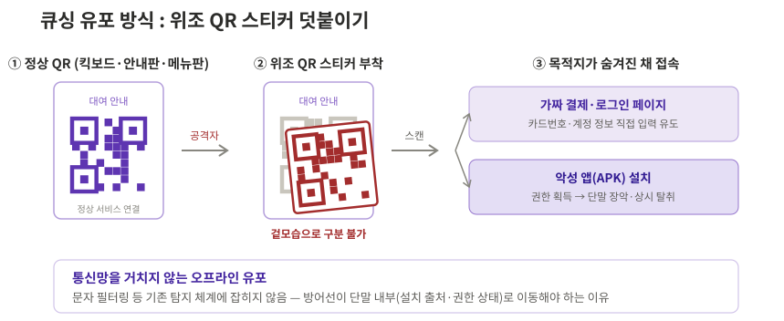
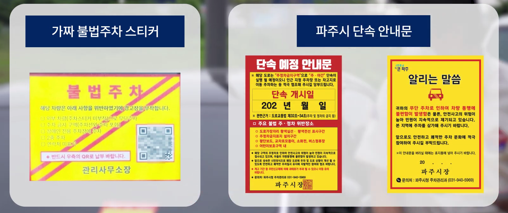
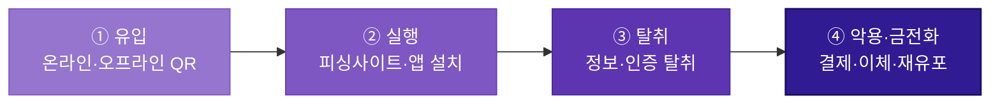

# 큐싱

!!! abstract "한눈에 보기"
    악성 URL을 담은 QR코드를 스캔하게 만들어 피싱사이트 접속이나 **악성 앱 설치**를 유도한다. 스캔하기 전까지 목적지를 알 수 없다는 점, 그리고 위조 스티커처럼 **통신망 밖(오프라인)에서도 유포된다는 점**이 다른 유형과 구별되는 특징이다.

## 1. 공격 유형 설명 및 정의

큐싱(Qshing)은 QR코드와 피싱(Phishing)의 합성어로, 악성 URL을 담은 QR코드를 스캔하게 만들어 피싱사이트 접속 또는 악성 앱 설치로 유도하고 개인정보·인증정보·금융정보를 탈취하는 공격이다.

QR 결제·주문·대여가 일상화되면서 "QR을 찍는 행위" 자체를 의심하지 않게 된 것이 이 공격이 통하는 배경이다. 들어오는 통로만 QR일 뿐, 이후 흐름은 스미싱과 동일하게 피싱사이트/악성 앱으로 이어진다(→ [스미싱] 페이지 참조).

| 유포 경로 | 방식 | 예시 |
| --- | --- | --- |
| **온라인** | 이메일·문자·SNS 광고에 QR코드 삽입 | 저금리 대출 안내 메일, 이벤트 당첨 광고, 정부기관 사칭 설문 |
| **오프라인 (물리적)** | 정상 QR코드 위에 가짜 QR 스티커 부착, 위조 안내문 배포 | 공유 킥보드·따릉이 QR 덮어붙이기, 허위 주차위반 딱지, 식당 메뉴판 QR 바꿔치기 |

큐싱이 스미싱과 구별되는 핵심 특성은 두 가지다.

1. **목적지가 숨겨져 있다**

    문자 속 URL은 눈으로 이상 여부를 어느 정도 확인할 수 있지만, QR코드는 **스캔하기 전까지 어디로 연결되는지 알 수 없다.** 겉모습만으로 정상 QR과 악성 QR을 구분하는 것은 불가능하다.

2. **공격 범위가 물리 세계까지 넓어진다**

    오프라인에 붙인 위조 스티커는 통신사·KISA의 문자 탐지 체계에 아예 잡히지 않는다. 문자·통신망 필터링이라는 기존 방어선을 그대로 지나치는 이 지점이 큐싱을 탐지하기 어려운 이유이자, 공격자가 큐싱을 택하는 이유다.

*큐싱 유포 방식 개념도 — 위조 QR 스티커 덧붙이기 (KISA 보호나라·파주시 공지 사례 재구성)*

!!! note "최근 추세 — 표적 공격과 재유포형으로 확장"
    큐싱은 불특정 다수를 노리는 사기를 넘어 새로운 방향으로 진화하고 있다.

    **① 특정 대상을 노리는 표적 공격의 유입 수단**

     KISA는 2026년 1월, 정부기관과 국내외 싱크탱크 직원을 사칭해 자문·설문조사나 민감정보 접근 권한 제공을 구실로 QR코드를 전달하는 공격 시도를 확인했다. 촬영하면 스마트폰 권한을 탈취하는 악성 앱이 설치되거나, 정상 사이트를 그대로 본뜬 가짜 로그인 페이지로 연결됐다.

    **② 피해자가 다시 퍼뜨리는 재유포형**

     "무료 쿠폰", "사은 행사" 문자로 설치된 악성 앱이 친구 초대 시 마일리지를 준다며 **피해자 스스로 주변인에게 악성 앱 설치용 QR을 만들어 보내게 하는** 사례가 확인됐다. 퍼뜨리는 주체가 공격자에서 감염된 피해자로 넓어지기 때문에, 공격자의 번호나 계정을 차단하는 기존 대응이 잘 통하지 않는다.

---

## 2. 실제 피해 현황

### 2.1 피해 추이

큐싱은 아직 독립된 피해 통계가 따로 공표되지 않고, KISA의 스미싱 탐지·대응 체계에 합산되어 관리된다. 다만 위협이 실제로 커지고 있다는 사실은 대응 체계의 변화에서 확인할 수 있다. 스미싱 탐지 건수가 폭증하는 가운데 큐싱이 새로운 유포 경로로 떠오르자, KISA는 2025년 1월 31일부터 카카오톡 '보호나라' 채널에 **큐싱 확인서비스**(의심 QR 촬영 → 악성 여부 판별)를 별도로 열었다. 국가 대응 체계가 전용 서비스를 만들 만큼 위협이 커졌다는 뜻이다.

통계에 잡히지 않는다는 특성은 오히려 큐싱의 위험을 보여준다. 오프라인 유포는 신고와 탐지 자체가 어려워 **드러나지 않는 피해가 많은 유형**이며, 피해가 발생해도 스미싱·악성 앱 통계로 나뉘어 집계되기 때문에 실제 규모는 공표된 수치보다 클 가능성이 높다.

### 2.2 대표 사례

!!! example "사례 ① — 소상공인 저금리 대출 사칭 QR, 피해액 약 1,000만 원 · 금융감독원 공개 사례 2024"
    자영업자에게 '소상공인 저금리 대출' 안내 이메일을 보내고, "금융사기 예방 앱 설치"를 구실로 QR코드 촬영을 유도했다. 피해자가 QR을 촬영하자 악성 앱이 설치되어 개인정보가 유출되었고 약 1,000만 원의 금전 피해로 이어졌다. **"보안 앱 설치"라는 명분 자체가 미끼**로 쓰였다는 점에서, 대출빙자형 보이스피싱의 유입 단계가 QR로 바뀐 형태다.

     **💡 시사점** - 보안을 내세운 설치 유도는 조심하려는 피해자의 마음을 오히려 이용한다. QR 스캔 직후 일어나는 미확인 경로 APK 설치가 관측할 수 있는 첫 신호다.

!!! example "사례 ② — 허위 주차위반 안내문 · 파주시 2024.8"
    도로변 주차 차량에 아파트 주차위반 딱지와 비슷한 노란 바탕·빨간 글씨의 위조 안내문을 붙이고, "요금을 납부하라"며 QR코드를 넣었다. 촬영하면 카드번호 입력을 요구하는 가짜 결제 페이지나 악성 앱 설치로 연결됐다. 파주시는 실제 주차위반 스티커에 QR코드가 들어가지 않는다고 공지하며 주의를 당부했다.

    

    *위조 스티커(좌)에는 "QR로 납부"를 유도하는 QR코드가 있지만, 실제 파주시 안내문(우)에는 QR코드가 없다. — 출처: 파주시 공식 홈페이지 「8월 마지막주 파주브리핑」 영상 (2024.9)*

    **💡 시사점** - **통신망을 전혀 거치지 않는 순수 오프라인 유입**이라, 문자 필터링 기반 방어가 아예 작동하지 않는다. 방어선이 단말 내부(설치 출처·권한 상태)로 옮겨가야 하는 대표 근거다.

---

## 3. 공격 흐름 정의

*배경이 짙어질수록 단말 장악도와 피해 위험이 높아진다.*

| 단계 | 핵심 행위 |
| :--- | :--- |
| **① 유입** | 이메일·문자·광고에 QR 삽입(온라인) 또는 위조 스티커·허위 안내문 부착(오프라인). 발신번호나 URL 문자열처럼 미리 걸러낼 수 있는 신호가 없음 |
| **② 실행** | 스캔 후 피싱사이트에서 정보 입력, 또는 악성 앱(APK) 설치와 권한 획득. 이후 흐름은 스미싱과 동일 |
| **③ 탈취** | 개인·금융·인증정보 수집, 단말 장악 시 상시 탈취 |
| **④ 악용·금전화** | 무단 결제·이체, 원격제어, 결제 QR 바꿔치기를 통한 소액결제, 감염 단말의 QR 재유포 |

!!! note "큐싱 방어의 실질 지점은 유입이 아니라 실행 이후"
    QR이라는 매체 특성상 유입 단계에는 잡아낼 신호가 없고, 오프라인 유포는 아예 관측할 수 없다. 따라서 **미확인 경로 앱 설치, 지나친 권한 요구, QR 스캔 직후 APK 다운로드**가 방어 체계가 잡을 수 있는 첫 신호가 된다.

---

## 4. 피해자가 속는 지점

- **목적지를 확인할 방법이 없다** — 문자 URL과 달리 QR은 스캔하기 전까지 어디로 연결되는지 알 수 없고, 정상 QR과 악성 QR은 겉모습으로 구분되지 않는다. "링크를 확인하고 접속하는" 습관 자체가 통하지 않는다.
- **일상 동작이라 경계심이 없다** — 결제·주문·대여로 QR 스캔이 습관이 되어, QR을 찍는 행위는 링크 클릭보다도 의심 없이 이루어진다. 주차 딱지·킥보드처럼 QR이 있을 법한 자리에 있으면 진위를 따지지 않는다.
- **보안·공공의 이름을 앞세운다** — "금융사기 예방 앱 설치", "주차요금 납부"처럼 안전하고 당연해 보이는 명분을 내세워, 피해자가 스스로 협조하며 설치·입력하게 만든다.

---

## 5. 탐지 관점 정리

사용자의 주의력에 기댄 방어는 위 지점들에서 모두 무너진다. 특히 큐싱은 유입 단계의 신호가 통신망 밖에 있으므로, 방어의 무게중심이 **단말 내부에 남는 흔적**으로 옮겨갈 수밖에 없다.

| 방어가 무너지는 지점 | 대신 관측해야 할 흔적 |
| --- | --- |
| 사용자의 QR 진위 판단 | QR 스캔 직후 미확인 경로 APK 다운로드·설치 |
| 사용자의 설치 판단 | 비공식 설치 출처, 지나친 권한 요구 |
| 사용자의 결제·인증 인지 | QR 인증 직후 신규 단말 등록·고액 거래 (FDS 룰 후보) |

범죄를 완벽히 막을 수는 없어도 **흔적은 반드시 남는다.** 문자 필터링 중심 대응의 한계를 가장 잘 보여주는 유형이 큐싱이며, 단말 쪽 보안 모듈 기반 탐지가 필요하다는 대표적 근거가 된다. 흔적을 어떤 데이터로 관측하고 조합하는지는 이후 [공격 흐름]·[탐지 데이터] 장에서 다룬다.

---

## 참고 자료

- KISA 보호나라, 「정부기관, 싱크탱크 사칭 큐싱 유포 주의 권고」 (2026.1.10) [🔗](https://www.boho.or.kr/kr/bbs/view.do?bbsId=B0000133&menuNo=205020&nttId=71936)
- KISA 보호나라, 무료 쿠폰 앱 사칭 QR 재유포형 스미싱 주의 공지 (2025) [🔗](https://www.boho.or.kr/kr/bbs/view.do?bbsId=B0000133&menuNo=205020&nttId=71612)
- 보안뉴스, 정부기관·싱크탱크 사칭 큐싱 보도 (2026.1) [🔗](https://m.boannews.com/html/detail.html?tab_type=1&idx=141424)
- KISA, 카카오톡 '보호나라' 큐싱 확인서비스 개시 — 아이뉴스24 (2025.3.31) [🔗](https://www.inews24.com/view/1828327)
- 금융감독원 공개 사례, 소상공인 저금리 대출 QR 피해 — 한국경제 (2024.3.5) [🔗](https://www.hankyung.com/article/2024030590921)
- 파주시, 불법주차 안내문 '가짜 QR코드' 주의 당부 (2024.8) [🔗](https://www.paju.go.kr/news/user/mediaPaju/BD_themaInPajuView.do?sn=1176)