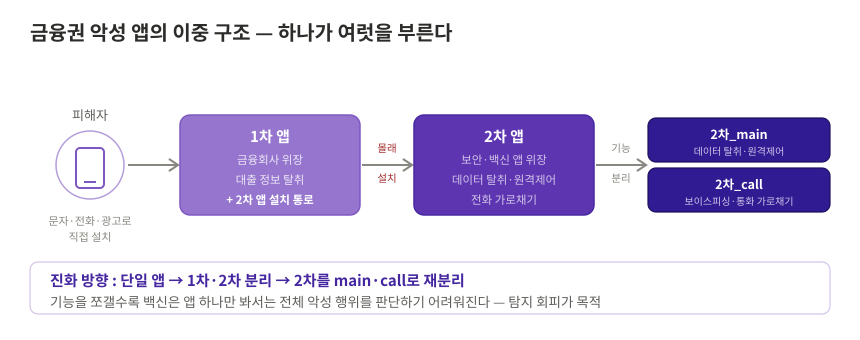
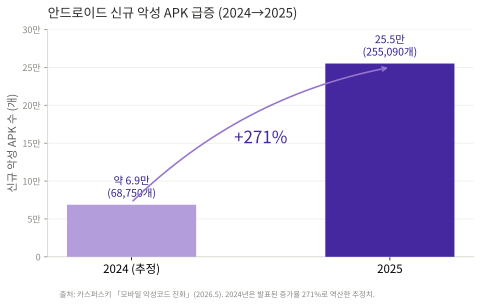

# 악성 앱

!!! abstract "한눈에 보기"
    정상 금융회사·공공기관 앱처럼 위장해 설치된 뒤, 개인정보·인증정보를 탈취하거나 원격제어·전화 가로채기로 휴대전화를 장악해 금융사기를 완성하는 앱이다. 앞선 세 유형(보이스피싱·스미싱·큐싱)이 **유입과 심리적 유인**을 맡는다면, 악성 앱은 **실제 탈취와 단말 장악**을 맡는 실행 도구다.

## 1. 공격 유형 설명 및 정의

금융권 모바일 악성 앱은 정상 앱으로 위장해 설치된 뒤 단말을 장악하고 금융사기를 완성하는 실행 도구다.

스미싱·큐싱·보이스피싱이 피해자를 **유인**해 문을 열게 만든다면, 악성 앱은 그 열린 문으로 들어가 **실제로 정보를 훔치고 단말을 조종**하는 도구다. 

그리고 이렇게 장악한 단말은 결국 보이스피싱 시나리오를 통해 **돈이 빠져나가는 통로**가 된다. 대형 사건을 뜯어보면 이 세 역할이 거의 항상 함께 나타나며, 악성 앱은 유입과 현금화를 잇는 그 교차점에 있다.

| 유형 | 주요 기능 | 금융 피해로 이어지는 방식 |
| --- | --- | --- |
| **정보 탈취형** | 연락처·문자·인증번호·사진·기기정보 수집 | 계정 탈취, 인증 우회, 명의도용, 비대면 대출 |
| **원격통제형** | 화면 확인·조작, 앱 추가 설치, 위치 확인 | 금융 앱 조작, 송금 유도, 백신·악성 앱 삭제 방해 |
| **전화 가로채기형** | 발신·수신 조작, 통화 녹음, 대표번호 우회 | 피해자가 가짜 상담원을 실제 은행·수사기관으로 오인해 송금 |
| **오버레이형** | 정상 금융 앱 위에 가짜 입력 화면 표시 | 로그인·이체 단계에서 인증정보 실시간 탈취 |
| **가짜 금융 앱형** | 허위 잔액·수익·거래 화면 표시 | 실제 투자로 착각하게 만들어 범죄계좌로 직접 입금 |

실제 악성 앱은 이 기능들을 하나만 갖기보다 **복합적으로 수행**한다.

*금융보안원 「Operation BlackEcho」(2024) 보고서 [그림 3-2] '악성 앱 구조 변화'를 재구성*

금융보안원이 900여 개 악성 앱을 추적한 「Operation BlackEcho」(2024)에 따르면, 국내 금융권 악성 앱은 백신 탐지를 피하기 위해 **역할을 나눈 이중 구조**로 진화했다. 

**1차 앱**은 금융회사 앱으로 위장해 조직이 직접 유포하며, 대출 정보를 탈취하는 동시에 2차 앱을 몰래 설치하는 통로가 된다. **2차 앱**은 보안·백신 앱으로 위장해 데이터 탈취·원격제어·전화 가로채기를 수행하고, 2023년 하반기부터는 이마저 기능별로 다시 분리됐다(2차_main·2차_call). 

피해자가 앱 하나만 깔았다고 믿는 사이 여러 앱이 연쇄로 설치되는 구조다.

!!! note "최근 추세 — 탐지를 피해 진화하는 변종"
    최근 악성 앱은 백신에 잡히지 않기 위해 여러 회피 기법을 겹겹이 두른다. 안랩 ASEC이 2025년 11월 분석한 악성 앱은 발견 당시 대부분의 백신에서 탐지되지 않았는데, 그 방법이 세 가지였다.

    **① 사람인지 확인해 분석 장비를 따돌린다.** 
     
     백신의 자동 분석 장비는 앱을 대신 실행해보고 악성 여부를 판단한다. 그런데 이 앱은 실행하자마자 화면에 단어를 띄우고 **사용자가 직접 그 단어를 입력해야만** 악성 동작을 시작하도록 만들었다. 사람이 없는 분석 장비 앞에서는 아무 일도 하지 않아, 평범한 앱으로 오인되는 것이다.

    **② 코드를 조각내 설치 파일에서 숨긴다.** 
     
    핵심 악성 코드를 암호화한 채 여러 조각으로 나눠 두었다가 실행된 뒤에야 하나로 조립한다. 백신이 설치 파일(APK)만 뜯어봐서는 악성 코드의 실체가 드러나지 않는다.

    **③ 명령 서버를 정상 사이트로 위장한다.** 
     
    감염 단말에 명령을 내리는 서버(C2)로 **해킹한 정상 웹사이트**를 쓴다. 수상한 서버가 아니라 멀쩡한 사이트와 통신하기 때문에, 통신 기록을 봐도 이상 징후를 찾기 어렵다.

    해외에서도 사람의 터치 속도와 패턴까지 흉내 내 "기계적 조작 여부" 탐지마저 피하는 변종(Herodotus)이 확인됐다.
---

## 2. 실제 피해 현황

### 2.1 피해 추이

카스퍼스키 보고서(2026.5)에 따르면 2025년 안드로이드 뱅킹 트로이목마 공격은 전년 대비 **56% 증가**했고, 신규 악성 APK 설치 패키지는 255,090개로 **271% 급증**했다. 변종이 대량으로 만들어지는데 개별 변종은 백신 검사를 피하도록 설계되기 때문에, **파일 시그니처 기반 탐지만으로는 따라잡을 수 없는 구도**다. 여기에 새 기기의 펌웨어에 미리 심어진 사전 설치형 백도어(Triada, Keenadu)까지 등장해, 방금 구매한 단말조차 이미 감염됐을 수 있다.

### 2.2 대표 사례

!!! example "사례 ① — 접근성 권한 하나로 단말을 장악하다 · 금융보안원 BlackEcho 2024"
    금융보안원이 1년간 추적한 대출빙자형 캠페인의 악성 앱은 안드로이드의 **접근성(화면을 대신 읽고 조작하는 보조 기능) 권한**을 무기로 삼았다. 이 권한을 얻은 앱은 다른 권한 요청 창의 "허용" 버튼을 스스로 누르고, 백신 등 지정된 앱을 강제로 삭제하며, 피해자가 전화 앱을 열면 대신 실행돼 통화를 가로챘다. 또 자신을 **기본 전화·문자 앱으로 설정**한 뒤 수신 문자의 알림을 중간에서 차단해, 은행이 보낸 **인증문자를 피해자 화면에 뜨지 않게 가로챘다.** 감염 단말은 10초마다 상태를 조직 서버에 보고하며 상시 통제됐다.

    **💡 시사점** - 권한 하나가 넘어가는 순간 단말 통제권이 통째로 넘어간다. 따라서 "접근성 권한이 켜졌는가"는 단일 항목으로도 강력한 탐지 신호이며, 본 프로젝트 룰 설계의 핵심 축이 된다.

!!! example "사례 ② — 원격제어 앱이 8시간 만에 3억 8천만 원을 인출 · 부산 2023"
    부산의 한 자영업자에게 "택배 수신주소가 잘못됐다"는 문자가 도착했다. URL을 누르자 원격제어 앱이 설치되며 휴대전화가 먹통이 됐고, 그사이 범인은 단말에 저장돼 있던 **운전면허증 사진으로 OTP를 새로 발급**받았다. 정상 인증 수단이 공격자 손에 들어가자, 스마트뱅킹으로 약 8시간 동안 예금이 빠져나가 피해액은 3억 8천만 원에 달했다.

    **💡 시사점** - 악성 앱이 단말을 장악하면 신분증·OTP 같은 본인인증 수단까지 재발급된다. "기기·인증수단 변경 직후의 고액·연속 이체"라는 거래 단계 신호가 마지막 방어선이 된다.

두 사례는 피해 규모도, 대상도 다르지만 공격의 골격은 같다. **악성 앱으로 단말을 장악한 뒤, 유심·OTP·인증서 같은 본인인증 수단을 탈취하거나 재발급받아 정상 인증 절차를 그대로 통과하는 것**이다. 이 구조는 개인을 넘어 조직 단위 사건에서도 반복된다

청첩장·부고장 위장 문자로 유심을 무단 개통해 1,000여 명에게 120억 원(2025), 법원·금감원 사칭에 원격제어 앱을 결합해 318명에게 443억 원(캄보디아 조직, 2026), 가짜 구속영장과 원격조종 앱으로 224명에게 245억 원(송남파, 2023~2026)의 피해가 났다. 

사칭 시나리오는 매번 달라도, **악성 앱이 인증 체계를 무력화하는 방식만은 변하지 않는다.**

---

## 3. 공격 흐름 정의

*배경이 짙어질수록 단말 장악도와 피해 위험이 높아진다.*

| 단계 | 핵심 행위 | 관측되는 흔적 |
| :--- | :--- | :--- |
| **① 유입** | 문자·전화·메신저·광고로 링크 전달 (상세: 스미싱·큐싱 페이지) | 출처 불명 URL, APK 다운로드 기록 |
| **② 실행** | 1차 앱 설치 → 2차 앱 자동 설치, 접근성·기기관리자 권한 확보, 설치 후 아이콘 은닉 | 비공식 설치 출처, 접근성·기기관리자·화면공유 활성화 |
| **③ 탈취** | 연락처·문자·위치·화면 수집, 인증문자 가로채기, 가짜 입력 화면(오버레이), 원격제어 | 의심 C2 통신, 원격제어 구동, 과도한 권한 사용 |
| **④ 악용·금전화** | 고액 이체, 비대면 대출, 현금 전달, 투자금 편취 | 신규 수취인, 고액·연속 거래, 기기·인증수단 변경 직후 거래 |

!!! note "접근성 권한이 공격의 지렛대다"
    악성 앱이 노리는 핵심은 **접근성 권한**이다. 화면을 대신 읽고 조작하는 이 기능을 얻으면, 앱은 다른 권한 요청을 스스로 허용하고, 백신을 삭제하고, 통화를 가로채고, 기본 전화·문자 앱이 되어 인증문자까지 차단한다. 권한 하나가 여러 방어를 동시에 무력화하기 때문에, **접근성 활성화 여부는 가장 이르면서도 강력한 단일 탐지 신호**가 된다(BlackEcho 분석 확인).

---

## 4. 피해자가 속는 지점

- **믿을 만한 앱의 얼굴을 하고 있다** — 은행·검찰청·백신 앱과 구분되지 않는 아이콘과 화면으로 위장하고, 가짜 구글 플레이스토어에서 배포되기도 한다. "공식 앱처럼 보이면 안전하다"는 판단 기준이 통하지 않는다.
- **권한 요청이 정상 절차처럼 보인다** — "대출 심사를 위해", "보안 점검을 위해" 같은 명분과 함께 접근성·기기관리자 권한을 요구한다. 피해자는 서비스 이용에 필요한 절차로 여기고 스스로 허용한다.
- **설치 후에는 존재가 지워진다** — 아이콘을 숨기고 화면이 꺼져 있어도 백그라운드에서 계속 동작하며, 인증문자를 가로채도 화면에 표시하지 않는다. 피해자는 돈이 빠져나간 뒤에야 감염을 알게 된다.

---

## 5. 탐지 관점 정리

사용자의 주의력에 기댄 방어는 위 지점들에서 모두 무너지고, 백신의 파일 검사도 조건 트리거·다단계 페이로드 같은 회피 기법 앞에서 한계를 보인다. 따라서 방어의 실효 지점은 **단말에 반드시 남는 상태·행위 흔적**으로 이동해야 한다.

| 방어가 무너지는 지점 | 대신 관측해야 할 흔적 |
| --- | --- |
| 사용자의 앱 진위 판단 | 비공식 설치 출처, 위장 앱 시그니처 |
| 사용자의 권한 허용 판단 | 접근성·기기관리자·화면공유 권한 활성화, 기본 전화·문자 앱 변경 |
| 백신의 파일 단위 탐지 | 원격제어 세션, 인증문자 가로채기, 의심 C2 통신 등 **행위 신호** |
| 사용자의 거래 인지 | 기기·인증수단 변경 직후 고액·연속 거래 |

범죄를 완벽히 막을 수는 없어도 **흔적은 반드시 남는다.** 악성 앱은 네 유형이 수렴하는 실행 도구인 만큼, 이 페이지의 흔적들이 곧 전체 탐지 설계의 중심 재료가 된다. 

---

## 참고 자료

- 금융보안원, 「Operation BlackEcho — 보이스피싱 위협 분석 보고서」 (2024) — III장 악성 앱 구조, V장 접근성 권한 악용·전화 가로채기
- 안랩 ASEC, 「고도화된 탐지 회피 기술을 적용한 악성 앱 분석 보고서」 (2025.11.19) [🔗](https://asec.ahnlab.com/ko/91104/)
- 안랩 ASEC, 「침해된 정상 사이트를 C2 서버로 사용하는 AI 기반 난독화 악성 앱 분석 보고서」 (2025.11) [🔗](https://asec.ahnlab.com/ko/91077/)
- 카스퍼스키, 「모바일 악성코드 진화」 현황 보고서 — ZDNet Korea (2026.5.21) [🔗](https://zdnet.co.kr/view/?no=20260521103650)
- ThreatFabric, 안드로이드 뱅킹 트로이목마 Herodotus 분석 (2025) [🔗](https://www.threatfabric.com/blogs)
- 경찰청 보도자료, 악성 앱 제어서버 및 전화 가로채기 확인 (2025.4.28) [🔗](https://www.counterscam112.go.kr/bbs002/board/boardDetail.do?pstSn=60)
- 연합뉴스, 청첩장·부고장 스미싱 조직 검거 (2025.11.26) [🔗](https://www.yna.co.kr/view/AKR20251126076000004)
- 연합뉴스, 캄보디아 기관사칭 조직 검거 (2026.7.13) [🔗](https://www.yna.co.kr/view/AKR20260713082000063)
- 연합뉴스, 동남아 거점 '송남파' 검거 (2026.2.26) [🔗](https://www.yna.co.kr/view/AKR20260226049600060)
- 농민신문, 부산 택배주소 수정 스미싱 원격제어 피해 (2023.9) [🔗](https://www.nongmin.com/article/20230901500315)