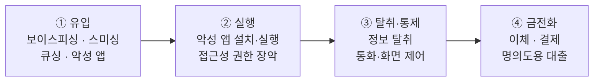

# 공격 흐름 개요

## 1. 이 장에서 다루는 것

금융 악성 앱이 피해자의 단말에 들어오기까지의 **유입 경로**와,
설치 이후 금전 피해에 이르는 **공통 공격 흐름**을 정리합니다.

수법은 달라도 대부분의 금융 사기는 같은 골격을 따릅니다.
이 장에서 그 골격을 세우고, 이후 장에서 각 단계를 구체화합니다.

---

## 2. 공통 공격 흐름

| 단계 | 내용 | 상세 |
| --- | --- | --- |
| ① 유입 | (작성 예정) | 아래 4개 경로 참조 |
| ② 실행 | (작성 예정) | [위협 유형 분석](../01-threat/overview.md) |
| ③ 탈취·통제 | (작성 예정) | [위협 유형 분석](../01-threat/overview.md) |
| ④ 금전화 | (작성 예정) | [공격 시나리오](../02-scenario/overview.md) |

각 단계는 단말에 **흔적을 남기며**, 그 흔적이 곧 탐지 지점이 됩니다.
어떤 흔적이 어떤 필드로 관측되는지는 [탐지 데이터](../03-detection/overview.md)에서 다룹니다.

---

## 3. 주요 유입 경로

| 경로 | 한 줄 정의 | 담당 |
| --- | --- | --- |
| [보이스피싱](entry-01-voicephishing.md) | 사칭 전화로 심리 지배 후 설치 유도 | |
| [스미싱](entry-02-smishing.md) | 문자 내 악성 링크로 유도 | |
| [큐싱](entry-03-qshing.md) | 위·변조 QR코드로 유도 | |
| [악성 앱](entry-04-malapp.md) | 정상 앱으로 위장해 직접 설치 | |

---

## 4. 유입 경로의 공통점

(작성 예정)

---

## 참고 자료

- (작성 예정)
