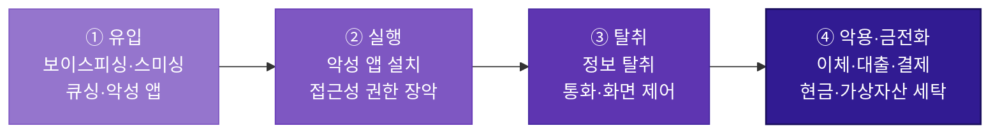
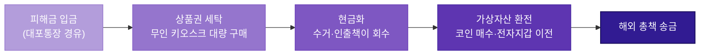

# 공격 흐름

## 1. 하나로 수렴하는 공격

앞서 살펴본 네 가지 주요 위협([보이스피싱](entry-01-voicephishing.md) · [스미싱](entry-02-smishing.md) · [큐싱](entry-03-qshing.md) · [악성 앱](entry-04-malapp.md))은 **유입 방식이 다를 뿐, 그 이후의 진행 과정은 대체로 같은 골격을 따른다.** 이 페이지에서는 그 공통 흐름을 4단계로 정리하고, 각 단계가 이후 장의 어느 내용과 연결되는지를 표시한다.

핵심은 하나다. **공격은 유입 단계에서 여러 갈래로 나뉘지만, 악성 앱 설치·실행 단계에서 하나로 수렴한다.** 유입 경로가 무엇이든 그 이후의 탈취·통제·금전화 과정은 거의 동일하며, 이 수렴 지점이 곧 탐지 설계의 출발점이 된다.

!!! quote "관계당국도 같은 골격을 확인한다"
    금융감독원 금융사기대응단은 2025년 12월 소비자경보에서, 최근 사기가 **피싱사이트 접속 → 개인정보 입력·악성 앱 설치 → 전화번호 조작·정보 탈취·실시간 통제 → 자금 편취**의 순서로 진행된다고 정리했다. 유입 경로만 다를 뿐, 실행 이후의 골격이 정형화되어 있다는 점을 보여준다.

---

## 2. 공통 공격 흐름

*4가지 유형은 유입에서 갈라지지만 실행 단계에서 하나로 수렴한다. 배경이 짙어질수록 단말 장악도와 피해 위험이 높아진다.*

| 단계 | 내용 | 이어지는 장 |
| --- | --- | --- |
| **① 유입** | 문자·전화·QR·광고로 접근해 링크 접속·앱 설치를 유도. 미끼로 신뢰를 확보하는 심리적 유인 단계 | [주요 위협 분석](entry-01-voicephishing.md) |
| **② 실행** | 악성 앱·원격제어 앱 설치, 접근성·SMS·기기관리자 권한 과다 부여. **네 유형이 하나로 수렴하는 지점** | [악성 앱 주요 행위](../01-threat/type-01-loader.md) |
| **③ 탈취** | 개인·금융·인증정보 수집, 통화 가로채기·화면 오버레이·원격제어로 단말 장악 | [악성 앱 주요 행위](../01-threat/type-01-loader.md) |
| **④ 악용·금전화** | 이체·대출·결제로 자산을 빼내고(악용), 이를 현금·가상자산으로 바꿔 조직에 전달(금전화). **모든 공격의 최종 목적** | [공격 시나리오](../02-scenario/scenario-01-card-cancel.md) |

## 3. 최종 목적 : 금전화

이체·대출·결제로 자산을 빼내는 것은 끝이 아니다. 공격의 실제 목적은 **탈취한 자산을 추적할 수 없는 형태로 바꿔 조직에 전달하는 것**이며, 대부분의 사슬은 국외 총책에게 도달하며 끝난다. 금융감독원이 2025년 8월 공개한 신종 자금세탁 흐름이 이를 잘 보여준다.

이 사슬에는 세 가지 특징이 있다.

- **대포통장 확보의 순환 구조** 저신용자에게 "상품권 구매 실적을 쌓으면 대출이 된다"고 속여 통장·카드를 넘겨받고, 이 계좌를 다시 **다른 피해자의 피해금을 받는 대포통장**으로 재활용한다. 한 피해자에게서 확보한 수단이 다음 피해의 도구가 되는 셈이다.
- **여러 형태를 거치는 세탁** 계좌 추적을 끊기 위해 피해금을 상품권으로 바꿔 현금화하고, 다시 가상자산으로 환전해 해외로 보낸다. 계좌·현금·상품권·가상자산을 거치며 자금 흐름의 연결고리를 끊는다.
- **역할 분업** 수거책·인출책·전달책이 나뉘어 있어, 한 명이 검거돼도 조직 전체와 총책은 드러나지 않는다.

**자금이 상품권·가상자산으로 넘어가면 사실상 회수가 불가능하다.** 

따라서 방어의 실효성은 금전화가 완료되기 전, 즉 실행~악용 단계에서 흔적을 포착하느냐에 달려 있다. 제도적으로도 2025년 10월부터 개정 통신사기피해환급법에 따라 가상자산 의심거래 탐지·계좌정지·피해자금 환수가 가능해지는 등, 금전화 단계를 겨냥한 차단 장치가 강화되고 있다.

---

## 4. 유입 경로별 비교

유입 단계에서만 경로가 갈린다. 아래 세 경로는 접점과 피해자 행동이 서로 다르지만, **모두 악성 앱 실행이라는 같은 종착점**으로 이어진다.

| 유입 경로 | 접점 | 피해자가 수행하는 행동 |
| --- | --- | --- |
| [보이스피싱](entry-01-voicephishing.md) | 전화 | 발신번호 변조 전화를 받고 사칭에 속아 앱 설치·정보 제공·이체를 직접 수행 |
| [스미싱](entry-02-smishing.md) | 문자 | 문자 내 URL 클릭 → 피싱사이트 입력 또는 APK 설치 |
| [큐싱](entry-03-qshing.md) | QR코드 | QR 스캔(목적지 은닉 상태) → 피싱사이트 또는 APK 설치 |

!!! info "악성 앱은 유입 경로가 아니라 '수렴 지점'이다"
    악성 앱은 위 세 경로가 공통으로 도달하는 **실행 도구**다. 유입 방식(문자·전화·광고)을 가리지 않고 설치를 유도하며, 이후 접근성 악용·원격제어·전화 가로채기로 단말을 장악한다. 따라서 별도 유입 경로로 나열하지 않고 ② 실행 단계에서 통합해 다룬다.

---

## 5. 탐지 관점에서의 의미

각 단계는 단말에 **흔적을 남기며, 그 흔적이 곧 탐지 지점이 된다.** 주목할 점은 단계별로 탐지 난이도가 다르다는 것이다.

| 단계 | 관측되는 흔적 | 탐지 난이도 |
| --- | --- | --- |
| ① 유입 | 출처 불명 URL, 발신번호 변작, QR 스캔 이력 | **높음**  유형마다 다르고, 큐싱은 통신망 밖에 존재하며 사용자 인지에 의존 |
| ② 실행 | 비공식 경로 설치, 접근성·기기관리자·화면공유 권한 활성화 | **낮음** 단말 내부에 명확한 상태 신호로 남음 |
| ③ 탈취 | 의심 C2 통신, 원격제어 구동, 인증문자 가로채기, 화면 오버레이 | **낮음**  행위 기반 관측 가능 |
| ④ 악용·금전화 | 신규 수취인, 기기·인증수단 변경 직후 고액·연속 거래, 상품권 대량 구매, 가상자산 환전 | **중간** 거래 데이터로 관측 가능하나 **가상자산 이전 후에는 회수 곤란** |

여기서 방어 전략의 방향이 나온다. **유입 차단은 유형마다 달라 한계가 뚜렷한 반면, 실행 이후 단계는 유형과 무관하게 단말에 공통된 흔적을 남긴다.** 따라서 방어의 무게중심은 "유입을 막는 것"에서 "실행 이후의 흔적을 탐지하는 것"으로 이동해야 한다.

네 유형이 실행 단계에서 하나로 수렴한다는 사실은 곧 **하나의 탐지 체계로 네 유형을 모두 포괄할 수 있다는 근거**가 된다. 범죄를 완벽히 막을 수는 없어도 **흔적은 반드시 남으며**, 그 흔적을 어떤 필드로 관측하는지는 [탐지 데이터](../03-detection/api-01-deviceinfo.md) 장에서, 흔적을 조합해 실제 공격을 판별하는 방법은 [공격 시나리오](../02-scenario/scenario-01-card-cancel.md) 장에서 다룬다.

---

## 참고 자료

- 금융감독원 금융사기대응단, 소비자경보 — 피싱사이트·악성앱·원격제어 결합 흐름 (2025.12) [🔗](https://www.fss.or.kr)
- 금융감독원, 상품권 이용 신종 자금세탁형 보이스피싱 소비자경보 (2025.8.9) [🔗](https://www.fss.or.kr)
- 금융위원회, 제2차 금융권 보이스피싱 근절 협의회 — 대포통장·가상자산 대응 (2025.8) [🔗](https://www.fsc.go.kr)
- 각 유형별 세부 출처는 [보이스피싱](entry-01-voicephishing.md) · [스미싱](entry-02-smishing.md) · [큐싱](entry-03-qshing.md) · [악성 앱](entry-04-maliciousapp.md) 페이지 참조

