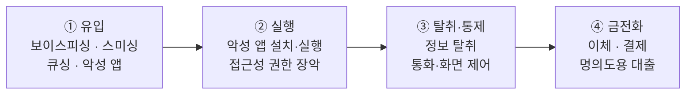

# 공격 흐름

## 1. 이 페이지에서 다루는 것

앞서 살펴본 네 가지 주요 위협([보이스피싱](entry-01-voicephishing.md) · [스미싱](entry-02-smishing.md) · [큐싱](entry-03-qshing.md) · [악성 앱](entry-04-malapp.md))은
유입 방식이 다를 뿐, 그 이후의 진행 과정은 대체로 같은 골격을 따릅니다.

이 페이지에서는 그 **공통 흐름**을 정리하고, 각 단계가 이후 장의 어느 내용과 연결되는지를 표시합니다.

---

## 2. 공통 공격 흐름

| 단계 | 내용 | 이어지는 장 |
| --- | --- | --- |
| ① 유입 | (작성 예정) | [주요 위협 분석](entry-01-voicephishing.md) |
| ② 실행 | (작성 예정) | [악성 앱 주요 행위](../01-threat/type-01-loader.md) |
| ③ 탈취·통제 | (작성 예정) | [악성 앱 주요 행위](../01-threat/type-01-loader.md) |
| ④ 금전화 | (작성 예정) | [공격 시나리오](../02-scenario/scenario-01-card-smishing.md) |

---

## 3. 유입 경로별 비교

| 유입 경로 | 접점 | 피해자가 수행하는 행동 | 담당 |
| --- | --- | --- | --- |
| [보이스피싱](entry-01-voicephishing.md) | 전화 | (작성 예정) | |
| [스미싱](entry-02-smishing.md) | 문자 | (작성 예정) | |
| [큐싱](entry-03-qshing.md) | QR코드 | (작성 예정) | |
| [악성 앱](entry-04-malapp.md) | 앱 설치 | (작성 예정) | |

---

## 4. 탐지 관점에서의 의미

각 단계는 단말에 **흔적을 남기며**, 그 흔적이 곧 탐지 지점이 됩니다.
어떤 흔적이 어떤 필드로 관측되는지는 [탐지 데이터](../03-detection/api-01-deviceinfo.md)에서 다룹니다.

(작성 예정)

---

## 참고 자료

- (작성 예정)
