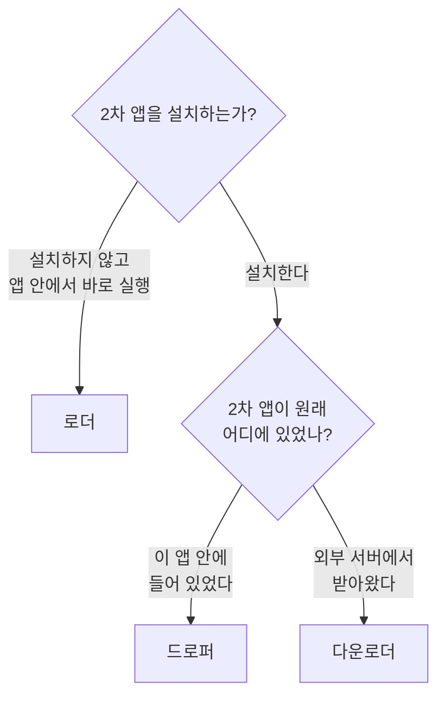
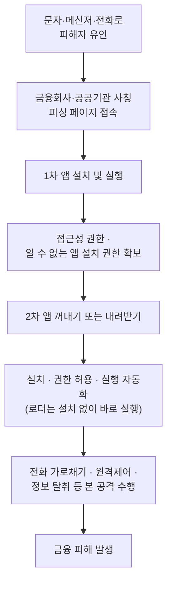
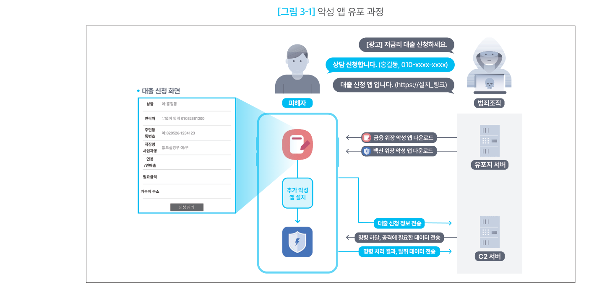
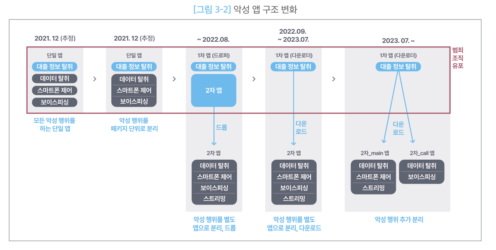

# 로더·드로퍼·다운로더형

## 1. 개요

이 유형은 **직접 돈을 빼가는 앱이 아니다.** 진짜 악성 기능을 가진 앱을 피해자 휴대폰에 들여보내는 것이 목적인 **첫 번째 앱**이다. 겉모습은 정상 앱이고, 하는 일은 "문을 열어주는 것"뿐이다.

국내 보이스피싱에서는 이 구조가 반복해서 확인된다. **금융회사나 공공기관 앱으로 위장한 1차 앱이 먼저 설치**되고, 그 앱이 **전화 가로채기·원격제어·정보 탈취를 실제로 수행하는 2차 앱을 설치**한다.

### 1-1. 세 가지 방식

이름이 세 개인 이유는 **2차 앱을 들여보내는 방법이 다르기** 때문이다.

- **드로퍼(Dropper)** — 2차 앱을 **자기 안에 숨겨서** 들어온다. 나중에 그것을 꺼내 설치한다.
- **다운로더(Downloader)** — **빈손으로** 들어온다. 설치된 뒤에 인터넷으로 2차 앱을 받아서 설치한다.
- **로더(Loader)** — 2차 앱을 **설치하지 않는다.** 악성 코드를 1차 앱 안에서 바로 실행해 버린다.

| 방식 | 2차 앱을 어디서 가져오나 | 2차 앱을 설치하나 |
| --- | --- | --- |
| 드로퍼 | 자기 안에 미리 넣어 옴 | 설치함 |
| 다운로더 | 외부 서버에서 받아옴 | 설치함 |
| 로더 | 내부·외부 모두 가능 | **설치하지 않음** |

셋 중 **로더만 성격이 조금 다르다.** 드로퍼와 다운로더는 "악성 코드를 어디서 가져오는가"의 차이지만, 로더는 "가져온 것을 설치하지 않고 바로 실행한다"는 점이 다르다. 그래서 실제 악성 앱은 *드로퍼이면서 로더*처럼 두 성격을 함께 갖는 경우도 있다. 자료에 따라 로더를 세 방식의 상위 개념으로 쓰기도 하지만, **본 문서는 위 표대로 셋을 나란히 구분한다.**

### 1-2. 새로 발견한 앱을 어느 방식으로 볼 것인가

1차 앱이 직접 정보 탈취까지 하는 경우도 있다. 그때는 [개인·단말정보 탈취형](type-02-deviceinfo.md) 문서를 함께 본다.

---

## 2. 국내 확인 사례

국내 보이스피싱에서는 **금융회사·공공기관을 사칭한 1차 앱 → 백신을 사칭한 2차 앱** 순서로 설치되는 구조가 반복 확인된다. 1차 앱은 대출 상담 같은 명목으로 피해자가 직접 받게 하고, 2차 앱은 1차 앱이 스스로 가져온다.

금융보안원(FSI)의 **[Operation BlackEcho](https://www.fsec.or.kr/bbs/detail?bbsNo=11611&menuNo=244)** 보고서가 이 구조를 가장 자세히 다룬 공식 자료다. 2023년 7월부터 약 1년간 수집한 악성 앱 약 900여 개를 분석했고, 악성 앱을 **1차 / 2차 / 2차_main / 2차_call** 네 종류로 나눠 정리했다.

유입 경로는 [보이스피싱](../00-flow/entry-01-voicephishing.md) · [스미싱](../00-flow/entry-02-smishing.md) 문서를 참고한다.

---

## 3. 핵심 기능

세 방식을 **같은 항목으로 정리**했다. 강점과 약점은 모두 **공격자 관점**이다.

### 3-1. 드로퍼

- **동작 방식**
    - 2차 앱을 자기 안에 넣어 두고, 때가 되면 꺼내서 설치한다.
    - 계산기·파일 관리자·문서 뷰어·VPN·게임처럼 **실제로 잘 작동하는 앱**으로 위장한다.
    - 안드로이드에서는 보통 앱 내부의 `assets` 폴더에 2차 APK를 넣어 둔다.
    - 처음에는 악성 기능 없이 배포되어 검사를 통과한 뒤, 사용자가 한동안 쓰면서 앱을 믿게 되고 업데이트·권한 요청에 무감각해진 시점에 2차 앱을 설치한다. **먼저 신뢰를 얻고 나중에 공격하는 시간차 방식**이다.
- **강점**
    - 검사받는 시점에는 악성 코드가 작동하지 않아 정적 분석·동작 시뮬레이션·머신러닝 기반  자동 검사를 통과한다.
    - 잠복 중에는 익스플로잇 코드나 의심스러운 권한 사용이 없어, 조사해도 조치할 근거를 찾기 어렵다.
    - 추가 통신이 발생하지 않으므로 트래픽을 보는 탐지를 피하기 쉽다.
    - 한 변종이 백신에 등재되어도 다른 변종을 배포하면 된다.
- **약점**
    - 2차 앱을 품고 있어 APK 용량이 크고, `assets` 안의 정체불명 대용량 파일 자체가 백신의   추가 분석 대상이 된다.
    - 2차 앱 기능을 바꾸려면 1차 앱을 다시 배포해야 한다.

### 3-2. 다운로더

- **동작 방식**
    - 설치될 때는 악성 코드를 전혀 갖고 있지 않다. 실행된 뒤에 외부 유포지 서버에서 2차 앱을  받아 설치한다.
    - APK 크기가 작고 실행 명령이 간결하다.
    - 정상 앱도 인터넷에서 파일을 받는 일이 흔하므로, 파일을 받는 행위 자체만으로는 악성으로 판단할 수 없다.
- **강점**
    - 앱 안에 악성 코드가 없어 설치 전 검사가 아무 의미가 없다.
    - 백신에 걸린 2차 앱은 서버 파일만 바꾸면 되고, 1차 앱은 그대로 쓴다.
    - 수집한 단말·통신 정보를 보고 대상별로 다른 2차 앱을 내려보낼 수 있다.
    - 유포지를 계속 갈아탈 수 있다(아래 표).
- **약점**
    - 2차 앱이 인터넷을 지나올 때 검사에 노출된다.
    - 통신이 차단되면 2차 감염 자체가 실패한다.
    - 서버 접속 흔적이 남는다.

국내 사례에서 확인된 유포지 변화는 다음과 같다. 한 곳이 막히면 다른 종류의 서비스로 갈아타 왔다.

| 시기 | 유포지로 사용한 것 |
| --- | --- |
| 2022.09 ~ 2023.01 | C2 서버 |
| 2023.01 ~ 2024.07 | 파일 공유 서비스 |
| 2023.12 ~ 2024.03 | 호스팅 서비스 |
| 2024.07 ~ | 별도 유포 서버 |

### 3-3. 로더

- **동작 방식**
    - 2차 앱을 설치하지 않는다. 악성 코드(주로 DEX·JAR 파일)를 1차 앱 안에서 바로 불러 실행한다.
    - 안드로이드에서는 `DexClassLoader`·`InMemoryDexClassLoader` 같은 기능을 이용한다.
    - 악성 코드를 암호화해 두고 실행 직전에만 풀어 쓴다. 파일로 저장하지 않고 메모리에서 바로 실행할 수도 있다.
- **강점**
    - 설치 화면이 뜨지 않아 피해자가 알아챌 기회가 아예 없다.
    - 휴대폰 앱 목록을 뒤져도 2차 앱이 없다.
    - 앱을 설치하지 않으므로 `REQUEST_INSTALL_PACKAGES` 권한을 요구하지 않는다.
    - 설치된 앱 목록·설치 기록·설치 권한을 근거로 하는 탐지가 전부 빗나간다.
- **약점**
    - 1차 앱이 지워지면 악성 코드도 같이 사라진다. 설치형과 달리 혼자 살아남지 못한다.

### 3-4. 세 방식 비교

| 구분 | 드로퍼 | 다운로더 | 로더 |
| --- | --- | --- | --- |
| 2차 앱 위치 | 1차 앱 안 (`assets` 등) | 외부 서버 | 내부·외부 모두 가능 |
| 2차 앱 설치 | 설치함 | 설치함 | **설치하지 않음** |
| 앱 용량 | 크다 | 작다 | 코드를 품으면 커짐 |
| 설치 전 검사 | 숨긴 파일이 흔적으로 남음 | 통과함 | 암호화 시 통과함 |
| 통신 흔적 | 거의 없음 | 2차 앱 수신 통신 발생 | 외부에서 받을 때만 발생 |
| 앱 목록 노출 | 노출됨 | 노출됨 | **노출 안 됨** |
| 피해자가 알아챌 기회 | 설치 화면이 뜸 | 설치 화면이 뜸 | **없음** |
| 2차 앱 교체 | 1차 앱을 다시 배포해야 함 | 서버 파일만 교체 | 외부에서 받으면 서버만 교체 |
| 1차 앱 삭제 시 | 2차 앱은 남음 | 2차 앱은 남음 | **악성 코드도 사라짐** |

---

## 4. 전체 공격 흐름

같은 흐름을 서버 쪽까지 그린 그림이다. **유포지 서버**에서 금융 위장 앱과 백신 위장 앱을 각각 내려받고, 설치된 뒤에는 **C2 서버**와 명령·데이터를 주고받는다. 서버가 둘로 나뉘어 있다는 점이 눈에 띈다.

여기서 **접근성 권한이 핵심 도구**다. 접근성 기능은 화면의 버튼을 대신 눌러줄 수 있어서, 1차 앱이 "설치 → 열기 → 허용" 버튼을 스스로 눌러 사용자 손을 거치지 않고 2차 앱 설치를 끝낸다. 피해자에게는 화면이 빠르게 넘어가는 자동 설정 과정처럼 보인다.

1차 앱이 실제로 하는 일과 피해자가 보는 화면은 단계마다 이렇게 어긋난다.

| 단계 | 1차 앱이 실제로 하는 일 | 피해자가 보는 모습 |
| --- | --- | --- |
| 위장 | 금융회사·공공기관 화면 표시 | 대출 신청·피해 확인·보안 점검 앱 |
| 권한 확보 | 접근성·저장소·앱 설치 권한 요청 | 서비스 이용에 필요한 절차로 오인 |
| 환경 확인 | 단말·앱 정보 전송, 2차 앱 정보 확인 | 화면에 거의 드러나지 않음 |
| 2차 앱 전달 | 내장 APK 꺼내기 또는 서버에서 받기 | 백신·보안 앱 설치나 업데이트로 표시 |
| 설치 자동화 | 설치·열기·허용 버튼 자동 선택 | 화면이 빠르게 넘어가 자동 설정처럼 보임 |
| 본체 실행 | 2차 앱 실행 및 권한 허용 | 설치가 끝난 것으로 인식 |

전체 공격 단계에서 이 유형의 위치는 [공격 흐름 개요](../00-flow/overview.md)를 참고한다.

---

## 5. 실제 사례에서 확인된 구조

### 5-1. 하나였던 앱이 쪼개져 온 과정

시기별로 정리하면 다음과 같다.

| 시기 | 1차 앱 | 2차 앱 | 무엇이 달라졌나 |
| --- | --- | --- | --- |
| 2021.12 (추정) | 단일 앱 — 대출 정보 탈취 · 데이터 탈취 · 스마트폰 제어 · 보이스피싱 | 없음 | 모든 악성 행위를 하는 단일 앱 |
| 2021.12 (추정) | 단일 앱 (기능 동일) | 없음 | 악성 행위를 패키지 단위로 분리 |
| ~ 2022.08 | **드로퍼** — 대출 정보 탈취 + 2차 앱 내장 | 데이터 탈취 · 스마트폰 제어 · 보이스피싱 · 스트리밍 | 악성 행위를 별도 앱으로 분리, **드롭** |
| 2022.09 ~ 2023.07 | **다운로더** — 대출 정보 탈취 | 위와 동일 | 별도 앱으로 분리, **다운로드** |
| 2023.07 ~ | **다운로더** — 대출 정보 탈취 | **2차_main** (데이터 탈취 · 스마트폰 제어 · 스트리밍) / **2차_call** (데이터 탈취 · 보이스피싱) | 악성 행위 추가 분리 |

두 가지를 눈여겨볼 만하다.

- **드로퍼에서 다운로더로 넘어갔다.** 2022년 8월까지는 2차 앱을 품고 다녔지만(드롭), 그 뒤로는 서버에서 받아오는 방식(다운로드)으로 바뀌었다.
- **전화 기능이 따로 떨어져 나갔다.** 2023년 7월부터 2차 앱이 둘로 갈라지면서, 보이스피싱·전화 관련 기능만 담당하는 `2차_call` 앱이 생겼다.

### 5-2. 1차 앱과 2차 앱은 오는 길이 다르다

위 그림에서 붉은 테두리로 묶인 부분이 **범죄 조직이 직접 유포하는 범위**다. 조직은 1차 앱만 뿌리고,  2차 앱은 1차 앱이 알아서 가져온다.

| 구분 | 위장 대상 | 누가 받아오나 |
| --- | --- | --- |
| 1차 앱 | 금융회사·공공기관 앱 | **피해자가 링크를 눌러 직접** 받는다 |
| 2차 앱 | 백신·보안 앱 | **1차 앱이 스스로** 받아온다 |

쪼개진 2차 앱이 실제로 하는 일은 [통화·문자 제어형](type-04-callcontrol.md) · [원격제어·화면감시형](type-05-remotecontrol.md) · [개인·단말정보 탈취형](type-02-deviceinfo.md) 문서에서 다룬다.

---

## 6. 공격자가 이 방식을 쓰는 이유

- **탐지를 피하기 위해서** — 앱 하나가 카메라·마이크·통화·화면 녹화 권한을 한꺼번에 요구하면  누가 봐도 수상하다. 백신 앱과 전화 앱으로 나누면 각각의 권한 요청이 자연스러워진다.
- **피해자를 안심시키기 위해서** — 1차 앱은 권한이 적고 대출 신청 앱처럼 보인다. 위험한 기능은 백신으로 위장한 2차 앱에 넣어, 피해자가 추가 설치를 "금융 앱의 정상 보안 절차"로 받아들이게 만든다.
- **쉽게 고치기 위해서** — 2차 앱 기능을 바꿔도 서버 파일만 교체하면 된다. 1차 앱을 다시 뿌릴 필요가 없어 백신에 걸려도 금방 복구한다.
- **오래 살아남기 위해서** — 여러 앱으로 나눠 두면 하나가 지워져도 나머지가 계속 동작한다.
- **분석을 늦추기 위해서** — 1차 앱만 확보해서는 실제 전화 가로채기·원격제어 코드를 볼 수 없다. 서버가 꺼져 있거나 조건이 맞지 않으면 2차 앱이 내려오지 않아, 자동 분석 환경에서 전체 기능이 드러나지 않는다.

---

## 7. 탐지 관점 정리

### 7-1. 방식별로 봐야 할 흔적

| 방식 | 주요 흔적 |
| --- | --- |
| 드로퍼 | `assets` 폴더의 정체불명 대용량 파일 · 기능에 비해 지나치게 큰 앱 용량 |
| 다운로더 | `INTERNET` + `REQUEST_INSTALL_PACKAGES` 권한 조합 · 숨겨진 접속 주소(C2) · 설치 직후가 아닌 **한참 뒤의 첫 통신** · 앱 기능과 무관한 도메인 접속 |
| 로더 | 암호화된 `.dex`·`.jar`·`.so` 파일 · `DexClassLoader`·`InMemoryDexClassLoader` 호출 · 앱 폴더에 실행 중 생겨나는 `dex` 파일 |

특히 **로더는 설치 흔적이 없으므로**, 설치 앱 목록과 설치 권한만 확인하는 룰로는 잡히지 않는다.

### 7-2. 단계가 진행될수록 탐지가 쉬워진다

문제는 **탐지가 쉬워지는 시점이 이미 피해가 시작된 시점**이라는 것이다.

| 단계 | 무슨 일이 일어나나 | 탐지 난이도 |
| --- | --- | --- |
| 1. 설치 직후 | 정상 앱처럼 작동, 악성 행위 없음 | 높음 (정상으로 보임) |
| 2. 뒤늦은 활성화 | 서버에 접속해 암호화된 2차 앱 수신 | 중간 (암호화 통신) |
| 3. 실행 | 2차 앱 설치·실행, 접근성 권한 악용 | 중간 (난독화) |
| 4. 명령 수신 | 외부 명령 수신, 정보 유출, 사기 행위 시작 | 낮음 (행위가 드러남) |

!!! warning "가장 어려운 점"
    이 유형은 **감염 초기에 결정적인 증거가 아예 없다.** 설치 전 검사도 통과하고 첫 통신도 늦게 일어나므로, 모든 항목이 정상으로 보이는 상태가 오히려 이 유형의 특징이다. 따라서 하나의 값만 보고 판단하기보다, **권한 조합·통신 지연·설치 자동화가 이어지는 순서**와 시간 간격을 함께 봐야 한다.

---

## 참고 자료

- 금융보안원, 「금융 및 백신 앱으로 위장한 보이스피싱 악성 앱 프로파일링」(FSI Intelligence Report · Operation BlackEcho), 2024.12 — <https://www.fsec.or.kr/bbs/detail?bbsNo=11611&menuNo=244>
- Rise of Dropper Malware: Android Bypass of Play Protect (2026) — <https://rehutalwar.com/blog/rise-of-dropper-malware-android-bypass-play-protect-2026>
- 시큐리온 블로그 · 드로퍼 악성코드 분석 — <https://blog.securion.co.kr/blog/post_dropper/>
- 용어 정의는 [부록 · 용어 정리](../99-appendix/glossary.md) 참고
