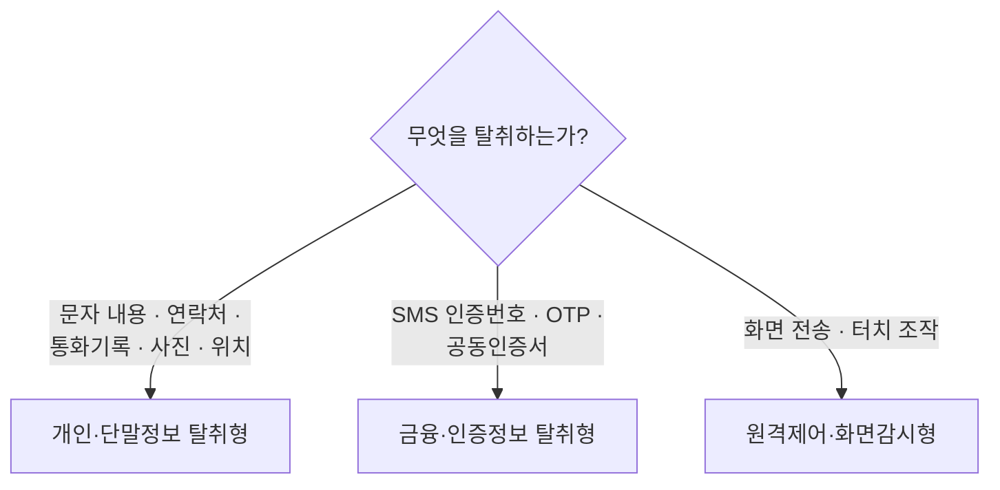
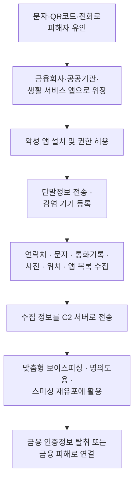
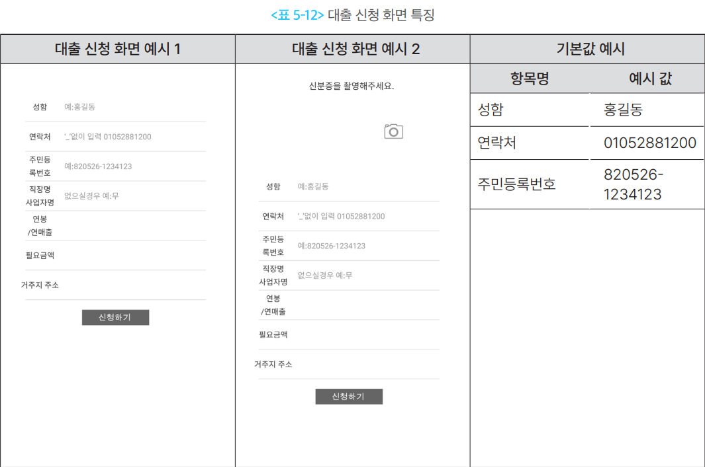
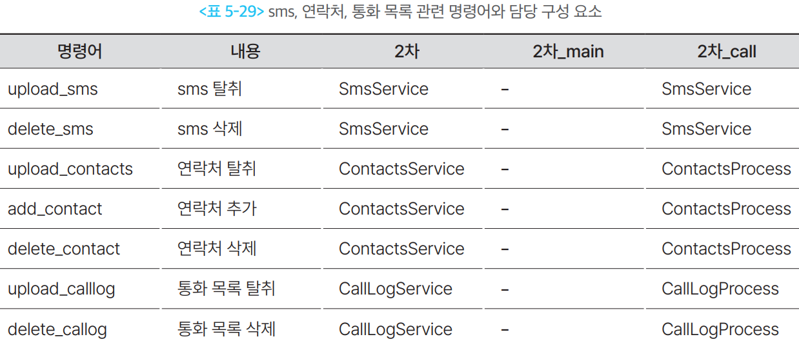

# 개인·단말정보 탈취형

## 1. 개요

이 유형은 스마트폰에 저장된 **피해자의 개인정보와 단말 환경정보를 수집해 공격자에게 보내는** 악성 앱이다.

이 정보만으로 곧바로 돈이 빠져나가지는 않는다. 대신 **다음 공격을 준비하는 재료**가 된다. 피해자를   더 정확하게 속이고, 명의를 도용하고, 지인에게 스미싱을 다시 뿌리고, 어떤 보안 앱이 깔려 있는지 미리 확인하는 데 쓰인다. 그래서 **당장 피해가 보이지 않는 것이 이 유형의 특징**이다.

### 1-1. 두 종류의 정보

- **개인정보** — 피해자와 그 주변 사람을 파악하기 위한 정보
- **단말정보** — 감염된 기기와 설치 환경을 파악하기 위한 정보

| 구분 | 수집하는 것 | 공격자가 쓰는 곳 |
| --- | --- | --- |
| 개인 식별정보 | 이름, 전화번호, 주민등록번호, 주소, 직장정보 | 피해자 사칭, 명의도용, 맞춤형 기망 |
| 관계·통신정보 | 연락처, 문자, 통화기록 | 지인 관계 파악, 스미싱 재유포, 통화 상황 확인 |
| 사진·파일 | 신분증, 서류, 금융 관련 사진 | 본인확인 악용, 명의도용 |
| 위치정보 | 네트워크 위치, GPS 좌표 | 피해자의 현재 위치와 행동 상태 확인 |
| 단말정보 | 기기 모델명, 브랜드, 통신사, OS 버전, 기기 식별자 | 감염 단말 식별 및 관리 |
| 설치 앱 정보 | 앱 이름, 패키지명, 버전, 설치일 | 이용 중인 금융 앱·보안 앱 확인 |

### 1-2. 다른 유형과 헷갈리는 지점

무엇을 가져가느냐로 구분한다.

하나의 앱이 여러 기능을 함께 가지는 경우가 많다. 앱 이름이나 분류가 아니라 **실제로 수행하는 기능**을 기준으로 판단한다. 각각은 [금융·인증정보 탈취형](type-03-credential.md) · [원격제어·화면감시형](type-05-remotecontrol.md) 문서에서 다룬다.

---

## 2. 국내 확인 사례

최근 국내 사례에서도 **단말정보 확인 → 문자·사진·연락처 탈취 → 감염 단말 재악용**이라는 구조가 반복해서 나타난다.

| 시기 | 사례 | 확인된 탈취 정보 |
| --- | --- | --- |
| 2025.03 | [경찰청교통민원24 등 경찰 사칭 스미싱](https://www.boho.or.kr/kr/bbs/view.do?bbsId=B0000133&nttId=71689&menuNo=205020) | 기기명·IMEI 등 단말정보, 연락처, 문자 메시지 |
| 2025.09 | [휴대폰 소액결제 피해 등 사회적 이슈를 악용한 스미싱](https://www.boho.or.kr/kr/bbs/view.do?bbsId=B0000133&nttId=71862&menuNo=205021) | 소액결제 조회를 빌미로 한 악성앱 설치 유도 · 휴대폰 주요권한 탈취 |
| 2026.01 | [정부기관·싱크탱크 사칭 큐싱](https://www.boho.or.kr/kr/bbs/view.do?bbsId=B0000133&nttId=71936&menuNo=205020) | 기기명·IMEI·핸드폰 정보 등 단말정보, 문자 메시지·사진 |
| 2026.03 | [불법 스트리밍 앱을 통한 개인정보 유출·문자 무단 발송](https://www.boho.or.kr/kr/bbs/view.do?bbsId=B0000133&nttId=72007&menuNo=205020) | 수신 문자 탈취, 감염 단말로 불법 문자 발송 |

두 가지가 눈에 띈다.

**하나. 감염된 스마트폰이 공격 도구가 된다.** 2026년 3월 불법 스트리밍 앱 사례에서 악성 앱은 수신 문자를 훔치는 데 그치지 않고, **피해자 번호로 도박 스팸 문자를 대량 발송**했다. 방송미디어통신위원회와 KISA는 이렇게 악용된 번호가 **통신사 약관에 따라 이용정지될 수 있고 보상도 받을 수 없다**고 안내했다. 정보를 잃는 것을 넘어 피해자가 가해자로 오인되는 상황까지 간다.

**둘. 연락처가 재유포 경로가 된다.** KISA는 스미싱 공지의 2차 피해 예방 안내에서 악성 앱이 **주소록을 조회해 다른 사람에게 비슷한 스미싱을 발송**할 수 있다고 반복해 경고한다. 연락처 탈취가 단순한 정보 유출이 아니라 다음 감염의 출발점이라는 뜻이다.

유입 경로는 [스미싱](../00-flow/entry-02-smishing.md) · [큐싱](../00-flow/entry-03-qshing.md) 문서를 참고한다.

---

## 3. 핵심 기능

정보를 가져가는 방법은 크게 두 가지다. **피해자가 직접 입력하게 만들거나, 권한을 얻어 몰래 읽어가거나.**

### 3-1. 직접 입력하게 만드는 방식

금융회사·공공기관 앱으로 위장한 화면을 띄우고, 피해자가 스스로 정보를 적어 넣게 한다.

- **동작 방식**
    - 대출 신청·본인확인·피해 접수 같은 명목의 입력 화면을 보여준다.
    - 화면은 앱 안에 들어 있는 HTML 파일이거나, 외부 피싱 페이지를 웹뷰로 띄운 것이다.
    - 입력값은 "신청하기" 버튼을 누르는 순간 C2 서버로 전송된다.
- **주로 받아내는 정보**
    - 이름, 연락처, 주민등록번호
    - 직장명·사업자명, 연 소득, 주소
    - 필요한 대출 금액
    - 신분증 사본
- **탐지가 어려운 이유**
    - 권한을 요구하지 않는다. 사용자가 직접 입력하므로 **권한 기반 탐지에 아무것도 걸리지 않는다.**
    - 화면이 앱 안에 들어 있으면 통신 흔적도 전송 순간에만 발생한다.

### 3-2. 권한으로 몰래 읽어가는 방식

설치 시 광범위한 권한을 요구하고, 허용되면 단말 내부를 읽어 서버로 보낸다.

- **동작 방식**
    - 백신·보안 앱으로 위장해 "검사에 필요하다"며 권한을 요구한다.
    - 권한이 허용되면 먼저 **단말정보를 보내 감염 기기를 등록**하고, 이후 서버 명령에 따라 항목별로 수집한다.
    - 수집한 파일은 앱 내부 폴더에 잠시 복사한 뒤 하나씩 전송한다.
- **수집 방식의 특징**
    - 전부 한 번에 가져가지 않는다. **필요할 때 명령을 내려 항목별로** 가져간다.
    - 통화기록처럼 양이 많은 항목은 **최근 100개**처럼 개수를 제한한다.
    - 문자는 **공격자가 지정한 날짜 이후**의 것만 가져가기도 한다.
- **탐지가 어려운 이유**
    - 백신 앱은 원래 권한을 많이 요구하므로 사용자가 의심하지 않는다.
    - 설치 직후에는 아무 일도 일어나지 않고, 명령이 올 때만 동작한다.

### 3-3. 항목별로 필요한 권한

탐지 관점에서 중요한 부분이다. **앱의 표면적 기능과 무관한 권한 조합**이 나타나면 의심 신호다.

| 수집 항목 | 필요한 권한 |
| --- | --- |
| 문자 내용 | `READ_SMS` · `RECEIVE_SMS` (발송까지 하면 `SEND_SMS`) |
| 연락처 | `READ_CONTACTS` |
| 통화기록 | `READ_CALL_LOG` |
| 사진·미디어 | `READ_EXTERNAL_STORAGE` (Android 12 이하) · `READ_MEDIA_IMAGES` (Android 13 이상) |
| 위치 | `ACCESS_COARSE_LOCATION` · `ACCESS_FINE_LOCATION` |
| 설치 앱 목록 | `QUERY_ALL_PACKAGES` (Android 11 타깃부터 앱 목록 조회가 기본 차단되며, 구글 플레이가 고위험 권한으로 분류해 사전 승인을 요구) |

단말 식별자에는 사정이 좀 다르다. **Android 10부터 일반 앱은 IMEI 같은 하드웨어 식별자를 읽을 수 없다.** 그래서 실제 악성 앱은 `ANDROID_ID`나 기기 모델명·브랜드·통신사·OS 버전을 조합해 감염 단말을 구분한다. `ANDROID_ID`는 공장초기화를 하면 값이 바뀐다.

---

## 4. 전체 공격 흐름

여기서 **감염 기기 등록이 먼저**라는 점이 중요하다. 정보를 훔치기 전에 "이 기기가 누구인지"부터 서버에 알린다. 이후 모든 수집 명령은 그 식별자를 기준으로 이뤄진다.

---

## 5. 실제 사례에서 확인된 구조

금융보안원 **[Operation BlackEcho](https://www.fsec.or.kr/bbs/detail?bbsNo=11611&menuNo=244)** 보고서에서 이 유형의 동작이 구체적으로 확인된다. 1차 앱과 2차 앱이 **서로 다른 방식으로** 정보를 가져간다.

### 5-1. 1차 앱 — 피해자가 직접 입력하게 한다

대출 신청 앱으로 위장해 입력 화면을 띄우고, 피해자가 적어 넣은 값을 그대로 서버로 보낸다. 실제로 전송되는 항목은 다음과 같다.

| 전송 항목 | 내용 |
| --- | --- |
| 성함 · 연락처 · 주민등록번호 | 피해자 식별의 핵심 |
| 직장명 / 사업자명 | 소득 규모 추정, 사칭 시나리오 구성 |
| 연봉 / 연매출, 필요 금액 | 대출 상담을 그럴듯하게 이어가기 위한 정보 |
| 거주지 주소 | 명의도용·우편물 이용 |

여기에 더해 **신분증 사본을 탈취하기도 한다.** 위 항목들이 한 번에 서버로 전송되는 것과 달리, 신분증은 별도로 촬영을 요구하는 방식이다.

입력 화면에는 예시값까지 채워져 있었다. `홍길동` / `01052881200` / `820526-1234123` 같은 형태다. 피해자가 무엇을 어떤 형식으로 적어야 하는지까지 유도한 셈이다.

### 5-2. 2차 앱 — 단말 내부를 몰래 수집한다

권한이 허용되면 먼저 단말정보를 보내 감염 기기를 등록하고, 이후 명령에 따라 항목별로 수집한다.

| 탈취 대상 | 실제 동작 |
| --- | --- |
| 단말정보 | 기기 식별자, 모델명, 브랜드, 통신사, OS 버전, 앱 정보를 전송 (공격자가 감염 단말과 악성 앱을 관리하기 위한 것으로 추정) |
| 문자 | 공격자가 지정한 날짜 이후 문자의 전화번호·내용·시간·유형(수신/발신/작성중/실패/대기) 수집 |
| 연락처 | 전체 연락처의 이름·전화번호 수집 |
| 통화기록 | 최근 통화목록 100개의 시간·전화번호·이름·통화시간·유형(수신/발신/부재/음성메일/거부) 수집 |
| 사진 | 외부 저장소의 이미지를 앱 내부 폴더로 복사한 뒤 하나씩 서버로 전송 |
| 위치 | 네트워크 위치를 우선 사용하고, 확인되지 않으면 GPS 좌표를 전송 |
| 앱 목록 | 앱 이름·패키지명·버전·설치일·업데이트일을 전송 |

**가져가기만 하는 것이 아니다.** 같은 계열의 명령에 **연락처 추가**와 **문자·연락처·통화기록 삭제**가 함께 들어 있다. 연락처를 심을 수 있다는 것은 공격자의 번호를 금융회사 이름으로 저장해 둘 수 있다는 뜻이고, 지울 수 있다는 것은 주고받은 문자나 통화 흔적을 없앨 수 있다는 뜻이다. 피해자가 나중에 확인해도 이상한 점을 찾지 못하게 된다.

보고서도 이 기능이 **2단계 인증을 위한 문자 탈취, 보이스피싱을 위한 연락처 추가와 통화목록 삭제**에 악용될 수 있다고 짚는다. 문자 탈취가 [금융·인증정보 탈취형](type-03-credential.md)으로 이어지는 지점이다.

수집한 데이터는 곧바로 전송되지 않는다. **먼저 앱 내부에 파일로 저장한 뒤 서버로 보낸다.** 저장 경로가 `dirsms` · `dircall` 처럼 고유해서 **파일 구조 자체가 탐지 지표**가 된다. 전송 경로도 항목별로 나뉘어 있고, 문자 삭제처럼 데이터를 바꾼 경우에도 결과를 따로 서버에 알린다.

### 5-3. 기능이 두 앱으로 나뉘어 있다

2차 앱은 다시 역할이 갈라졌다.

| 앱 | 담당하는 정보 | 위장 대상 |
| --- | --- | --- |
| 2차_main | 사진·파일, 위치, 앱 삭제 | 개인정보보호·신용정보보호·백신 앱 |
| 2차_call | 문자, 연락처, 통화기록 | 키보드 보안·백신·전화 앱 |

앱 목록 탈취는 **두 앱이 모두** 수행한다. 2차_main 전용인 것은 앱 삭제다.

**전화·문자와 관련된 정보만 따로 떼어낸 구조**다. 전화 앱으로 위장한 쪽이 문자·연락처 권한을 요구하면 사용자가 이상하게 여기지 않는다. 권한 요청을 자연스럽게 만들기 위한 배치다.

---

## 6. 공격자가 이 정보를 탈취하는 이유

- **피해자를 더 정확히 속이기 위해서** — 이름·직장·연락관계를 알고 전화하면 설득력이 완전히 달라진다. "본인 확인차 여쭙니다"라며 이미 아는 정보를 확인시켜 신뢰를 만든다.
- **명의를 도용하기 위해서** — 주민등록번호와 신분증 사진이 함께 넘어가면 비대면 계좌 개설이나  대출 신청의 본인확인 절차를 시도할 수 있다.
- **지인에게 다시 유포하기 위해서** — 훔친 연락처로 스미싱을 재발송한다. 아는 번호에서 온 문자라 다음 피해자가 훨씬 쉽게 걸린다. 감염이 스스로 번지는 구조다.
- **보안 앱을 미리 확인하기 위해서** — 설치된 앱 목록을 보면 어느 금융사를 쓰는지, 백신이 깔려 있는지 알 수 있다. 실제 사례에서는 **백신 앱과 스미싱 경고 기능이 있는 전화 앱을 삭제**하는 명령까지 있었다.
- **공격 시점을 조정하기 위해서** — 문자·통화기록·위치를 보면 피해자가 지금 무엇을 하는지  짐작할 수 있다. 은행 업무 시간인지, 통화 중인지, 이동 중인지에 맞춰 전화를 건다.
- **피해자 번호를 발송 수단으로 사용하기 위해서** — 감염 단말로 스미싱이나 스팸을 대량 발송한다. 발신자가 실제 개인 번호라 차단이 어렵다.

---

## 7. 탐지 관점 정리

### 7-1. 봐야 할 흔적

| 구분 | 주요 흔적 |
| --- | --- |
| 권한 조합 | 앱의 표면적 기능과 무관한 `READ_SMS` + `READ_CONTACTS` + `READ_CALL_LOG` 동시 요구 · `QUERY_ALL_PACKAGES` 요구 |
| 통신 패턴 | 설치 직후 단말정보 1회 전송 후 침묵 · 이후 간헐적으로 발생하는 업로드성 통신 · 앱 기능과 무관한 도메인 접속 |
| 파일 흔적 | 앱 내부 폴더에 원본이 따로 있는 이미지 사본이 쌓임 |
| 발신 이상 | 사용자가 보내지 않은 문자 발송 · 단시간 대량 발송 |
| 앱 목록 | 백신 앱이나 보안 기능 전화 앱이 사용자 의도와 무관하게 삭제됨 |

### 7-2. 이 유형이 특히 까다로운 이유

| 어려운 점 | 내용 |
| --- | --- |
| 정상 앱과 구분이 안 된다 | 연락처·문자 권한은 메신저·전화 앱도 정상적으로 요구한다. 권한 하나만으로는 판단할 수 없다. |
| 직접 입력분은 권한을 안 쓴다 | 피싱 화면에 피해자가 적어 넣는 정보는 권한 요청이 전혀 없어, 권한 기반 탐지에   걸리지 않는다. |
| 피해가 바로 안 보인다 | 돈이 빠져나가지 않으므로 피해자도 금융회사도 이상을 느끼지 못한다. |
| 시점이 어긋난다 | 탈취는 지금 일어나고 실제 금융 피해는 며칠 뒤에 발생한다. 두 사건을 이어 붙이기 어렵다. |

!!! warning "가장 어려운 점"
    이 유형은 **탈취 시점과 피해 시점이 떨어져 있다.** 정보가 빠져나간 순간에는 금융거래가 일어나지 않으므로 거래 기반 탐지에 아무것도 잡히지 않고, 며칠 뒤 실제 피해가 발생했을 때는 이미 정보가 다 넘어간 뒤다. 따라서 **단건 거래보다, 감염 정황이 확인된 단말에서 이후 발생하는 거래를 어떻게 다룰지**가 핵심이 된다.

---

## 참고 자료

- KISA 보호나라, 「정부기관, 싱크탱크 사칭 큐싱(Quishing) 유포 주의 권고」, 2026.01.10 — <https://www.boho.or.kr/kr/bbs/view.do?bbsId=B0000133&nttId=71936&menuNo=205020>
- KISA 보호나라, 「불법 스트리밍 앱으로 인한 개인정보 유출 및 문자 무단 발송 주의 권고」, 2026.03.25 — <https://www.boho.or.kr/kr/bbs/view.do?bbsId=B0000133&nttId=72007&menuNo=205020>
- KISA 보호나라, 「경찰청교통민원24 등 경찰 사칭 스미싱 주의 권고」, 2025.03.20 — <https://www.boho.or.kr/kr/bbs/view.do?bbsId=B0000133&nttId=71689&menuNo=205020>
- KISA 보호나라, 「휴대폰 소액결제 피해 등 사회적 이슈를 악용한 스미싱 주의」, 2025.09.07 — <https://www.boho.or.kr/kr/bbs/view.do?bbsId=B0000133&nttId=71862&menuNo=205021>
- 금융보안원, 「금융 및 백신 앱으로 위장한 보이스피싱 악성 앱 프로파일링」(Operation BlackEcho), 2024.12 — <https://www.fsec.or.kr/bbs/detail?bbsNo=11611&menuNo=244>
- 금융보안원, 「은행앱 위장 악성앱을 심층 분석한 인텔리전스 보고서 공개」 보도자료, 2025.01.23 — <https://www.fsec.or.kr/bbs/detail?menuNo=69&bbsNo=11621>
- 용어 정의는 [부록 · 용어 정리](../99-appendix/glossary.md) 참고
