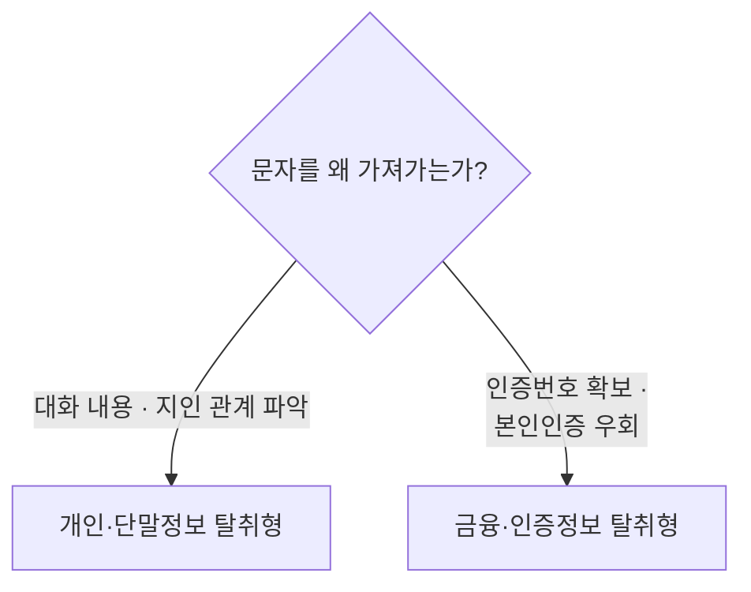
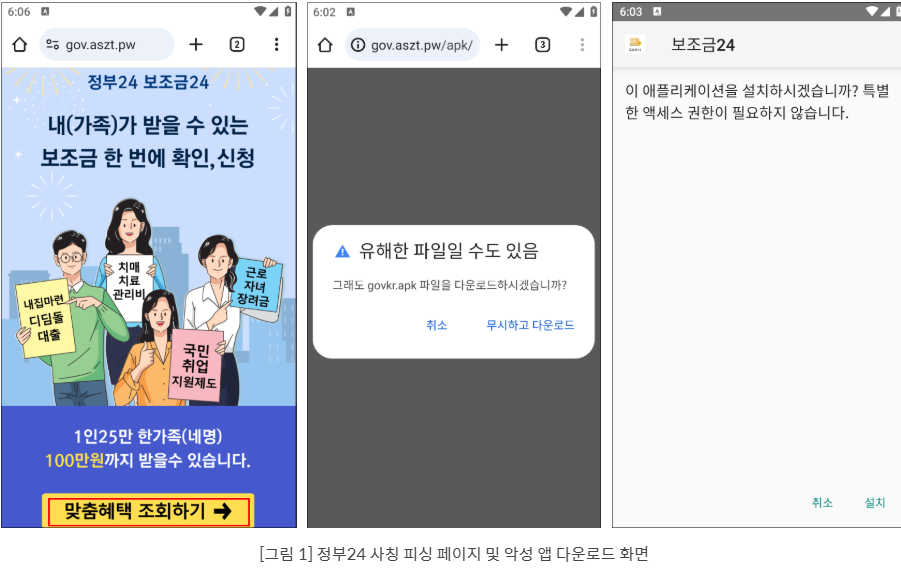
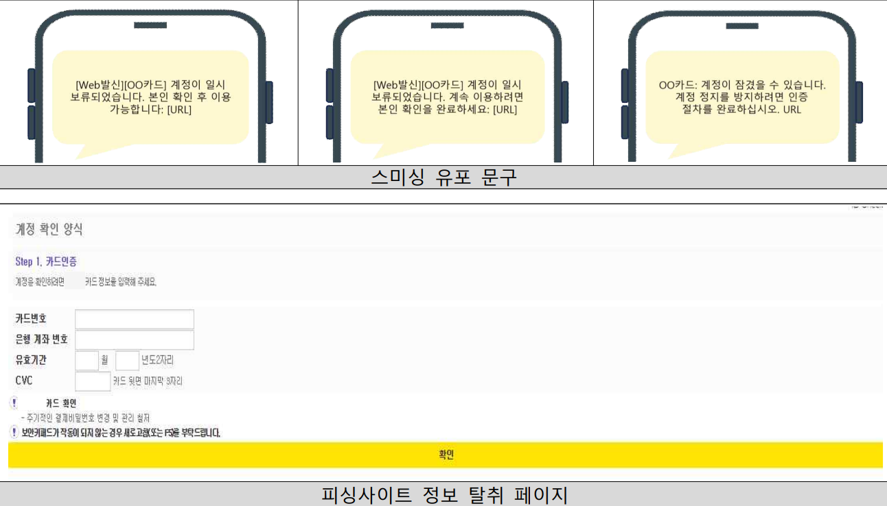
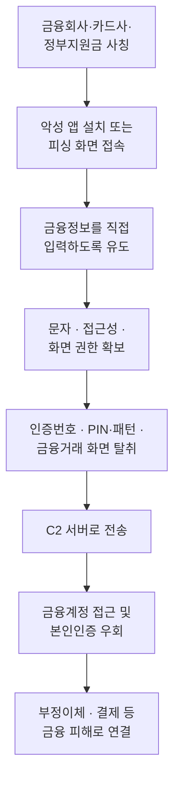
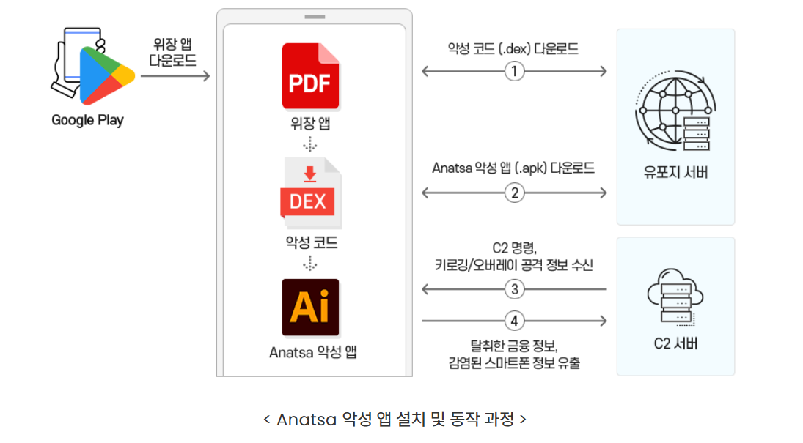
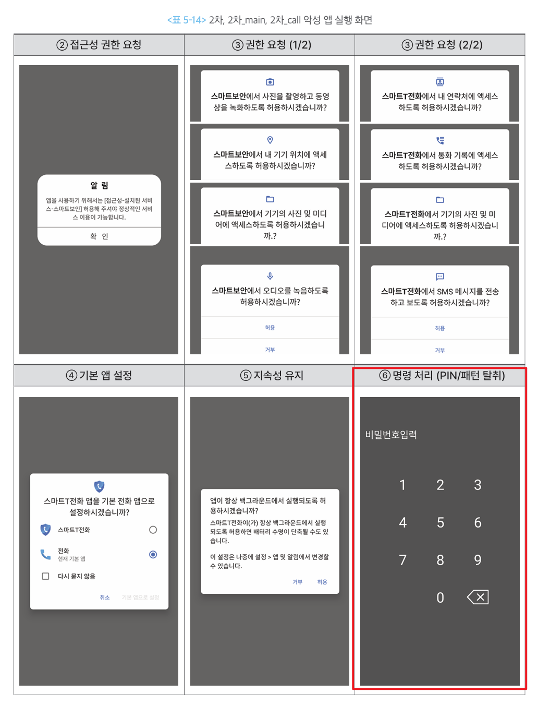

# 금융·인증정보 탈취형

## 1. 개요

이 유형은 **금융계정에 접근하거나 거래를 승인하는 데 필요한 정보를 빼내는** 악성 앱이다.

[개인·단말정보 탈취형](type-02-deviceinfo.md)이 피해자가 누구인지 파악하는 단계라면, 이 유형은 **그 정보로 실제 돈을 움직이기 직전 단계**다. 탈취한 정보로 금융 앱에 로그인하고, 본인인증을 통과하고, 계좌이체나 결제를 시도한다. 이 유형에서 정보가 넘어가면 **금융 피해까지 남은 거리가 매우 짧다.**

가져가는 것은 크게 둘이다.

- **금융정보** — 계좌번호·카드번호·금융 앱 계정처럼 돈에 직접 닿는 정보
- **인증정보** — PIN·패턴·문자 인증번호처럼 "본인이 맞다"를 증명하는 수단

### 1-1. 무엇을 탈취하는가

| 구분 | 대표 정보 | 공격자의 활용 |
| --- | --- | --- |
| 금융정보 | 계좌번호, 카드번호, 유효기간, CVC, 금융 앱 계정정보 | 계정 접근, 부정결제 |
| 단말 인증정보 | 화면 잠금 PIN·패턴 | 단말 잠금 해제, 원격 조작 보조 |
| 2차 인증정보 | 문자 인증번호, OTP | 본인인증 및 거래 승인 우회 |
| 금융거래 화면 | 로그인·인증·이체 화면 | 입력값 확인, 거래 진행 상황 감시 |

### 1-2. 다른 유형과 헷갈리는 지점

문자를 가져간다는 점은 [개인·단말정보 탈취형](type-02-deviceinfo.md)과 겹친다. **무엇을 노리고 가져가느냐**로 구분한다.

실제 악성 앱은 두 목적을 함께 갖는 경우가 많다. 앱 하나가 문자를 통째로 가져가면 **두 유형에 모두 해당**한다고 보는 편이 안전하다.

---

## 2. 국내 확인 사례

| 시기 | 사례 | 확인된 탈취 정보 |
| --- | --- | --- |
| 2024.07 | [해외 금융을 노리는 악성 앱, 한국에 상륙하다 (Anatsa)](https://www.fsec.or.kr/bbs/detail?bbsNo=11508&menuNo=69) | 오버레이·키로깅으로 금융 앱 로그인정보, 스크린샷·문자·인증코드 |
| 2025.08 | [지원금 사칭 스미싱 앱](https://blog.alyac.co.kr/5631) | 수신 문자 본문·발신번호·수신시각, 단말정보 |
| 2026.07 | [카드사 사칭 스미싱·피싱](https://www.boho.or.kr/kr/bbs/view.do?bbsId=B0000133&nttId=72131&menuNo=205020) | 카드번호, 계좌번호, 유효기간, CVC |

### 2-1. 지원금 사칭 스미싱 앱 (이스트시큐리티, 2025.08)

`국민지원금 신청대상자에 해당되므로 온라인센터에서 신청하시기 바랍니다`라는 문자로 시작해, **정부24를 사칭한 가짜 사이트**로 연결하고 악성 앱을 내려받게 한다.

이 앱의 핵심은 문자 가로채기다. 단순히 읽어가는 것이 아니라 **다른 앱이 그 문자를 받지 못하도록 수신을 중간에서 끊는다.** 가져간 것은 **문자 본문·발신번호·수신시각**이며 단말 식별값과 함께 서버로 넘어간다.

분석 자료는 이 기능이 **금융 계정 접근과 2차 인증 우회에 그대로 쓰일 수 있다**고 지적한다. 여기에 더해 감염 단말이 약 0.2초 간격으로 스미싱 문자를 자동 대량 발송하는 기능도 확인됐다.

설치 화면에 뜬 문구가 눈에 띈다. **"특별한 액세스 권한이 필요하지 않습니다."** 실제로는 설치 직후부터 문자 수신·발송 권한을 요구한다. 설치 단계에서 권한을 숨기고 **실행한 뒤에 요구**하는 방식이다.

### 2-2. 카드사 사칭 스미싱·피싱 (KISA, 2026.07)

`OO카드` · `본인 확인` · `계정 정지` 같은 키워드를 쓴 문자로 시작한다. `계정 일시 보류`, `인증 절차` 같은 문구로 링크를 누르게 하고, 연결된 피싱사이트가 **계정 인증 단계라며 카드번호·계좌번호·유효기간·CVC를 입력받는다.**

악성 앱을 설치하지 않아도 성립한다는 점이 중요하다. **피해자가 직접 입력하므로 단말에는 아무 흔적도 남지 않는다.**

피싱사이트가 `계정 확인 양식` · `Step 1. 카드인증`처럼 **절차가 진행되는 것처럼 보이는 화면**을 쓴다는 점도 눈여겨볼 만하다. `주기적인 결제비밀번호 변경 및 관리 철저` 같은 안내 문구까지 넣어 실제 카드사 화면처럼 꾸몄다.

---

## 3. 핵심 기능

정보를 가져가는 방식은 세 가지로 나뉜다. 세 가지를 **같은 항목으로 정리**했다.

### 3-1. 가짜 입력 화면

형태가 두 가지다. **앱 없이 웹페이지만으로** 하는 것과, **앱을 설치해 진짜 금융 앱 위에 덮어씌우는** 것이다.

- **동작 방식 ① 피싱 웹페이지**
    - 문자 링크로 금융회사·카드사 홈페이지처럼 꾸민 웹페이지에 접속시킨다.
    - 본인 확인·계정 인증을 이유로 카드번호·계좌번호를 적어 넣게 한다.
    - **악성 앱을 설치하지 않는다.** 2026년 7월 카드사 사칭 사례가 여기에 해당한다.
- **동작 방식 ② 오버레이**
    - 악성 앱을 설치한 경우에 쓴다.
    - 피해자가 **진짜 금융 앱을 실행한 그 순간**, 악성 앱이 그 위에 똑같이 생긴 가짜 입력창을 덮어씌운다.
    - 피해자는 방금 자기가 켠 정상 앱에 입력한다고 믿지만, 입력값은 위에 덮인 가짜 창으로 들어간다.
- **왜 통하는가**
    - 피싱 웹페이지는 앱이 설치되지 않으므로 **백신 검사 대상 자체가 없다.** 피해자가 직접 입력하니 권한 요청도 없다.
    - 오버레이는 **피해자가 실제로 정상 앱을 실행한 것이 맞다.** 앱을 켠 기록도, 화면을 본 것도 전부 정상이라 단말 기록만 봐서는 이상한 점이 없다.
- **한계와 조건**
    - 오버레이를 쓰려면 "다른 앱 위에 표시" 권한이 필요하고, 이 권한은 사용자가 직접 켜야 한다.
    - 마켓을 거치지 않고 설치된 앱은 이 권한을 앱 안에서 유도해 켤 수 없다. 설정 앱의 해당 앱 정보 화면까지 사용자가 직접 들어가야 한다(안드로이드 15 기준. 안드로이드 13에서는 접근성·알림 접근에만 적용됐다).
    - 금융 앱이 **화면이 가려진 상태의 터치를 무시**하도록 만들어 두면 오버레이 입력이 통하지 않는다.
    - 피싱 웹페이지만으로는 문자 인증번호까지 얻지 못한다. 그래서 아래 3-2와 함께 쓰인다.

여기서 짚어둘 점이 있다. KISA는 **문자에 있는 주소를 누른 것만으로는 악성 앱에 감염되지 않는다**고 안내한다. 링크를 누르는 것과 앱을 설치하는 것은 다른 사건이다. 탐지 관점에서도 **링크 접속 기록만으로는 감염을 판단할 수 없고, 설치가 일어났는지가 분기점**이 된다.

### 3-2. 문자 인증번호 가로채기

- **동작 방식**
    - 문자 수신 권한을 얻어 들어오는 문자를 읽고, 본문·발신번호·수신시각을 서버로 보낸다.
    - 여기서 더 나아가 **다른 앱이 그 문자를 받지 못하도록 수신을 중간에서 끊기도** 한다.
    - 악성 앱을 **기본 문자 앱으로 설정**하도록 유도하는 경우도 있다. 기본 문자 앱이 되면 문자에 대한 제약이 크게 줄어든다.
- **왜 통하는가**
    - 피해자가 인증번호를 보지 못하면 이상을 눈치채기 어렵다. 문자가 안 오면 통신 문제라고 여긴다.
    - 문자 인증은 국내 금융거래의 본인확인 수단으로 널리 쓰인다. 이 하나가 뚫리면 **비대면 계좌개설·대출·소액결제까지 이어진다.**
    - 문자 권한은 메신저나 전화 앱도 정상적으로 요구하는 권한이라 의심받지 않는다.
- **한계와 조건**
    - 안드로이드는 **문자를 읽는 것**과 **문자함을 고치는 것**을 다르게 취급한다. 문자 수신 권한만 있으면 들어오는 문자를 볼 수는 있어도, 문자함에서 문자를 지우거나 숨기지는 못한다. 그건 **기본 문자 앱만** 할 수 있다.
    - 그래서 공격자는 악성 앱을 **기본 문자 앱으로 바꾸게** 유도한다. 기본 문자 앱이 되면 인증번호 문자를 받는 즉시 지워, 피해자가 나중에 문자함을 뒤져봐도 아무것도 찾지 못하게 만들 수 있다.
    - **문자를 쓰지 않는 인증에는 통하지 않는다.** 금융 앱이 자체 생성하는 OTP, 앱 푸시 승인, 생체인증은 문자 가로채기로 넘을 수 없다.
    - 통신이 차단되면 가로챈 문자를 서버로 보내지 못한다.

### 3-3. 잠금 인증정보와 금융거래 화면 탈취

- **동작 방식**
    - 가짜 잠금화면을 띄워 **화면 잠금 PIN이나 패턴**을 입력받는다.
    - 접근성 권한으로 화면에 표시되는 내용과 입력값을 읽는다.
    - 화면을 녹화해 서버로 보낸다. 인증 과정과 금융거래 화면을 그대로 볼 수 있다.
- **왜 통하는가**
    - 잠금화면은 하루에도 수십 번 보는 화면이라 **의심 없이 입력한다.**
    - 접근성 권한은 원래 화면을 읽고 대신 조작하라고 만든 기능이다. 악용해도 동작 자체는 정상 범위다.
    - 화면 녹화는 입력값을 직접 훔치지 않고도 **인증 과정 전체를 볼 수 있게** 해준다.
- **한계와 조건**
    - 접근성 권한은 사용자가 설정에서 직접 켜야 하고, 안드로이드 13부터 마켓을 거치지 않은 앱은 앱 안에서 유도해 켤 수 없다.
    - 금융 앱이 화면 보호를 켜 두면 캡처·녹화 결과가 빈 화면으로 남는다.
    - 최신 안드로이드는 정식 접근성 도구가 아닌 앱이 **민감한 화면 내용을 읽지 못하도록** 막는 수단을 제공한다.
    - 가짜 잠금화면으로 얻은 값은 어디까지나 입력받은 값이다. 실제 단말 잠금을 푸는 데는 별도 조작이 필요하다.

---

## 4. 전체 공격 흐름

앞선 두 유형과 결정적으로 다른 점이 있다. **여기서부터는 공격자가 피해자를 흉내 낼 수 있다.** 계정과 인증수단을 모두 쥐게 되므로, 금융회사 입장에서는 정상 이용자의 거래와 구분하기 어려워진다.

---

## 5. 실제 사례에서 확인된 구조

### 5-1. Anatsa — 정식 마켓을 통과한 오버레이·키로깅

2024년 7월 금융보안원은 해외 뱅킹 악성코드 **Anatsa**가 국내 금융을 대상으로 공격 범위를 넓힌 것을 확인했다. 국내 유입이 공식 확인된 사례라는 점에서 의미가 크다.

| 항목 | 내용 |
| --- | --- |
| 유포 경로 | PDF 리더·QR코드 스캐너 등으로 위장해 **구글 플레이**를 통해 배포 |
| 설치 방식 | 마켓에 올라간 위장 앱이 **앱 업데이트를 가장해** 본체를 내려받아 설치 |
| 탈취 방식 | 키로깅으로 입력값을 가로채고, 오버레이로 가짜 뱅킹 로그인 화면을 띄움 |
| 탈취 대상 | 스크린샷, 문자, 인증코드 |
| 단말 제어 | 화면잠금 해제, 화면 터치, 값 입력 |
| 방해 기능 | 모바일 백신·클리너 실행 방해, 앱 삭제 차단 |
| 규모 | 2024년 6월 기준 한국 포함 **54개국 688개 금융·핀테크·가상화폐 앱**이 대상 |

여기서 두 가지를 짚어둘 만하다.

**하나. 정식 마켓 심사를 통과했다.** 설치 시점에는 악성 기능이 없는 껍데기 앱이었기 때문이다. 이 구조 자체는 [로더·드로퍼·다운로더형](type-01-loader.md)에서 다룬 것과 같다.

**둘. 백신 실행을 방해하고 삭제를 막는다.** 감염을 발견해도 정리가 쉽지 않다는 뜻이다.

### 5-2. 지원금 사칭 앱 — 문자 인증번호 가로채기

2025년 8월 확인된 정부24 사칭 앱은 문자 가로채기에 집중한 형태였다.

| 단계 | 동작 |
| --- | --- |
| 유인 | 지원금 신청 안내 문자로 가짜 정부24 사이트 접속 유도 |
| 설치 | "맞춤 혜택 조회하기" 버튼을 누르면 악성 앱 내려받기 |
| 권한 | 문자 수신·발송, 전화번호 조회, 배터리 최적화 제외 |
| 가로채기 | 문자 수신을 **중간에서 끊어** 다른 앱에 전달되지 않게 차단 |
| 전송 | 문자 본문·발신번호·수신시각을 단말 식별값과 함께 서버로 전송 |
| 재확산 | 약 0.2초 간격으로 스미싱 문자 자동 대량 발송 |

설치 시점에는 특별한 권한을 요구하지 않다가 **실행한 뒤에 권한을 요구**하는 점도 확인됐다. 설치 직후 검사에서는 별다른 신호가 나오지 않는다는 뜻이다.

### 5-3. BlackEcho — 가짜 잠금화면과 화면 녹화

Operation BlackEcho의 2차 악성 앱은 공격자 명령을 받으면 **범죄조직이 만든 잠금화면을 띄워 PIN 또는 패턴을 입력받았다.** 입력된 값은 그대로 서버로 전송된다.

여기에 더해 **화면을 기본 6분간 녹화해 전송**하는 기능도 있었다. 피해자의 인증 과정과 금융거래 화면을 그대로 볼 수 있다는 뜻이다.

위 화면이 **권한을 얻어내는 순서**를 그대로 보여준다. 접근성 권한을 먼저 요구하고, 카메라·위치·사진·녹음·연락처·통화기록·문자 권한을 차례로 받아낸다. 이어서 **기본 전화 앱으로 설정**하게 하고 배터리 최적화에서 제외시켜 백그라운드에 계속 남는다. 이 준비가 끝난 뒤에야 마지막 단계로 **가짜 비밀번호 입력 화면**이 뜬다.

여기서 눈여겨볼 점이 있다. 요구하는 권한이 **앱마다 다르다.** 백신을 자처하는 쪽은 카메라·위치·오디오를, 전화 앱을 자처하는 쪽은 연락처·통화기록·문자를 요구한다. **각자 위장한 정체에 어울리는 권한만 요구**해서 의심을 피한다.

화면 조작과 실시간 감시에 대한 상세는 [원격제어·화면감시형](type-05-remotecontrol.md) 문서에서 다룬다.

### 5-4. 참고 · 해외에서 확인된 최신 형태

2026년 공개된 **로카롤라(Rokarolla)** 는 이 유형의 기능이 어디까지 모여 있는지 보여준다. 217개 금융·가상화폐 앱을 대상으로 하며, 특정 금융 앱을 모방한 가짜 로그인 화면과 가짜 잠금화면으로 **로그인정보와 PIN·패턴을 함께** 가져간다. 문자 전체를 읽고 발송할 수 있어 일회용 인증번호를 가로채 다중인증을 우회하며, 최초 배포 파일은 **구글 플레이 프로텍트로 위장**한 드로퍼였다.

---

## 6. 공격자가 이 정보를 탈취하는 이유

- **금융계정에 직접 로그인하기 위해서** — 계정정보만 있으면 피해자의 금융 앱에 그대로 들어갈 수 있다.
- **본인인증 절차를 우회하기 위해서** — 문자 인증번호나 PIN을 확보하면 "본인이 맞다"는 확인 단계를 그대로 통과한다.
- **단말 잠금을 풀고 금융 앱을 조작하기 위해서** — PIN·패턴이 넘어가면 피해자의 단말 자체를 열어 직접 조작할 수 있다.
- **이체·결제 승인에 필요한 정보를 확보하기 위해서** — 카드번호·유효기간·CVC가 모이면 결제 승인까지 완결된다.
- **피해자 명의로 새 금융거래를 만들기 위해서** — 문자 인증이 뚫리면 비대면 계좌개설·대출·소액결제 같은 신규 거래까지 가능해진다.

---

## 7. 탐지 관점 정리

### 7-1. 봐야 할 흔적

| 구분 | 주요 흔적 |
| --- | --- |
| 권한 조합 | 앱 기능과 무관한 문자 수신·발송 권한 · 다른 앱 위에 표시 권한 · 접근성 권한 요구 |
| 화면 | 금융 앱 실행 시점에 다른 앱의 창이 위에 겹쳐짐 · 화면 캡처나 녹화가 동작 중 |
| 문자 | 인증번호 문자가 도착하지 않음 · 사용자가 보내지 않은 문자 발송 |
| 통신 | 문자 수신 직후 발생하는 외부 전송 · 금융 앱 실행과 시점이 겹치는 통신 |
| 단말 상태 | 백신 앱이 실행되지 않거나 삭제가 막힘 |

**권한을 요구한다는 사실 자체가 신호가 되기도 한다.** 구글 플레이 정책은 접근성 도구로 인정되는 앱을 장애 사용자를 위한 서비스로 한정하고, **안티바이러스·자동화 도구·모니터링 앱은 여기에 해당하지 않는다**고 명시한다. 또한 앱이 스스로 판단해 동작을 실행하도록 만드는 접근성 API 사용을 금지한다. 따라서 **백신을 자처하는 앱이 접근성 권한을 요구한다면 그 요구 자체가 정책에 어긋난다.**   정상 백신이라면 하지 않을 요구다.

### 7-2. 이 유형이 특히 까다로운 이유

| 어려운 점 | 내용 |
| --- | --- |
| 권한을 안 쓰는 경로가 있다 | 피싱 화면에 피해자가 직접 입력하는 정보는 권한 요청이 전혀 없어, 권한 기반 탐지에 걸리지 않는다. |
| 앱이 아예 없을 수도 있다 | 웹페이지만으로 카드정보를 받아내면 단말에 설치되는 것이 없다. 백신 검사 대상 자체가 없다. |
| 인증이 정상적으로 통과된다 | 가로챈 인증번호는 진짜다. 금융회사 입장에서는 본인확인이 정상 처리된 것으로 보인다. |
| 피해자가 이상을 못 느낀다 | 인증번호 문자가 안 오면 통신 문제로 여기고, 오버레이는 정상 앱 화면과 구분되지 않는다. |

### 7-3. 플랫폼에서 받을 수 있는 신호

안드로이드는 화면을 훔쳐보거나 조작하는 앱을 판별하는 신호를 앱에 제공한다. FDS 룰에서   활용할 수 있는 부분이다.

| 신호 | 의미 |
| --- | --- |
| 화면 캡처 가능 앱 감지 | 현재 화면을 보거나 캡처할 수 있는 다른 앱이 실행 중 |
| 화면 제어 가능 앱 감지 | 화면 캡처와 입력 제어를 모두 할 수 있는 앱이 실행 중 |
| 앱 보호 기능 상태 | 단말의 앱 검사 기능이 꺼져 있거나 위험 앱이 탐지됨 |

공식 가이드는 이런 신호가 잡혔을 때 **거래를 무조건 막기보다 추가 확인 절차를 제시하라**고 권고한다. 정상 접근성 앱을 쓰는 이용자를 차단하지 않기 위해서다.

한 가지 더. 안드로이드 13부터는 **마켓을 거치지 않고 설치된 앱**이 접근성 권한을 얻으려면, 사용자가 설정 앱의 해당 앱 정보 화면까지 직접 들어가 허용해야 한다. 앱 안에서 유도해 켤 수 없다. 안드로이드 15부터는 다른 앱 위에 표시 권한과 기본 전화·문자 앱 역할까지 같은 절차를 거친다. **이 절차를 피해자가 통과했다면 상당한 수준의 유도가 있었다는 뜻**이므로, 감염 정황을 강하게 시사하는 신호로 볼 수 있다.

!!! warning "가장 어려운 점"
    이 유형은 **탈취가 끝나면 공격자의 거래와 피해자의 거래가 구분되지 않는다.** 계정도 맞고 인증번호도 맞고 단말도 피해자의 것이다. 개별 거래만 보면 모든 항목이 정상이다. 따라서 거래 자체보다 **그 거래 직전에 단말에서 무슨 일이 있었는지**, 그리고 **인증 수단이 평소와 다르게 쓰이지 않았는지**를 함께 봐야 한다.

---

## 참고 자료

- KISA 보호나라, 「카드사 사칭 스미싱·피싱 주의 권고」, 2026.07.16 — <https://www.boho.or.kr/kr/bbs/view.do?bbsId=B0000133&nttId=72131&menuNo=205020>
- 이스트시큐리티 알약 블로그, 「국민지원금 스미싱 수법을 재활용한 지원금 사칭 스미싱 주의!」, 2025.08.25 — <https://blog.alyac.co.kr/5631>
- 금융보안원, 「해외 금융을 노리는 악성 앱, 한국에 상륙하다: 금융소비자 주의 필요」(Anatsa), 2024.07.03 — <https://www.fsec.or.kr/bbs/detail?bbsNo=11508&menuNo=69>
- 금융보안원, 「금융 및 백신 앱으로 위장한 보이스피싱 악성 앱 프로파일링」(Operation BlackEcho), 2024.12 — <https://www.fsec.or.kr/bbs/detail?bbsNo=11611&menuNo=244>
- Zscaler ThreatLabz, 「Technical Analysis of Anatsa Campaigns」, 2024.05.27 — <https://www.zscaler.com/blogs/security-research/technical-analysis-anatsa-campaigns-android-banking-malware-active-google>
- 데일리시큐, 「217개 금융앱 노린 안드로이드 악성코드 '로카롤라' 등장」 — <https://www.dailysecu.com/news/articleView.html?idxno=207194>
- Google Play, 「Use of the AccessibilityService API」 — <https://support.google.com/googleplay/android-developer/answer/10964491>
- Android Developers, 「Protect against fraud」 — <https://developer.android.com/security/fraud-prevention>
- 용어 정의는 [부록 · 용어 정리](../99-appendix/glossary.md) 참고
