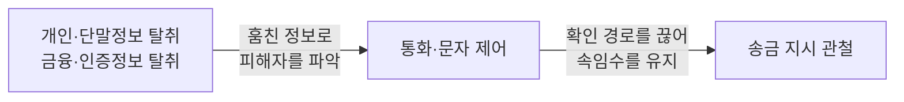
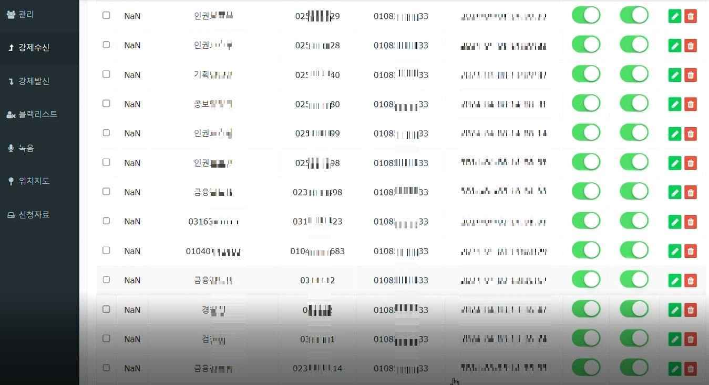
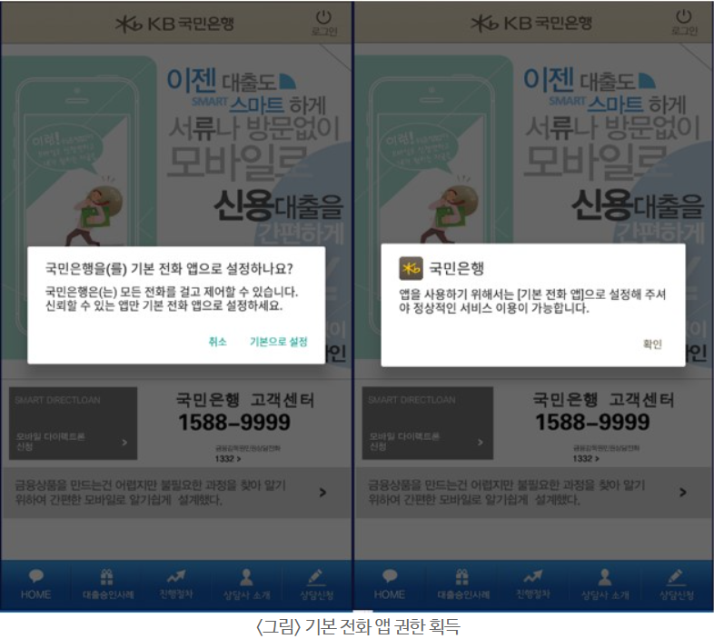
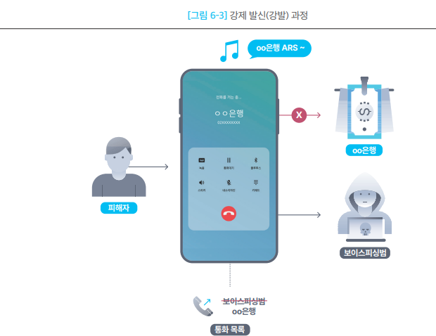
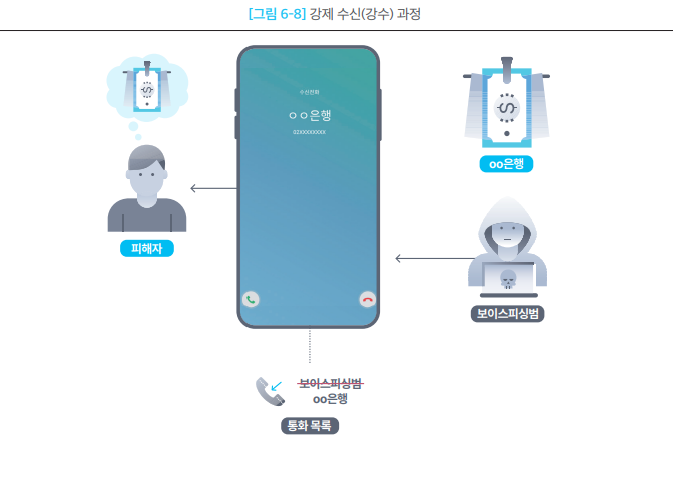
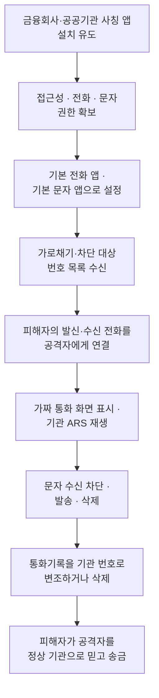
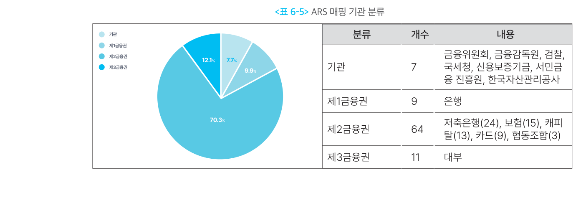
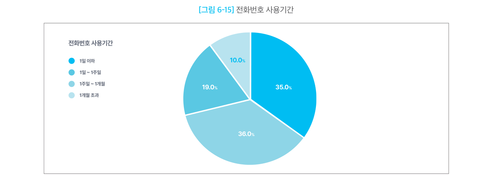

# 통화·문자 제어형

## 1. 개요

이 유형은 스마트폰의 **전화 연결과 문자 송수신을 공격자가 원하는 방향으로 조작하는** 악성 앱이다.

앞선 유형들이 **정보를 훔치는 것**을 목적으로 한다면, 이 유형의 목적은 다르다. **피해자가 사실을 확인하려는 행동 자체를 무너뜨리는 것**이다. 피해자가 은행에 전화해 확인하려 해도 공격자에게 연결되고, 은행이 피해자에게 경고 전화를 걸어도 닿지 않는다.

그래서 이 유형은 **피해자를 속이는 데 그치지 않고, 속임수가 유지되도록 만든다.** 의심이 들어 확인해 봐도 확인이 안 되니, 피해자는 오히려 더 확신하게 된다.

### 1-1. 무엇을 제어하는가

| 기능 | 실제 동작 | 공격 효과 |
| --- | --- | --- |
| 발신 전화 가로채기 | 피해자가 기관에 건 전화를 끊고 공격자에게 다시 연결 | 피해자의 사실 확인 차단 |
| 수신 전화 가로채기 | 공격자 전화를 금융회사·수사기관 전화처럼 표시 | 공격자 신원 위장 |
| 수신 전화 차단 | 정상 기관의 전화를 끊고 기록까지 삭제 | 기관의 경고·확인 연락 차단 |
| 통화기록 변조 | 공격자 번호를 기관 번호로 바꾸거나 기록 삭제 | 흔적 은폐와 신뢰 형성 |
| 문자 수신 차단 | 악성 앱이 문자를 먼저 처리해 다른 앱에 전달되지 않게 함 | 인증·경고 문자 차단 |
| 문자 발송·삭제 | 피해자 단말에서 문자를 보내거나 특정 문자를 삭제 | 공격 수행 및 흔적 은폐 |

보고서 원문은 발신·수신 가로채기를 각각 `강제 발신` · `강제 수신`으로 표기한다. 본 문서는 팀 용어 규칙에 따라 **전화 가로채기**로 통일한다.

### 1-2. 다른 유형과의 관계

이 유형은 혼자 쓰이지 않는다. **정보를 훔치는 기능과 짝을 이뤄** 동작한다.

정보 탈취는 [개인·단말정보 탈취형](type-02-deviceinfo.md) · [금융·인증정보 탈취형](type-03-credential.md) 문서에서 다룬다.

---

## 2. 국내 확인 사례

| 시기 | 사례 | 확인된 내용 |
| --- | --- | --- |
| 2025.04 | [경찰청 주의 발표](https://www.korea.kr/news/policyNewsView.do?newsId=148942500) | 기관 전화번호 80여 개를 목록화해 어디로 걸어도 공격자에게 연결 |
| 2025.11 | [S2W, HeadCalls 분석](https://s2w.inc/ko/resource/detail/962) | 접근성 권한으로 본체 설치, 기본 전화 앱 장악, 통화기록 변조 |
| 2026.01 | [경찰청 2025년 통계](https://www.data.go.kr/data/15063815/fileData.do) | 피해액 1조 2,578억원 — 사상 첫 1조원 돌파 |

### 2-1. 경찰청이 확인한 구조 (2025.04)

경찰청은 범죄조직의 악성 앱 동작을 이렇게 설명했다.

> 금융감독원·검찰·경찰 등 각 기관에서 **실제로 사용 중인 전화번호 80여 개를 목록화**한 뒤, 피해자가 그중 어떤 번호로 발신하더라도 범죄조직이 사용하는 하나의 번호로 연결되도록 하거나, 범죄조직이 발신한 전화가 피해자의 휴대전화에는 기관의 대표번호로 표시되게 조작한다.

여기에 정보 탈취가 겹치면 효과가 커진다. 경찰청은 **"피해자는 통화상대방이 실제 존재하는 공공기관이고, 그래서 이미 나의 정보를 파악하고 있다는 착각을 하게 된다"** 고 지적했다.

실제 제어서버 화면이다. `경찰` · `검찰` · `금융감독원` 같은 기관 이름과 함께 **화면에 표시할 번호**와 **실제로 연결되는 번호**가 한 줄씩 짝지어져 있다. 목록 전체가 이런 식으로 채워져 있어, 피해자가 어느 기관 번호를 눌러도 같은 곳으로 연결된다.

경찰청이 제시한 위험 신호도 참고할 만하다. 모르는 번호로 전화가 와서 `사건조회` · `특급보안·엠바고` · `약식조사·보호관찰` · `자산검수·자산이전` · `휴대전화개통·해외메신저` 를 요구하면 보이스피싱으로 봐야 한다. **`특급보안·엠바고`(외부 발설 금지)와 `약식조사·보호관찰`은 피해자를 주변과 단절시키기 위한 구실**이다.

### 2-2. HeadCalls (S2W, 2025.11)

2025년 8월 21일부터 국내 모바일 사용자를 대상으로 유포된 악성 앱이다. **두 개로 나뉘어 있다.**

| 구성 | 역할 |
| --- | --- |
| HeadCalls Loader | 피싱 페이지에서 내려받는 앱. **접근성 권한을 악용해 사용자 조작 없이** 본체를 설치하고 권한까지 부여 |
| HeadCalls | 실제 통화 가로채기를 수행하는 본체 |

앞의 로더는 [로더·드로퍼·다운로더형](type-01-loader.md)에서 다룬 구조 그대로다. 통화 제어 기능은 언제나 **먼저 들어온 무언가가 설치해 준 결과**라는 점을 기억해 둘 만하다.

- 본체는 **배터리 최적화 예외 · 알림 접근 · 다른 앱 위에 표시** 권한을 요구한다.
- **오버레이로 가짜 다이얼러와 통화 화면**을 띄운다.
- **기본 전화 앱으로 설정되면** 전화 수발신을 제어하고 통화기록을 조작할 수 있게 된다.
- 연결할 번호는 **소켓 통신으로 그때그때 받아온다.**
- 사칭 대상은 한국소비자원·서민금융진흥원과 다수 금융회사였다.

이름의 유래도 기능을 보여준다. **통화 권한이 부여되지 않은 상황에서는 헤드셋 버튼 이벤트를 이용해 통화를 강제로 끊는다.** 권한이 부족해도 통화를 끊을 방법을 마련해 둔 것이다.

### 2-3. 피해 규모 (경찰청, 2025년)

| 항목 | 2025년 | 전년 대비 |
| --- | --- | --- |
| 피해액 | 1조 2,578억원 | +47.2% (2024년 8,545억원) |
| 발생 건수 | 2만 3,360건 | +12.1% |
| 건당 피해액 | 5,384만원 | +31.3% |
| 기관사칭형 비중 | 9,884억원 (전체의 78.6%) | 2021년 1,741억원의 약 5.7배 |

기관을 사칭하는 유형이 전체 피해의 **약 80%** 를 차지한다. 기관 사칭은 **피해자가 그 기관에 확인 전화를 걸 가능성**을 전제로 하므로, 통화 가로채기가 함께 쓰일 수밖에 없는 구조다.

---

## 3. 핵심 기능

네 가지를 **같은 항목으로 정리**했다.

### 3-1. 기본 전화 앱 장악

모든 통화 제어의 출발점이다. **이것이 되지 않으면 나머지가 성립하지 않는다.**

- **동작 방식**
    - 설치 후 "기본 전화 앱으로 설정하시겠습니까?" 화면을 띄워 사용자가 직접 바꾸게 한다.
    - 기본 전화 앱이 되면 **통화 화면을 앱이 직접 그린다.** 안드로이드는 기본 전화 앱의 자격 요건으로 다이얼 화면과 통화 화면을 모두 직접 구현하도록 요구한다.
    - 통화기록을 읽는 것뿐 아니라 **고치고 지우는 것**도 가능해진다.
- **왜 통하는가**
    - 통화 화면을 직접 그리는 것은 정상 기능이다. `T전화` 같은 앱도 같은 방식으로 동작한다.
    - 화면에 무엇을 표시할지 앱이 정하므로, **표시되는 번호와 실제 연결된 번호를 다르게 만들 수 있다.**
- **한계와 조건**
    - 코드만으로는 안 된다. **반드시 사용자가 확인 대화상자에서 직접 승인해야 한다.** 사회공학이 필수 단계다.
    - 안드로이드 15부터는 마켓을 거치지 않은 앱이 이런 역할을 앱 안에서 유도해 얻을 수 없다. 설정 앱의 해당 앱 정보 화면까지 사용자가 직접 들어가야 한다. 다만 접근성 권한을 먼저 얻으면 **앱이 대신 눌러줄 수 있다.**
    - 구글 플레이는 통화기록·전화 권한 사용을 기본 전화 앱 같은 핵심 기능에만 허용한다. 정식 마켓 배포가 어려워 대부분 마켓 외 경로로 유포된다.

안드로이드는 이 단계에서 **"모든 전화를 걸고 제어할 수 있습니다. 신뢰할 수 있는 앱만 기본 전화 앱으로 설정하세요"** 라고 경고한다. 그런데 악성 앱은 그 직전에 **"정상적인 서비스 이용을 위해 필요하다"** 는 안내를 먼저 띄운다. **시스템 경고보다 앱의 설명을 먼저 읽게 만드는 순서**다.

### 3-2. 발신 전화 가로채기

- **동작 방식**
    1. 피해자가 목록에 있는 번호(예: 은행 대표번호)로 전화를 건다.
    2. 악성 앱이 통화 시작을 감지하고 **해당 기관의 ARS 연결음을 재생하면서 전화를 끊는다.**
    3. 곧바로 **공격자 번호로 다시 전화를 건다.**
    4. 화면에는 피해자가 걸었던 **기관 번호와 연락처에 저장된 이름**을 표시한다.
    5. 통화가 끝나면 **통화기록을 손본다.** 피해자가 건 기록을 지우고, 실제 통화한 공격자 번호를 기관 번호로 바꿔 넣는다.
- **왜 통하는가**
    - **피해자가 직접 번호를 눌렀다.** 링크를 누른 것도, 전화를 받은 것도 아니라 자기가 확인차 건 전화다. 의심할 이유가 없다.
    - ARS 연결음이 재생되므로 **연결 과정이 정상처럼 들린다.**
    - 통화기록에도 기관과 통화한 것으로 남아, 나중에 확인해도 어긋나지 않는다.
- **한계와 조건**
    - 미리 등록된 번호에만 동작한다. 목록에 없는 번호로 걸면 정상 연결된다.
    - 기관마다 다른 ARS 음원이 필요하다. 준비가 안 된 기관은 어색해진다.
    - 다른 사람의 전화기로 걸면 통하지 않는다.

피해자는 은행 번호로 걸었고 화면에도 은행이 떠 있지만, 실제 연결은 보이스피싱범과 이뤄진다. 통화가 끝나면 **통화 목록에도 은행과 통화한 것으로 남는다.**

### 3-3. 수신 전화 가로채기와 수신 차단

- **동작 방식**
    - **수신 가로채기** — 공격자가 전화를 걸면, 화면에는 금융회사·수사기관의 이름과 대표번호가 뜬다. 통화가 끝나면 통화기록도 그 기관에서 온 것으로 바꾼다.
    - **수신 차단** — 차단 목록에 있는 번호(금융감독원, 카드사 등)에서 전화가 오면 **받기 전에 끊고 통화기록에서도 지운다.** 피해자는 전화가 왔다는 사실 자체를 모른다.
- **왜 통하는가**
    - 걸려 온 전화의 발신번호는 사용자가 검증할 수단이 없다. **화면에 뜬 것을 믿을 수밖에 없다.**
    - 차단은 더 은밀하다. 무언가 일어난 흔적이 아예 남지 않는다.
- **한계와 조건**
    - 차단 목록도 미리 등록돼 있어야 한다. 목록에 없는 기관은 연결된다.
    - 기관이 문자나 앱 알림 같은 **다른 경로로 연락하면 막지 못한다.**

발신과 방향만 반대일 뿐 구조는 같다. 보이스피싱범이 걸었는데 **화면에는 은행에서 걸려 온 것으로 표시**되고, 통화 목록도 그렇게 남는다.

### 3-4. 문자 제어

- **동작 방식**
    - 악성 앱을 **기본 문자 앱으로 설정**하게 유도한다. 기본 문자 앱만 받을 수 있는 문자 전달 신호가 있어서, 이걸 차지하면 문자를 먼저 처리할 수 있다.
    - 문자를 받으면 **다른 앱으로 전달되지 않게 중단시킨다.** 문자 앱에도, 금융 앱에도 도착하지 않는다.
    - 명령에 따라 피해자 단말에서 문자를 발송하거나 특정 문자를 삭제한다.
- **왜 통하는가**
    - 인증번호나 거래 알림 문자가 오지 않으면 피해자는 **통신 문제라고 여긴다.**
    - 금융회사가 문자로 보내는 이상거래 경고도 함께 막힌다.
- **한계와 조건**
    - 기본 문자 앱 설정 역시 사용자 승인이 필요하다.
    - 앱 푸시 알림이나 이메일로 오는 통지는 막지 못한다.

---

## 4. 전체 공격 흐름

---

## 5. 실제 사례에서 확인된 구조

Operation BlackEcho의 `2차_call` 악성 앱이 통화·문자 기능을 전담했다.

### 5-1. 공격 준비 — ARS 음원과 번호 목록

가로채기가 자연스럽게 보이려면 **기관별 연결음이 미리 있어야 한다.**

- ARS 음원은 앱 안에 **압축된 채로 들어 있다가, 실행 시 외부 저장소에 풀린다.**
- 전화번호와 음원 파일을 짝지어 앱 내부 데이터베이스에 저장한다.
- 매핑된 규모는 **91개 기관 · 368개 번호 · 음원 93개**다.

사칭 대상 기관의 분포가 눈에 띈다.

| 구분 | 기관 수 | 비중 |
| --- | --- | --- |
| 제2금융권 (저축은행 24 · 보험 15 · 캐피탈 13 · 카드 9 · 협동조합 3) | 64 | 70.3% |
| 제3금융권 (대부) | 11 | 12.1% |
| 제1금융권 (은행) | 9 | 9.9% |
| 기관 (금융위·금감원·검찰·국세청·신용보증기금·서민금융진흥원·한국자산관리공사) | 7 | 7.7% |

**약 70%가 제2금융권**이다. 대출을 빙자해 피해자를 유인하는 수법과 맞물린다.

전화번호 목록은 고정되어 있지 않다. **1시간 주기로 서버에 요청해 갱신**하며, 차단 번호·발신 가로채기 번호·수신 가로채기 번호를 각각 추가·수정·삭제하는 명령이 따로 있다. 가로채기 전체를 켜고 끄는 명령도 있다.

### 5-2. 실제로 어떻게 걸렸나

보고서에 실린 실제 데이터를 보면 동작이 분명해진다. 카드 부정 발급을 빙자한 시나리오에서, 피해자에게는 **"금융사고는 금융감독원 국번없이 1332"** 라는 안내가 표시됐다.

그리고 서버가 내려준 목록에는 이렇게 들어 있었다.

| 대상 | 화면에 표시할 번호 | 실제로 연결되는 번호 |
| --- | --- | --- |
| 금융감독원 | `1332` | 공격자 번호 |
| 비자카드 | `18992364` | 같은 공격자 번호 |
| 중앙지검 보이스피싱전담팀 | `01035708242` | 같은 공격자 번호 |

**세 곳 중 어디로 걸어도 같은 공격자에게 연결된다.** 차단 목록에는 `1332`(금융감독원)와 `114`도 함께 들어 있었다. 피해자가 걸면 공격자에게 연결하고, 기관이 걸어오면 아예 차단하는 양방향 구조다.

### 5-3. 번호는 오래 쓰지 않는다

공격자가 쓰는 전화번호의 수명을 분석한 결과다.

| 사용 기간 | 비중 |
| --- | --- |
| 1일 이하 | 35% |
| 1일 ~ 1주일 | 36% |
| 1주일 ~ 1개월 | 19% |
| 1개월 초과 | 10% |

**71%가 1주일 안에 교체된다.** 번호 기반 차단 목록으로 대응하는 데 한계가 있다는 뜻이다.

### 5-4. 삭제 대상 앱 목록

악성 앱은 삭제할 앱 목록을 들고 있었다. 16개인데, **구성이 의미심장하다.**

| 분류 | 앱 |
| --- | --- |
| 전화 앱 (스팸·피싱 경고 기능) | T전화, 후후, 뭐야이번호, 후스콜, 리멤버Call |
| 피싱 예방·신고 앱 | 피싱아이즈, 시티즌코난, 더치트, 스마트피싱보호, 경찰청 사이버캅, 경찰청 폴-안티스파이 |
| 백신 | 알약M, V3 Mobile Security |
| 금융 앱 | 하나원큐, 신한카드 |

**피해자가 의심을 확인할 수단을 미리 치우려는 목록**이다. 스팸 경고 기능이 있는 전화 앱과 피싱 신고 앱이 대부분이다. 다만 보고서는 이 목록을 실제로 사용하는 코드는 확인되지 않았고 **추후 구현 가능성**으로 봤다.

### 5-5. 감염된 앱에 따라 연결 상대가 달라진다

악성 앱은 서버에 번호 목록을 요청할 때 **단말 식별값과 앱 식별값을 함께 보낸다.** 서버는 그 앱에 맞는 번호 목록을 내려준다. 결과적으로 **어떤 기관을 사칭한 앱에 감염됐는지에 따라 연결되는 상대가 달라진다.** 사칭 기관과 통화 상대를 일치시키기 위한 구조다.

---

## 6. 공격자가 통화·문자를 제어하는 이유

- **피해자가 직접 확인하지 못하게 하기 위해서** — 기관에 전화해 사실을 확인하는 것이 가장 확실한 방어책이다. 이 경로를 끊는 것이 첫 번째 목적이다.
- **공격자를 기관으로 믿게 만들기 위해서** — 화면에 기관 이름과 대표번호가 뜨면 의심이 사라진다.
- **기관의 경고 연락을 차단하기 위해서** — 금융회사가 이상거래를 발견해 연락해도 피해자에게 닿지 않는다.
- **흔적을 지우기 위해서** — 통화기록과 문자를 손보면 피해자가 나중에 확인해도 어긋나는 점을 찾지 못한다.
- **피해자를 통화 안에 고립시키기 위해서** — 외부 확인이 막힌 상태에서 통화가 길어지면 피해자는 상대의 지시만 따르게 된다.

---

## 7. 탐지 관점 정리

### 7-1. 봐야 할 흔적

| 구분 | 주요 흔적 |
| --- | --- |
| 앱 구성 | 통화 화면을 대체하겠다고 선언한 앱 · 통화 화면·다이얼 화면을 직접 그리는 구성 요소 |
| 권한·역할 | 기본 전화 앱·기본 문자 앱 변경 요구 · 접근성 권한과 오버레이 권한 동시 요구 · 배터리 최적화 예외 요구 |
| 앱 내부 | `assets`에 들어 있는 정체불명 음원 압축 파일 · 외부 저장소에 풀린 다수의 ARS 음원 |
| 통신 | 짧은 주기로 반복되는 전화번호 목록 요청 · 통화 시작·종료 시점에 발생하는 통신 |
| 통화기록 | 발신 기록이 사라짐 · 기록의 번호가 사후에 바뀜 · 수신 기록 없이 끊긴 통화 |
| 단말 상태 | 스팸 경고 기능이 있는 전화 앱이나 피싱 신고 앱이 사라짐 |

특히 **통화 화면을 대체하겠다는 선언**은 앱 구성 정보에 명시적으로 남는다. 정상 전화 앱도 같은 선언을 하므로 이것만으로 판단할 수는 없지만, **금융·공공기관을 자처하는 앱이 이 선언을 갖고 있다면 정상적인 조합이 아니다.**

### 7-2. 이 유형이 특히 까다로운 이유

| 어려운 점 | 내용 |
| --- | --- |
| 사용자 승인을 거친다 | 기본 전화 앱 변경은 사용자가 직접 승인해야 한다. 기록상으로는 정상 절차다. |
| 정상 앱과 구조가 같다 | 통화 화면을 직접 그리는 것은 정상 전화 앱의 자격 요건이다. |
| 번호 차단이 오래 못 간다 | 공격자 번호의 71%가 1주일 안에 교체된다. |
| 피해자 진술이 어긋난다 | 피해자는 기관과 통화했다고 기억하고, 통화기록도 그렇게 남아 있다. |

!!! warning "가장 어려운 점"
    이 유형은 **피해자의 확인 절차 자체가 무력화된다.** "의심되면 기관에 직접 전화해 확인하라"는 원칙이 통하지 않는다. 게다가 통화기록까지 변조되므로 **사후 조사에서도 피해자 단말의 기록을 그대로 믿을 수 없다.** 따라서 단말에 남은 통화기록보다 **통신사 측 통화 내역과의 대조**가 결정적인 근거가 된다.

### 7-3. 통화 단계 대응

정부와 통신사는 통화 내용을 실시간으로 분석하는 방향으로 대응하고 있다. 2026년 2월 과학기술정보통신부 발표에 따르면, 삼성전자와 이동통신 3사가 **통화 중 실시간 탐지·알림 서비스**를 제공한다.

- 통화 내용 분석은 **외부 서버가 아니라 단말 안에서** 이뤄진다(온디바이스 AI).
- 의심 시 통화 중에 경고 팝업·알림음·진동으로 알린다.
- KT 사례로 **2025년 통화 4,680만여 건 중 3천여 건의 보이스피싱을 예방**했고, 탐지 정확도는 2025년 1분기 90.3%에서 4분기 97.2%로 올랐다.
- 일부 서비스는 **전화 가로채기 탐지 알림**을 별도 기능으로 제공한다.

정부는 2026~2027년에 관계기관·기업이 보이스피싱 데이터를 실시간으로 공유하는 공동 대응 플랫폼을 구축할 계획이다.

---

## 참고 자료

- 경찰청 국가수사본부, 「그놈 목소리, 치밀한 각본 주인공이 되시겠습니까」 보도자료(2025.04.28 조간) — 정책브리핑 게재본 <https://www.korea.kr/news/policyNewsView.do?newsId=148942500>
- S2W TALON, 「HeadCalls 악성앱 상세 분석: 통화를 가로채는 한국 대상 보이스피싱 악성앱」, 2025.11.18 — <https://s2w.inc/ko/resource/detail/962>
- 금융보안원, 「금융 및 백신 앱으로 위장한 보이스피싱 악성 앱 프로파일링」(Operation BlackEcho), 2024.12 — <https://www.fsec.or.kr/bbs/detail?bbsNo=11611&menuNo=244>
- 과학기술정보통신부, 「인공지능으로 통화 중에 보이스피싱 잡는다」, 2026.02.12 — <https://www.korea.kr/news/policyNewsView.do?newsId=148959497>
- 경찰청, 「보이스피싱 현황」 공공데이터 (기준 2025.12.31) — <https://www.data.go.kr/data/15063815/fileData.do>
- 헤럴드경제, 「악성 앱으로 휴대폰 장악·금융사 사칭…지난해 보이스피싱 피해 1.2조 '사상 최대'」, 2026.01.24 — 경찰청 자료 인용 보도 <https://biz.heraldcorp.com/article/10661923>
- 파이오링크, 「안드로이드 뱅킹 악성코드(kb.apk) 분석보고서」, 2021.10.12 — <https://www.piolink.com/kr/service/Security-Analysis.php?bbsCode=security&vType=view&idx=78>
- Android Developers, 「Build a default phone application」 — <https://developer.android.com/develop/connectivity/telecom/dialer-app>
- 용어 정의는 [부록 · 용어 정리](../99-appendix/glossary.md) 참고
