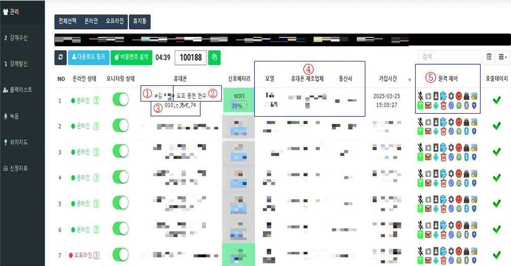
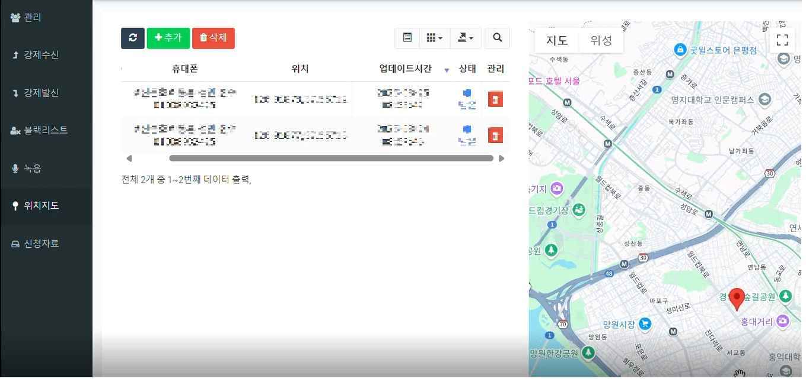
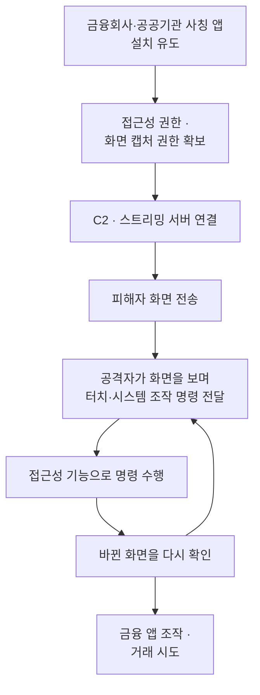
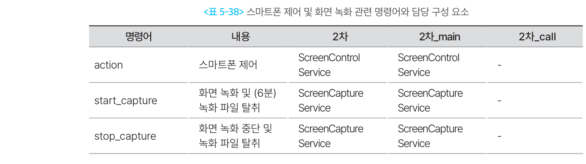
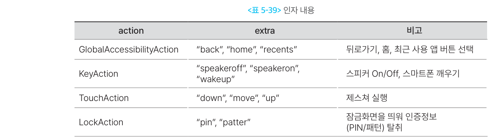

# 원격제어·화면감시형

## 1. 개요

이 유형은 피해자의 스마트폰 **화면을 공격자가 들여다보고, 터치·뒤로가기·홈 이동 같은 단말 조작까지 원격으로 수행하는** 악성 앱이다.

두 기능이 짝을 이룬다.

- **화면감시** — 현재 화면을 실시간으로 전송하거나 녹화해, 피해자가 지금 무엇을 보고 있는지 확인한다.
- **원격제어** — 접근성 권한을 이용해 화면을 대신 터치하고 앱을 조작한다.

공격자는 **화면으로 결과를 확인하고 다시 명령을 내린다.** 그래서 화면감시와 원격제어는 따로 떨어진 기능이 아니라 하나의 반복 과정이다.

### 1-1. 무엇을 할 수 있는가

| 기능 | 실제 동작 | 공격 효과 |
| --- | --- | --- |
| 화면 스트리밍 | 현재 화면을 공격자 서버로 실시간 전송 | 금융 앱 실행과 인증 과정을 즉시 확인 |
| 화면 녹화 | 일정 시간 화면을 영상으로 저장·전송 | 입력 내용과 거래 과정을 사후 확인 |
| 터치·제스처 제어 | 좌표를 지정해 누르기·끌기 동작 수행 | 앱 실행, 메뉴 이동, 버튼 선택 |
| 시스템 버튼 제어 | 뒤로가기·홈·최근 앱 실행 | 화면 전환과 앱 이동 |
| 화면 깨우기 | 꺼진 화면을 활성화 | 피해자가 쓰지 않을 때도 조작 시도 |
| 위치 확인 | 실시간 위치를 지도에 표시 | 피해자가 지시대로 움직이는지 감시 |

### 1-2. 다른 유형과의 관계 — 지휘하는 계층

앞선 유형들과 목적이 다르다. 정보를 훔치는 것도, 통화를 막는 것도 아니다. **다른 기능들을 실시간으로 지휘하는 통제 계층**에 해당한다.

| 비교 | 하는 일 |
| --- | --- |
| [금융·인증정보 탈취형](type-03-credential.md) | 화면을 **읽어서** 데이터를 빼낸다 |
| [통화·문자 제어형](type-04-callcontrol.md) | 피해자의 **확인 경로를 끊는다** |
| **원격제어·화면감시형** | 화면을 **보면서 직접 조작한다** |

이 계층을 갖추면 **미리 짜둔 시나리오를 넘어선 대응**이 가능해진다. 피해자가 예상 밖으로 행동해도 공격자가 화면을 보며 그때그때 대처할 수 있다.

단말에 들어오는 경로 자체는 [로더·드로퍼·다운로더형](type-01-loader.md)과 같다. 1차 앱이 설치한 2차 앱이 이 기능을 담당하는 구조다.

---

## 2. 국내 확인 사례

| 시기 | 사례 | 확인된 내용 |
| --- | --- | --- |
| 2025.02 | [금융감독원 소비자경보 상향](https://www.fss.or.kr/fss/bbs/B0000188/view.do?nttId=190989&menuNo=200218) | 카드배송 사칭 → 원격제어앱 설치 유도 → 자산보호 명목 이체 |
| 2025.04 | [경찰청, 악성 앱 제어서버 확인](https://www.korea.kr/news/policyNewsView.do?newsId=148942500) | 관리자 페이지에서 감염 단말을 원격제어·위치추적 |
| 2025.05 | [애니데스크 악용 사례](https://www.cio.com/article/3980663/) | 정상 원격제어 앱으로 접속해 악성 앱을 직접 설치 |

### 2-1. 경찰청이 확인한 제어서버 (2025.04)

경찰이 수사 과정에서 **범죄조직이 사용하는 악성 앱 제어서버를 직접 확인**했다. 관리자 페이지는 이렇게 구성돼 있었다.

| 표시 항목 | 내용 |
| --- | --- |
| 피해자 정보 | 이름, 전화번호, 휴대폰 기종, 통신사 |
| 조직원 가명 | 해당 피해자를 담당하는 조직원 |
| 원격제어 조작 | 감염 단말을 직접 조작 |
| 통화 녹음 | 통화 내용 녹음 |
| 실시간 위치 | 지도에 위치 표시 |

**위치 정보의 용도가 특히 눈에 띈다.** 경찰청 자료는 `휴대전화 실시간 위치정보가 지도로 현출되어 **피해자가 지시에 따라 이동하고 있는지 확인 가능**` 하다고 적었다. 감시가 정보 수집이 아니라 **피해자를 통제하는 수단**으로 쓰인 것이다.

감염된 단말이 **표로 줄지어 관리된다.** 온라인 여부, 배터리 잔량, 기종·제조사·통신사, 감염 시각이 한눈에 들어오고, 맨 오른쪽 열에 단말별 **원격 제어 버튼**이 붙어 있다. 왼쪽 메뉴에는 `강제수신` · `강제발신` · `블랙리스트` · `녹음` · `위치지도`가 있다. **통화 가로채기와 원격 감시가 같은 화면에서 운용된다는 뜻이다.**

`위치지도` 메뉴를 열면 감염 단말의 위치가 지도에 찍힌다. 갱신 시각도 함께 기록된다. 경찰청이 지적한 **"피해자가 지시에 따라 이동하고 있는지 확인 가능"** 하다는 것이 바로 이 화면이다.

같은 자료에서 조직의 **탐지 회피 방식**도 확인됐다.

- 기능이 세분된 **다수의 악성 앱을 한 번에** 유포한다.
- 짧게는 **하루 단위로 악성 앱을 업데이트**한다.
- **자산 탈취가 끝난 피해자의 단말은 악성 앱 통신을 스스로 끊는다.**

마지막 항목이 특히 까다롭다. 피해가 발생한 뒤 조사하려 해도 **단말이 이미 조용해진 상태**라는 뜻이다.

### 2-2. 정상 원격제어 앱이 감염 경로가 된다

이 유형에는 다른 유형에 없는 경로가 하나 더 있다. **악성 앱을 설치하기 위해 정상 원격제어 앱을 먼저 쓰는** 방식이다.

경찰청 자료에 나온 실제 유도 경로다.

> 피해자가 명의도용 사건에 연루된 것처럼 속여 **신규 휴대전화를 구매하게 한 뒤**, 휴대전화 검열이 필요하다며 **원격제어 앱 설치를 유도한 후 악성 앱을 직접 설치**

2025년 5월 확인된 사례도 같은 구조였다. 통신사 해킹 사고를 점검해주겠다며 접근해, **피해자가 정식 스토어에서 애니데스크를 직접 설치하게 한 뒤** 원격 접속으로 악성 앱을 보내 설치했다.

새 휴대전화를 사게 하는 것도 의도적이다. 경찰청은 범죄조직이 **보안 프로그램이 깔려 있지 않은, 보안성이 낮은 휴대전화를 쓰도록 유도**한다고 설명했다.

!!! warning "정상 앱이라 차단이 어렵다"
    팀뷰어·애니데스크 같은 원격지원 앱은 **악성코드가 아니라 정식 소프트웨어**다. 백신에도 걸리지 않고 마켓에서 정상적으로 내려받을 수 있다. 그래서 금융 앱 쪽에서 별도로 탐지·차단하는 통제가 필요하다.

### 2-3. 피해 규모

원격제어 수법이 확산된 시기의 보이스피싱 피해액 추이다(금융감독원).

| 시점 | 피해액 |
| --- | --- |
| 2024년 9월 | 249억원 |
| 2024년 10월 | 453억원 |
| 2024년 11월 | 614억원 |
| 2024년 12월 | 610억원 |

금융감독원은 2024년 12월 발령한 소비자경보를 2025년 2월 **`주의`에서 `경고`로 상향**했다.

원격제어 피해는 **잔액이 없어도 발생한다.** 계좌이체 1억 8천만원에 더해 **카드론 대출 1억 1천만원을 실행**시켜 총 2억 9천만원을 빼앗은 사례가 있다. 금융위원회도 원격제어로 탈취한 개인정보가 **본인도 모르는 비대면 계좌개설과 대출 실행**으로 이어진다고 밝혔다.

---

## 3. 핵심 기능

세 가지를 **같은 항목으로 정리**했다.

### 3-1. 화면 감시

- **동작 방식**
    - 현재 화면을 **실시간으로 스트리밍**하거나, 일정 시간 **녹화해 파일로 전송**한다.
    - 카메라와 마이크를 함께 스트리밍하는 경우도 있다.
    - 녹화는 외부 저장소에 저장했다가 전송한다.
- **왜 통하는가**
    - 화면을 보면 **어떤 은행 앱을 쓰는지, 지금 어느 단계인지**가 한눈에 드러난다.
    - 입력값을 직접 훔치지 않고도 인증 과정 전체를 관찰할 수 있다.
    - 공격자가 다음 지시를 정확한 타이밍에 내릴 수 있다.
- **한계와 조건**
    - 정상적으로 화면을 캡처하려면 **화면 공유 동의 화면을 사용자가 승인**해야 한다. 세션마다 다시 받아야 한다.
    - 안드로이드 15 QPR1부터는 화면이 전송되는 동안 **상태 표시줄에 눈에 띄는 표시가 뜨고, 잠금 시 자동으로 중단**된다.
    - 금융 앱이 화면 보호를 켜두면 캡처 결과가 빈 화면으로 남는다.

### 3-2. 원격 조작

- **동작 방식**
    - 접근성 권한으로 **뒤로가기·홈·최근 앱** 같은 시스템 동작을 실행한다.
    - **좌표를 지정해 누르기·이동·떼기** 방식의 터치 제스처를 수행한다.
    - **꺼진 화면을 깨우고** 스피커 설정을 바꾸기도 한다.
    - 공격자가 만든 잠금화면을 띄워 PIN·패턴을 받아낸 뒤, 그 값으로 잠금을 풀고 조작을 이어간다.
- **왜 통하는가**
    - 접근성 서비스는 원래 **화면을 읽고 사용자를 대신해 조작하라고** 만들어진 기능이다. 악용해도 동작 자체는 정상 범위다.
    - 피해자의 단말에서, 피해자의 계정으로, 피해자가 늘 쓰던 환경에서 거래가 일어난다.
- **한계와 조건**
    - 접근성 권한은 사용자가 설정에서 직접 켜야 한다.
    - 안드로이드 13부터 마켓을 거치지 않은 앱은 이 권한을 앱 안에서 유도해 켤 수 없다.
    - 구글 플레이 정책은 **앱이 스스로 판단해 동작을 실행하도록 만드는 접근성 API 사용을 금지**한다.

### 3-3. 감시와 조작의 결합

- **동작 방식**
    1. 화면 스트리밍으로 현재 상태를 확인한다.
    2. 조작 명령과 세부 동작을 전달한다.
    3. 접근성 기능으로 화면을 조작한다.
    4. 바뀐 화면을 다시 확인하고 1로 돌아간다.
- **왜 통하는가**
    - 정해진 시나리오가 아니라 **상황을 보며 대응**한다. 피해자가 예상 밖으로 움직여도 대처가 가능하다.
    - 앞선 유형에서 훔친 [금융 인증정보](type-03-credential.md)를 **이 계층에서 실제 거래에 사용**한다. 정보 탈취와 실행이   한 단말에서 이어진다.
- **한계와 조건**
    - 통신이 끊기면 실시간 제어가 불가능하다.
    - 화면이 꺼져 있거나 피해자가 단말을 쓰고 있으면 조작이 눈에 띈다. 그래서 **피해자를 통화에 붙들어 두거나, 잠든 시간을 노리는** 방식이 함께 쓰인다.

---

## 4. 전체 공격 흐름

**확인과 조작이 순환한다**는 점이 이 흐름의 특징이다. 다른 유형이 한 방향으로 진행되는 것과 다르다.

---

## 5. 실제 사례에서 확인된 구조

Operation BlackEcho에서는 `2차_main` 악성 앱이 **스트리밍·원격제어·화면 녹화**를 담당했다.

### 5-1. 화면을 가져가는 세 가지 방법

| 명령 | 동작 |
| --- | --- |
| 화면 스트리밍 | 화면을 스트리밍 서버로 실시간 전송 |
| 카메라·마이크 스트리밍 | 전면·후면 카메라 전환 가능, 마이크 음성 전송 |
| 화면 녹화 | **기본 6분** 녹화 후 파일을 C2 서버로 전송 |

녹화 파일은 외부 저장소에 저장했다가 전송한다. 피해자의 **인증 과정과 금융거래 화면을 그대로 확인**하는 데 쓰였다.

### 5-2. 조작 명령의 구성

조작 명령 하나에 **동작 종류와 세부 내용**을 함께 실어 보내는 구조였다.

| 동작 종류 | 세부 내용 |
| --- | --- |
| 시스템 동작 | 뒤로가기 · 홈 · 최근 사용 앱 |
| 단말 상태 | 스피커 켜기·끄기 · 화면 깨우기 |
| 터치 제스처 | 누르기 · 이동 · 떼기 |
| 잠금화면 | PIN 입력 화면 · 패턴 입력 화면 표시 |

터치를 **누르기·이동·떼기**로 나눠 보내는 것이 핵심이다. 이 셋을 조합하면 **사람이 손가락으로 하는 거의 모든 동작**을 재현할 수 있다.

### 5-3. 참고 · 해외에서 확인된 최신 형태

국내에서 확인되지 않은 기법도 해외 분석에서는 이미 나타나고 있다. **앞으로 국내에 들어올 가능성을 보는 참고 자료**다.

| 기법 | 내용 |
| --- | --- |
| 검은 화면 위장 | 조작하는 동안 피해자 화면에 **검은 화면을 덮어** 아무것도 보이지 않게 한다 |
| 취침 시간 공격 | 단말이 **충전 중이고 화면이 꺼진 야간**에, 탈취한 PIN으로 잠금을 풀고 이체를 실행한다 |
| 사람처럼 입력 | 텍스트를 **한 글자씩 0.3~3초 무작위 간격**으로 입력한다 |
| 화면 보호 우회 | 화면을 캡처하지 않고 **접근성 정보로 화면 구성을 읽어**, 캡처 차단 설정을 건드리지 않고 내용을 파악한다 |

---

## 6. 공격자가 원격제어를 사용하는 이유

- **피해자가 무엇을 보고 있는지 실시간으로 확인하기 위해서** — 지시를 언제 내려야 할지 정확히 알 수 있다.
- **금융 앱의 로그인·인증·거래 과정을 관찰하기 위해서** — 입력값을 직접 훔치지 않아도 진행 상황이 보인다.
- **피해자의 조작 없이 앱을 직접 다루기 위해서** — 설득이 통하지 않아도 공격자가 직접   실행할 수 있다.
- **탈취한 정보를 실제 거래에 사용하기 위해서** — 정보를 빼내는 것과 돈을 옮기는 것이 한 단말에서 이어진다.
- **탐지를 피하기 위해서** — 피해자의 단말, 피해자의 계정, 늘 쓰던 접속 환경에서 거래가 일어나므로 금융회사 쪽에서 이상을 잡아내기 어렵다.
- **피해자가 단말을 쓰지 않는 시간에도 거래를 시도하기 위해서** — 잠든 사이에도 조작이 가능하다.

---

## 7. 탐지 관점 정리

### 7-1. 봐야 할 흔적

| 구분 | 주요 흔적 |
| --- | --- |
| 권한 | 접근성 권한과 화면 캡처 권한을 함께 요구 · 다른 앱 위에 표시 권한 · 배터리 최적화 예외 |
| 단말 상태 | 정상 원격지원 앱이 금융 앱과 함께 실행 중 · 화면 공유 세션이 열려 있음 |
| 입력 특성 | 사람의 조작과 다른 입력 패턴 · 반대로 **지나치게 자연스럽게 꾸며진** 입력 간격 |
| 거래 시점 | 새벽·심야에 발생하는 거래 · 통화가 길게 이어지는 동안 발생하는 거래 |
| 통신 | 거래 화면 전환 시점과 겹치는 지속적 업로드 트래픽 |
| 사후 | 피해 발생 후 단말의 악성 앱 통신이 끊긴 상태 |

플랫폼이 제공하는 신호도 활용할 수 있다. 안드로이드는 앱에게 **화면을 보거나 캡처할 수 있는 다른 앱이 실행 중인지**, **화면과 입력을 모두 제어할 수 있는 앱이 실행 중인지**를 판정해 알려준다.

### 7-2. 이 유형이 특히 까다로운 이유

| 어려운 점 | 내용 |
| --- | --- |
| 모든 조건이 정상이다 | 피해자 단말, 피해자 계정, 늘 쓰던 위치와 기기다. 신규 단말·신규 위치 같은 위험 지표가 아예 뜨지 않는다. |
| 정상 앱이 도구가 된다 | 원격지원 앱은 악성코드가 아니다. 백신으로 걸러낼 수 없다. |
| 행위 분석도 우회 대상 | 입력 속도와 간격을 사람처럼 꾸미는 기법이 이미 등장했다. |
| 화면 보호를 비켜 간다 | 화면을 캡처하지 않고 접근성 정보로 내용을 읽으면 캡처 차단이 무력해진다. |
| 사후 조사가 어렵다 | 탈취가 끝나면 악성 앱이 통신을 스스로 끊는다. |

!!! warning "가장 어려운 점"
    이 유형은 **공격자의 거래와 피해자의 거래가 기술적으로 구분되지 않는다.** 단말도 계정도 접속 환경도 전부 진짜다. 개별 거래를 아무리 뜯어봐도 이상한 점이 나오지 않는다.

    따라서 **거래 그 자체보다 거래가 일어나는 상황**을 봐야 한다. 화면을 공유하거나 조작할 수 있는 앱이 함께 떠 있는지, 통화가 이어지는 중인지, 평소와 다른 시간대인지 같은 **맥락 정보**가 결정적인 근거가 된다.

### 7-3. 금융권의 대응

금융보안원은 2023년에 **149개 금융회사의 금융앱을 대상으로 4종의 원격제어앱을 탐지·차단하는지 점검**했다. `사기범들이 원격제어앱으로 피해자 스마트폰을 장악하여 금융앱을 통해 금전을 탈취하는 사기`를 막기 위한 조치다. **금융 앱이 원격제어앱 실행을 감지해 스스로 차단하는 통제가 이미 운영되고 있다**는 뜻이다.

같은 해 금융보안원은 보이스피싱 사기정보 공유로 약 **1,233억원**의 피해를 예방했고, 이상금융거래정보 공유로 약 42억원을 추가로 막았다. 보이스피싱사기정보와 이상금융거래정보 **14,000건 이상**을 금융회사 등에 실시간으로 공유했다.

원격제어로 탈취한 정보가 **명의도용 계좌개설과 대출 실행**으로 이어지는 문제에 대해서는 별도 대책이 있다.

| 서비스 | 내용 |
| --- | --- |
| 여신거래 안심차단 (2024.08) | 신규 대출·카드론을 사전에 차단. 시행 7개월 만에 약 31만명 가입 |
| 비대면 계좌개설 안심차단 (2025.03) | 비대면 계좌개설을 사전에 차단. 3,613개 금융회사 참여 |

---

## 참고 자료

- 경찰청 국가수사본부, 「그놈 목소리, 치밀한 각본 주인공이 되시겠습니까」 보도자료(2025.04.28 조간) — 정책브리핑 게재본 <https://www.korea.kr/news/policyNewsView.do?newsId=148942500>
    - 제어서버 관리자 페이지의 세부 항목과 위치정보 지도 표시는 보도자료 본문이 아니라 **붙임 자료(경찰청 제공 캡처)** 에 근거한다.
- 금융감독원, 「카드배송 사칭 보이스피싱 증가, 소비자경보 상향!!」, 2025.02.13 — <https://www.fss.or.kr/fss/bbs/B0000188/view.do?nttId=190989&menuNo=200218>
- 금융보안원, 「금융보안원, 지난 해 1,233억원의 보이스피싱 등 사기 피해 예방」, 2024.02.07 — <https://www.fsec.or.kr/bbs/detail?menuNo=69&bbsNo=11406>
- 금융위원회, 「나도 모르게 개설되는 계좌 이제는 사전에 차단할 수 있습니다」, 2025.03.12 — <https://www.fsc.go.kr/no010101/84123>
- 금융보안원, 「금융 및 백신 앱으로 위장한 보이스피싱 악성 앱 프로파일링」(Operation BlackEcho), 2024.12 — <https://www.fsec.or.kr/bbs/detail?bbsNo=11611&menuNo=244>
- Android Developers, 「Screen capture with MediaProjection」 — <https://developer.android.com/media/grow/media-projection>
- Cleafy, 「On-device fraud: a rising threat in online banking fraud」, 2024.04 — <https://www.cleafy.com/insights/on-device-fraud-a-rising-threat-in-online-banking-fraud>
- ThreatFabric, 「New Android Malware Herodotus Mimics Human Behaviour to Evade Detection」, 2025.10 — <https://www.threatfabric.com/blogs/new-android-malware-herodotus-mimics-human-behaviour-to-evade-detection>
- Zimperium zLabs, 「Rokarolla: Android Banker with Complete Device Takeover Capabilities」, 2026.06 — <https://zimperium.com/blog/rokarolla-android-banker-with-complete-device-takeover-capabilities>
- 용어 정의는 [부록 · 용어 정리](../99-appendix/glossary.md) 참고
