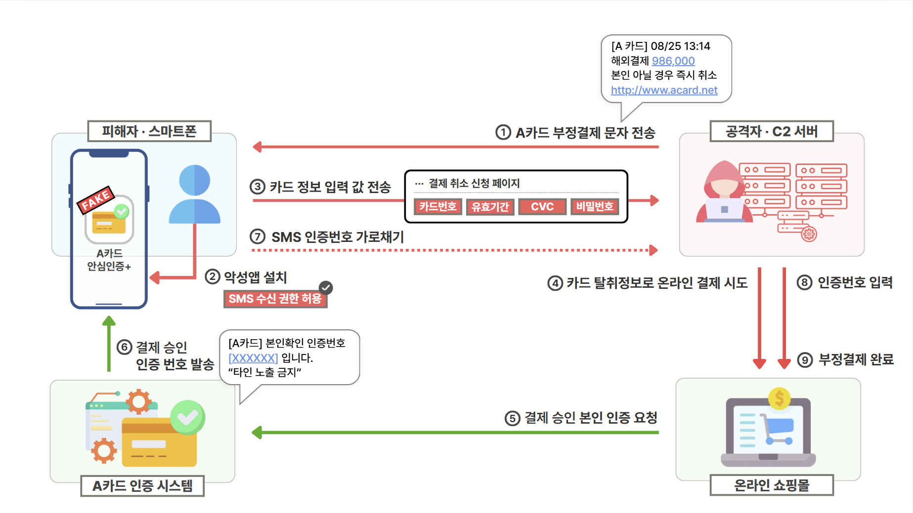

# 시나리오 01 · 카드사 사칭 스미싱 시나리오

## 1. 개요

문자로 유입되는 스미싱 공격이다. 카드사를 사칭해 "본인이 하지 않은 해외결제가 승인되었다"는 문자를 보내고, 놀란 피해자가 취소하려고 링크를 누르면 카드사 취소센터를 모방한 피싱 페이지로 연결된다. 페이지는 결제 취소에 본인인증이 필요하다며 악성 앱 설치를 유도하고, 설치된 앱은 카드정보를 입력받아 탈취한 뒤 SMS 수신 권한으로 인증번호까지 가로챈다. 공격자는 이렇게 확보한 카드정보와 인증번호로 **피해자가 취소하려던 건과는 별개의 신규 결제**를 승인시킨다.

- **긴급성을 이용한 사회공학** — 부정결제가 이미 발생했다고 믿게 만들어 판단할 시간을 주지 않는다
- **단일 악성 앱 구조** — 로더나 2차 페이로드 없이 앱 하나가 카드정보 입력 화면과 인증번호 탈취를 모두 수행한다
- **부정결제는 공격자 단말에서 발생** — 피해자 단말에는 결제 흔적이 남지 않으며, 취소 요청 이력이 없는데 신규 승인만 발생하는 모순이 유일한 증거가 된다

---

## 2. 공격 흐름

| 시점 | 공격 행위 | 피해자 인식 |
| --- | --- | --- |
| T1 | 카드사를 사칭한 부정결제 문자를 발송한다. "[A카드] 해외결제 986,000원 승인 / 본인 아닐 시 즉시 취소" 문구와 가짜 취소 페이지 링크를 포함한다 | 카드사에서 부정결제 알림을 보낸 것으로 인식한다 |
| T2 | 피해자가 링크를 눌러 A카드 취소센터를 모방한 **피싱 페이지**에 접속한다 | 카드사 공식 취소센터에 접속했다고 인식한다 |
| T3 | 피싱 페이지가 결제 취소에 본인인증이 필요하다며 'A카드 안심인증' **악성 APK 설치**를 유도하고, 피해자가 설치한다 | 취소 처리에 필요한 공식 본인인증 앱으로 인식한다 |
| T4 | 설치된 앱이 취소 인증에 필요하다는 명목으로 **SMS 수신 권한**을 요청하고, 피해자가 허용한다 | 인증번호 자동 입력을 위한 정상 권한 요청으로 인식한다 |
| T5 | 악성 앱이 결제취소 신청 화면을 표시해 카드번호·유효기간·CVC·카드 비밀번호 앞 2자리를 입력받아 **C2 서버로 전송**한다 | 결제 취소에 필요한 카드 확인 절차로 인식한다 |
| T6 | 공격자가 탈취한 카드정보로 온라인 결제를 시도하고, A카드 인증 시스템이 피해자 휴대전화로 SMS 인증번호를 발송한다 | 카드사가 보낸 취소 인증번호로 인식한다 |
| T7 | 악성 앱이 수신된 인증문자를 읽어 **C2 서버로 전송**한다 | 취소 처리가 진행 중이라고 인식한다 |
| T8 | 공격자가 탈취한 인증번호를 입력해 본인인증을 통과하고, 피해자가 취소하려던 건과 **별개의 신규 온라인 부정결제**가 승인된다 | 결제 취소가 완료되었다고 인식한다 |

---

## 3. 악성 앱 구조

| 앱 구분 | 위장 명칭 | 요구 권한 | 실제 기능 |
| --- | --- | --- | --- |
| 악성 앱 | A카드 안심인증 | 문자 수신·읽기 | 가짜 결제취소 신청 화면으로 카드번호·유효기간·CVC·비밀번호 앞 2자리를 입력받아 C2로 전송하고, 수신된 SMS 인증번호를 사용자보다 먼저 읽어 C2로 중계한다 |