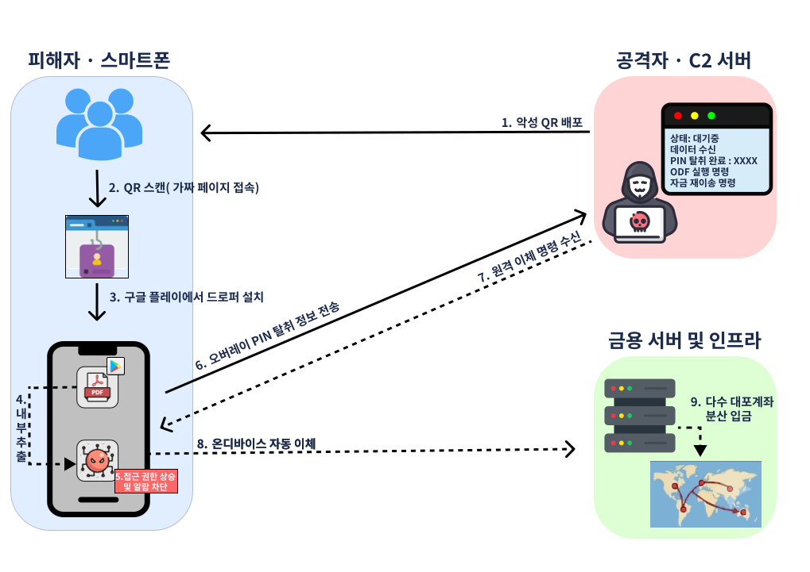

# 시나리오 02 · 큐싱 기반 드로퍼 시나리오

## 1. 개요

이 시나리오는 사칭 문서에 삽입한 QR([큐싱](../00-flow/entry-03-qshing.md))로 유입되어 **피해자 단말에서 직접 이체가 실행되는** 흐름이다. QR이 안내한 앱은 정식 앱마켓에 등록된 드로퍼로, 악성 모듈을 암호화한 채 내부에 품고 있어 마켓 심사와 백신 검사를 모두 지나간다. 시간이 지난 뒤 보안 안내를 빌미로 설치 승인을 받아내 숨겨 둔 모듈을 꺼내 설치하고, 설치된 악성 앱이 접근성 권한으로 단말 안에서 이체를 자동 실행한다. 공격자가 원격으로 조종하지 않으므로 원격제어와 설치 출처를 보는 기존 탐지가 발화하지 않는다.

- 사칭 문서에 삽입한 QR로 유입
- 정식 앱마켓 드로퍼가 악성 모듈을 내부에서 추출해 설치
- 접근성 권한으로 피해자 단말에서 직접 이체 (온디바이스 부정거래)

---

## 2. 공격 흐름

| 시점 | 공격 행위 | 피해자 인식 |
| --- | --- | --- |
| T1 | 실제 양식을 베낀 사칭 문서(건강검진 결과·고지서·급여명세서 등)에 가짜 QR을 삽입해 문자·메일·전단으로 살포 (`QR 피싱`) | 평소 받는 문서로 인식하고 QR을 스캔 |
| T2 | QR이 가짜 페이지로 연결되고, "문서 확인용 앱"을 사칭해 정식 앱마켓의 앱 설치로 유도 (`피싱 페이지 접속`, `악성 앱 설치`) | 문서를 열기 위한 앱으로 여기고, 공식 마켓이라 신뢰해 설치 |
| T3 | 설치된 드로퍼가 문서를 실제로 정상 실행해 의심을 없앰. 악성 모듈은 암호화된 채 앱 내부에 은닉되어 정적 분석과 심사·샌드박스 검사를 통과 (`암호화 은닉`, `정상 기능 위장`) | 문서가 제대로 열리므로 정상 앱으로 확신 |
| T4 | 조건이 맞는 시점에 보안 승급 안내를 빌미로 설치 승인을 유도하고, 승인되면 숨겨 둔 모듈을 복호화해 꺼내 설치·실행 (`지연 실행`, `내부 추출`) | 은행이 요구하는 필수 보안 조치로 믿고 승인 |
| T5 | 설치된 악성 앱이 접근성 권한을 요구·획득하고, 이를 이용해 문자·알림 권한까지 스스로 활성화한 뒤 백그라운드에 상주 (`접근성 권한 악용`, `권한 자동 승인`) | 본인인증·보안 강화를 위한 정상 권한 요청으로 믿고 허용 |
| T6 | 피해자가 금융 앱을 실행하면 그 위에 가짜 로그인 화면을 덮어 인증정보를 받아냄 (`오버레이`, `금융 인증정보 탈취`) | 실제 금융 앱 화면으로 인식하고 정상적으로 입력 |
| T7 | 접근성 권한으로 백그라운드에서 금융 앱 알림을 차단하고 이체한도를 상향 조작 (`알림 차단`, `한도 변경`) | 알림이 차단되어 한도 변경과 이상 동작을 인지하지 못함 |
| T8 | 접근성 자동 조작으로 단말에서 직접 이체를 실행한 뒤 대포계좌로 재이송하고 여러 계좌로 분산 입금. 로그·흔적을 삭제해 추적을 회피 (`온디바이스 부정거래`, `자금세탁`, `증거 인멸`) | 본인이 이체한 적이 없으며, 사후 잔액 조회로 뒤늦게 인지 |

---

## 3. 악성 앱 구조

| 앱 구분 | 위장 명칭 | 요구 권한 | 실제 기능 |
| --- | --- | --- | --- |
| 1차 앱 (드로퍼) | 문서 확인용 앱 (정식 마켓 등록) | 앱 설치 권한 | 위장한 문서 기능을 정상 실행해 의심 제거, 암호화 은닉한 악성 모듈을 복호화해 추출·설치 |
| 2차 앱 (본체) | 표면 노출 없이 백그라운드 상주 | 접근성·다른 앱 위에 표시·문자·알림 접근 권한 | 오버레이로 금융 인증정보 탈취, 알림 차단 및 이체한도 조작, 접근성 주입으로 단말 내 이체 실행 |

유형별 상세는 [로더·드로퍼·다운로더형](../01-threat/type-01-loader.md) · [금융·인증정보 탈취형](../01-threat/type-03-credential.md) · [원격제어·화면감시형](../01-threat/type-05-remotecontrol.md) 문서를 참고한다.
