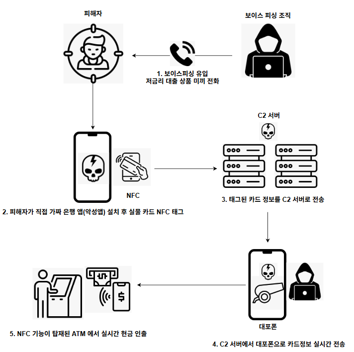

# 시나리오 03 · NFC 릴레이 공격 시나리오

## 1. 개요



보이스피싱으로 접근해 피해자 단말에 최소 권한 Reader 앱을 설치시킨 뒤, **실물 카드를 폰에 태그하게 유도해 카드 응답을 원격지 ATM까지 실시간 중계**하는 공격이다. 공격자는 NFC 지원 ATM 앞에서 대포폰으로 카드를 흉내 내고, 통화 중 사회공학으로 별도 확보한 PIN을 입력해 현금을 인출한다.

**배경 사례** — 스미싱과 NFC 결제를 결합한 신종 수법으로 약 30억 원 규모의 카드 부정승인이 발생했다. 범죄 조직은 스미싱으로 신용카드 정보를 가로챈 뒤 국내 위장 가맹점 단말기를 통해 카드대금을 부정 결제했다. 본 시나리오는 원 사례(POS 소액 다건 결제)를 확장해 **한도 해제 후 ATM 현금 인출**로 재구성했다.

### 핵심 문제 — 권한이 적은 앱이 오히려 위험하다

정상 앱을 악성으로 판단하는 일반적 근거는 위험한 권한을 많이 요구하는가이다. 그러나 이 공격의 Reader 앱은 **NFC와 인터넷 두 개 권한만** 사용한다. 오버레이·접근성·SMS·원격제어를 전혀 쓰지 않는다. PIN을 통화로 탈취하므로 앱이 수집할 필요가 없기 때문이다.

그 결과 권한 기준으로는 오히려 착해 보이는 역설이 생긴다. V3 모듈이 미확인 경로 설치는 탐지하더라도, 그 앱이 실제로 수행하는 행위인 NFC 릴레이는 권한만으로 판단할 수 없다.

### 성립 전제 세 가지

| 전제 조건 | 내용 |
| --- | --- |
| PIN 확보 | ATM 인출은 거의 항상 PIN을 요구한다. PIN은 카드 응답값이 아니라 사람이 키패드에 입력하는 값이라 릴레이로 넘어오지 않으므로, 통화 중 사회공학으로 별도 확보해야 한다 |
| 실시간 릴레이 | 거래가 진행되는 그 순간 카드가 폰에 태그되어 응답해야 한다. "카드를 대고 계세요" 유도가 필수인 이유다 |
| 컨택리스 ATM | NFC 기능이 탑재된 자동화기기여야 공격자 폰이 카드를 흉내 낼 수 있다. 국내 은행이 실제로 운용 중인 인프라다 |

### 공격 대상 인프라의 실재성

가상의 전제가 아니다. KB국민은행 KB모바일현금카드 서비스는 NFC가 지원되는 안드로이드폰으로 **전국 16개 은행 자동화기기에서 현금 입출금·조회·이체**가 가능하다.

---

## 2. 공격 흐름

```
보이스피싱 통화 → 가짜 스토어 경유 Reader 앱 설치 → NFC·인터넷 2개 권한 허용
→ 통화 중 PIN 구두 탈취 → 실물 카드 태그 유도 → APDU 실시간 중계
→ 대포폰 HCE 카드 흉내 + PIN 입력 → 원격지 ATM 현금 인출
```

| 단계 | 내용 |
| --- | --- |
| 1. 유입 | 보이스피싱으로 실물 카드 소지 피해자에게 접근. 저금리 대출 상품 미끼 전화 → 가짜 링크로 은행 보안앱(실제와 동일 아이콘) 설치 유도 → 가짜 구글스토어를 실제 스토어처럼 위장 → NFC 카드 스캔 유도 |
| 2. 최소 권한 | 설치된 악성 Reader 앱이 NFC와 인터넷 두 권한만 요청한다. 피해자가 위기감을 느끼지 못한다. 통상 악성앱은 오버레이·접근성·SMS·원격제어 등 다수를 요청한다 |
| 3. 정보 전송 | 피해자가 권한 수락 → Reader 앱이 스캔된 카드 정보를 C2 서버로 전송 |
| 4. 인출 | 공격자가 NFC 지원 ATM 앞에서 대포폰으로 C2로부터 받은 카드 신호와 PIN을 사용해 현금 인출 |

### 릴레이는 복제가 아니라 실시간 중계다

가장 흔한 오해는 릴레이를 카드 복제로 이해하는 것이다. 과거 마그네틱 카드는 저장 정보가 고정값이라 한 번 읽으면 가짜 카드를 만들 수 있었다. 그러나 현재 IC·컨택리스 카드는 결제 시마다 **일회성 암호문(cryptogram)** 을 새로 생성·검증하므로, 통신을 훔쳐봐도 다음 거래에 재사용할 수 없다.

따라서 공격자는 복제 대신 실시간 중계를 택한다. 공격자 폰이 ATM 앞에서 카드인 척(HCE, Host Card Emulation)하며, ATM 요청을 인터넷으로 피해자 카드까지 실시간 전달하고 응답을 되돌린다.

### ATM ↔ 카드 문답(APDU) 구조

| 순서 | 단말(ATM) 요청 | 카드 응답 | 릴레이 경로 |
| --- | --- | --- | --- |
| 1 | 지원 결제 규격 질의(PPSE) | 카드 종류·브랜드 | ATM→공격자폰→C2→피해자폰→카드 |
| 2 | 카드 신원정보 요청 | 카드번호·유효기간 | ATM→공격자폰→C2→피해자폰→카드 |
| **3** | **이번 거래용 서명 암호문 생성 요청** | **칩이 그 자리에서 생성한 일회성 암호문** | **동일 경로 (핵심)** |
| 4 | PIN 입력 요구 | 통신 아님 — 사람이 키패드 입력 | 릴레이 대상 아님 |
| 5 | 암호문+PIN 은행 전송·검증 | 승인 시 현금 배출 | — |

**3번이 결정적이다.** 이 일회성 암호문은 카드 칩이 해당 거래를 위해 그 순간 직접 계산해야만 하는 값으로, 미리 훔치거나 공격자 폰이 대신 만들 수 없고 재사용도 불가능하다. 공격자가 오직 실시간 중계로만 이 값을 얻는 이유다.

---

## 3. 사용된 악성 앱 구조·기능

### 현 시나리오의 악성코드 조합

| 구분 | 사용된 역할 | 참조 계열 |
| --- | --- | --- |
| 단계 2 | 경량 Reader 앱 (순수 Java, 루팅 불필요) | NFCMultiPay 계열 |
| 단계 3 | 클라우드 브로커 라우팅 (MQTT/TCP) | NFCMultiPay 계열 |
| 단계 4 | 카드 에뮬레이터 (Tapper 역할) | SuperCard X의 Tapper 개념 |

### Reader 앱의 2개 권한 구조

| 권한 | 역할 |
| --- | --- |
| NFC | 실물 카드를 읽는 통로 |
| 인터넷(통신) | C2 서버로 전송하는 통로 |

C2 주소는 앱 안에 하드코딩되어 있다. 연결은 https·TCP 등 정상 앱도 쓰는 표준 방식이라 통신만으로는 겉으로 구별이 불가능하다. **인터넷 권한은 거의 모든 앱이 갖는 평범한 권한이므로 사용자와 백신 모두 의심하지 않는다.**

### NFC 악용 악성코드 계보

| 유형 | 등장 | 지역·언어권 | 특징 |
| --- | --- | --- | --- |
| NFCGate | 학술 | 독일 (연구) | 모든 릴레이의 오픈소스 원류 |
| NGate / NFSkate | 2024 | 체코 | 최초의 악성 무기화, ESET 발견 |
| SuperCard X | 2025 | 중국어권 MaaS | 산업화·상품화, Reader/Tapper 2앱, 텔레그램 판매 |
| PhantomCard | 2025 | 브라질 | 지역 확산, ThreatFabric 발견 |
| DevilNFC | 2026 | 스페인어권 | 로컬 자체 개발, 고도화 (루팅·후킹·Kiosk) |
| **NFCMultiPay** | **2026** | **브라질 포르투갈어권** | **로컬 자체 개발, 경량 (순수 Java·클라우드) — 본 시나리오 기준** |
| SpyNote 결합형 | 2026 | — | 릴레이 + 원격제어·스파이웨어 결합 |

---