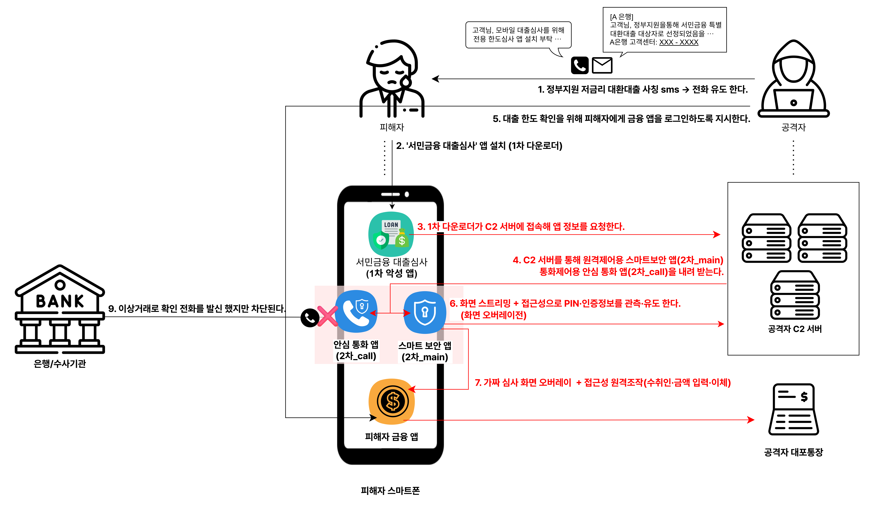

# 시나리오 04 · 대출 사칭 원격제어 시나리오

## 1. 개요

가짜 정부지원 대환대출 안내로 유입되는 공격이다. "저금리 대환대출 승인 대상자"라는 문자로 피해자를 유인한 뒤, 상담원을 사칭한 전화로 통화를 걸어 공격이 끝날 때까지 피해자를 붙잡아 둔다. 통화 상태에서 "심사 서류 제출용"이라며 가짜 대출 앱을 설치시키면, 이 앱이 원격제어·전화 제어 앱을 연쇄로 깔아 단말을 장악한다. 이후 공격자는 화면에 가짜 심사 화면을 씌운 채 뒤에서 이체를 실행하는데, 이 **이체가 피해자 본인 단말·본인 IP에서 발생**하기 때문에 기기·위치·행동이 평소와 동일해 기존 이상거래 탐지에 걸리지 않는다.

- **통화로 피해자를 고립시킨다** — 상담을 가장한 전화로 공격 내내 피해자를 붙잡아 다른 확인 경로를 차단한다
- **다중 앱으로 단말을 장악한다** — 가짜 대출 앱(1차)이 원격제어 앱과 전화 제어 앱(2차)을 연쇄 설치해 화면·통화를 모두 통제한다
- **이체가 피해자 단말에서 발생한다** — 정상 기기·정상 IP로 이체가 이뤄져 흔적이 남지 않으며, 확인 전화까지 가로채 피해 인지를 늦춘다

---

## 2. 공격 흐름

| 시점 | 공격 행위 | 피해자 인식 |
| --- | --- | --- |
| T1 | 정부지원 대환대출을 사칭한 **문자를 발송**한다.  "저금리 대환대출 승인 대상자 안내 / 기존 대출 조회 후 한도 확인" 문구와 상담 신청 링크를 포함한다 | 정부·은행의 실제 대출 안내로 인식한다 |
| T2 | 피해자가 상담을 신청하면 은행 대출 담당자를 사칭해 **전화를 걸어** 통화를 시작하고, 공격이 끝날 때까지 통화로 붙잡아 둔다 | 정식 대출 상담 통화로 인식한다 |
| T3 | "심사 서류 제출용"이라며 정식 마켓이 아닌 경로로 **가짜 대출 앱(1차) 설치**를 유도하고, 피해자가 설치한다 | 대출에 필요한 공식 앱으로 인식한다 |
| T4 | 1차 앱이 백그라운드에서 **원격제어 앱(2차_main)과 전화 제어 앱(2차_call)을 연쇄 설치**한다 | 아무 동작도 인지하지 못한다 |
| T5 | "본인 확인 절차"라며 **접근성·다른 앱 위에 표시·화면 녹화 권한**을 요청하고, 피해자가 허용한다 | 본인 확인에 필요한 절차로 인식한다 |
| T6 | 2차_call이 **기본 전화 앱 자리를 차지해** 단말의 수신·발신을 제어할 수 있는 상태가 된다 | 변화를 인지하지 못한다 |
| T7 | 공격자가 **원격제어 앱으로 단말에 연결**하고, "대출 상환 계좌 확인" 명목으로 금융앱에 로그인하게 하거나 탈취한 정보로 직접 로그인한다 | 상환 계좌 확인 절차로 인식한다 |
| T8 | 금융앱 화면 위에 "대출 심사 진행 중" **가짜 화면(오버레이)**을 띄워 실제 화면을 가린다 | 심사가 진행 중이라고 인식한다 |
| T9 | 가짜 화면 뒤에서 **원격제어·접근성 자동 조작으로 이체 정보를 입력**한다 | 화면이 가려져 이체를 알 수 없다 |
| T10 | **대포통장으로 이체가 실행**된다. 이체는 피해자 본인 단말·본인 IP에서 발생한다 | 이체 사실을 인지하지 못한다 |
| T11 | 은행·수사기관이 확인 전화를 걸어도 2차_call이 **가로채거나 즉시 종료**해 피해자에게 닿지 않는다 | 확인 연락을 받지 못한다 |
| T12 | 통화와 가짜 심사 화면이 유지되는 사이 공격자는 **수취 계좌에서 현금을 인출**한다 | 피해 사실을 뒤늦게 인지한다 |

---

## 3. 악성 앱 구조

| 앱 구분 | 위장 명칭 | 요구 권한 | 실제 기능 |
| --- | --- | --- | --- |
| 1차 앱 | 정부지원 대환대출 앱 | 저장소·앱 설치 | 대출 신청 정보를 탈취하고, 2차 앱을 연쇄 설치하는 드로퍼 역할을 한다 |
| 2차_main 앱 | 본인 확인·보안 앱 | 접근성·다른 앱 위에 표시·화면 녹화 | 원격제어로 단말을 조작하고, 가짜 화면(오버레이) 뒤에서 접근성 자동 조작으로 이체를 실행한다 |
| 2차_call 앱 | (비표시·백그라운드) | 기본 전화 앱·통화 | 기본 전화 앱 자리를 차지해 수신·발신을 제어하고, 은행·수사기관의 확인 전화를 가로챈다 |