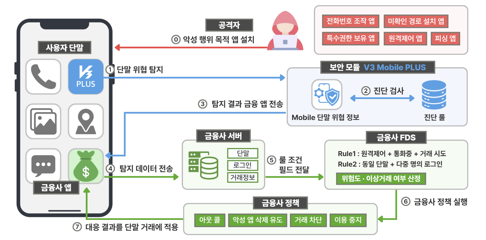

# 모바일 보안 구조 및 아키텍처

## 1. 개요

본 아키텍처는 사용자 단말의 보안 모듈에서 탐지한 위협 정보를 금융사에 전달하고, 금융사 FDS가 로그인·거래정보 등과 함께 분석하여 대응 정책을 적용하는 구조이다.

보안 모듈은 단말의 위협 신호를 탐지하고, 금융사 FDS는 단말 탐지정보와 금융 거래정보를 종합하여 이상거래 위험도를 판단한다. 금융사는 판단 결과에 따라 아웃콜, 악성 앱 삭제 유도, 거래 차단, 서비스 이용 중지 등의 대응 정책을 실행한다.

!!! info "핵심 구조"
    **보안 모듈의 단말 위협 탐지 → 금융사 FDS의 위험 판단 → 금융사의 대응 정책 실행**

---

## 2. 전체 아키텍처

*그림 1. 모바일 보안 모듈과 금융사 FDS 연동 구조*

공격자가 악성 행위 목적의 앱 설치를 유도하면, 보안 모듈은 사용자 단말에서 발생하는 위협 신호를 탐지한다. 탐지 결과는 금융 앱과 금융사 서버를 거쳐 FDS에 전달되며, FDS는 단말 탐지정보와 로그인·거래정보를 조합하여 위험도와 이상거래 여부를 판단한다.

---

## 3. 구성요소별 역할

| 구성요소 | 주요 역할 |
| --- | --- |
| **사용자 단말** | 금융 앱과 보안 모듈이 실행되며, 공격 앱의 설치와 위협 행위가 발생할 수 있는 환경이다. |
| **V3 Mobile Plus** | 악성 앱, 단말 취약 상태, 단말 위협 및 단말 정보를 탐지하고 진단 결과를 생성한다. |
| **금융 앱** | 보안 모듈의 탐지 결과를 전달받아 금융사 서버로 전송하고, 금융사의 대응 결과를 사용자 거래에 반영한다. |
| **금융사 서버** | 단말 탐지정보와 로그인·거래정보를 수집하고 FDS 판단에 필요한 필드를 전달한다. |
| **금융사 FDS** | 복수의 탐지정보와 금융 거래정보를 룰에 대입하여 위험도와 이상거래 여부를 판단한다. |
| **금융사 정책** | FDS 판단 결과에 따라 아웃콜, 악성 앱 삭제 유도, 거래 차단, 서비스 이용 중지 등의 조치를 실행한다. |

---

## 4. 단계별 동작 흐름

| 단계 | 구분 | 동작 내용 |
| ---: | --- | --- |
| **0** | 위협 발생 | 공격자가 전화번호 조작, 원격제어, 피싱 등의 악성 행위를 목적으로 앱 설치를 유도한다. |
| **1** | 단말 위협 탐지 | 보안 모듈이 사용자 단말의 앱과 실행 환경에서 위협 신호를 탐지한다. |
| **2** | 진단 검사 | 탐지된 정보를 진단 룰과 비교하여 위협 여부와 유형을 판별한다. |
| **3** | 탐지 결과 전달 | 보안 모듈이 진단 결과를 금융 앱에 전달한다. |
| **4** | 금융사 서버 전송 | 금융 앱이 탐지 결과와 단말·세션 정보를 금융사 서버로 전송한다. |
| **5** | FDS 룰 적용 | 금융사 서버가 단말 탐지정보와 로그인·거래정보를 FDS에 전달하고 룰 조건에 대입한다. |
| **6** | 대응 정책 실행 | FDS가 산정한 위험도와 이상거래 판단 결과에 따라 금융사 정책을 실행한다. |
| **7** | 거래 반영 | 대응 결과를 금융 앱과 해당 거래에 반영한다. |

0단계는 아키텍처 내부의 처리 과정이 아니라, 이후 탐지와 대응이 시작되는 **공격 발생의 사전 조건**이다.

---

## 5. 핵심 설계 원칙

### 5.1 탐지와 판단의 분리

보안 모듈은 단말에서 발생하는 위협 신호를 탐지하지만, 개별 탐지 결과만으로 이상거래를 확정하지 않는다. 최종 위험 판단은 금융사 FDS가 수행한다.

### 5.2 복수 데이터의 조합

FDS는 악성 앱이나 원격제어 앱의 탐지 여부와 같은 단말 정보뿐 아니라 로그인 계정, 이체 금액, 이체 횟수 등의 금융 거래정보를 함께 활용한다. 이를 통해 하나의 탐지 결과에 의존하지 않고 거래 위험도를 종합적으로 판단한다.

### 5.3 위험도 기반 단계별 대응

모든 탐지 결과를 즉시 차단으로 처리하지 않고, 복수의 위험 신호를 바탕으로 산정한 위험도에 따라 대응 수준을 결정한다. 금융사는 판단 결과에 따라 아웃콜, 악성 앱 삭제 유도, 거래 차단, 서비스 이용 중지 등의 정책을 적용할 수 있다.

---

## 6. 아키텍처 요약

본 아키텍처는 **단말 탐지 → 데이터 전달 → FDS 판단 → 금융사 대응**의 흐름으로 구성된다. 보안 모듈과 금융사 FDS의 역할을 분리하면서도 단말 탐지정보와 금융 거래정보를 연계하여, 모바일 위협이 실제 금융 피해로 이어지기 전에 단계적으로 대응하는 것을 목표로 한다.
